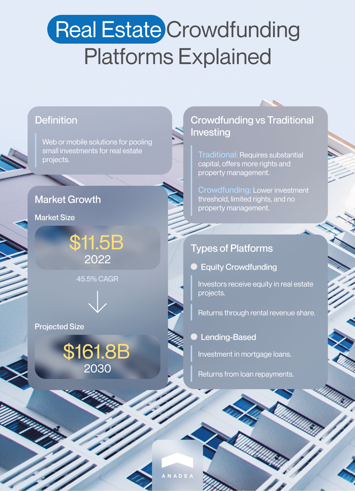
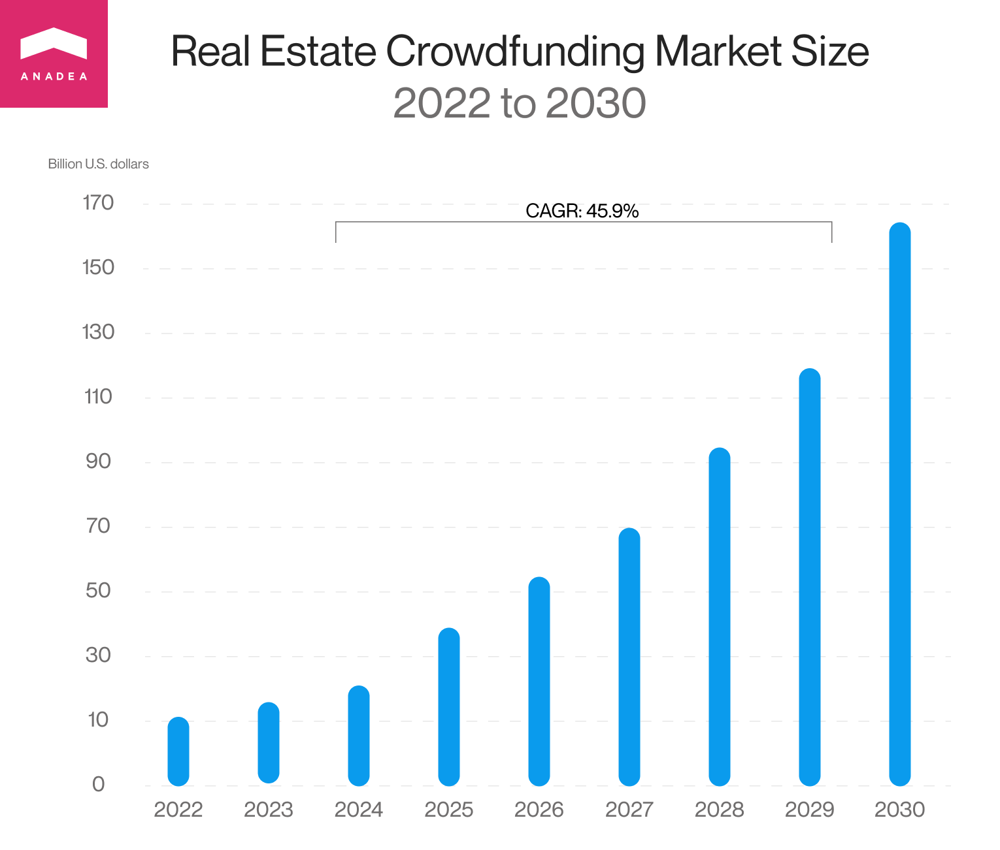
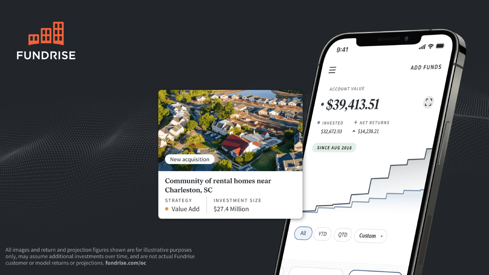
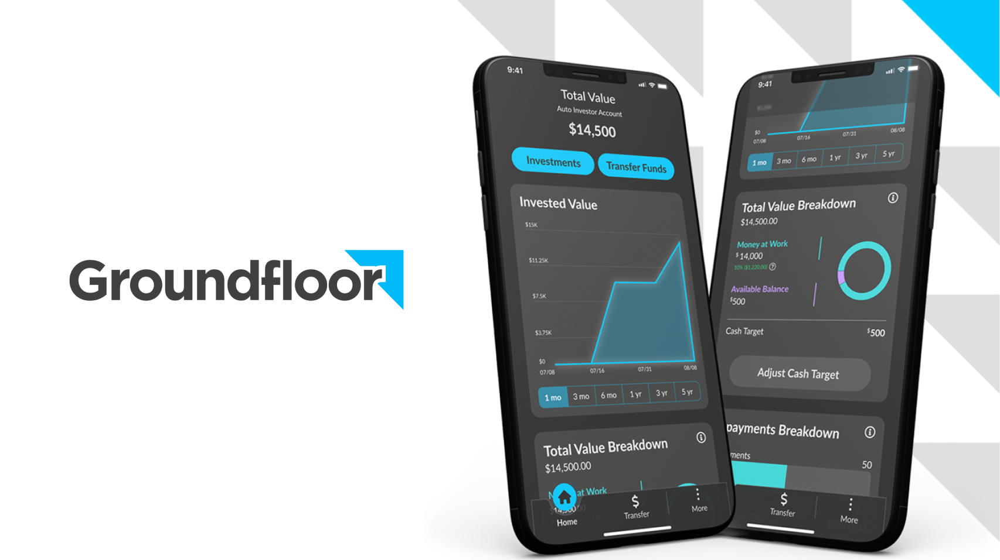
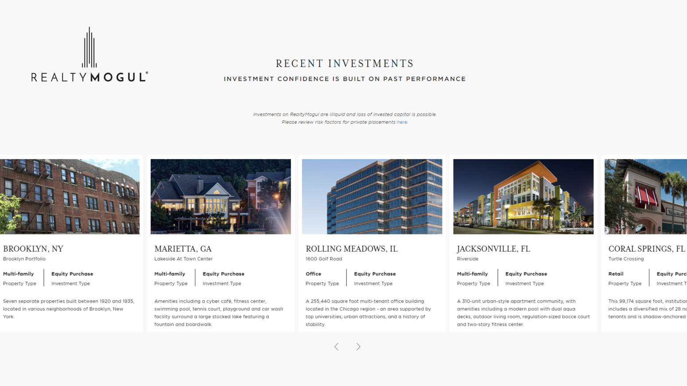
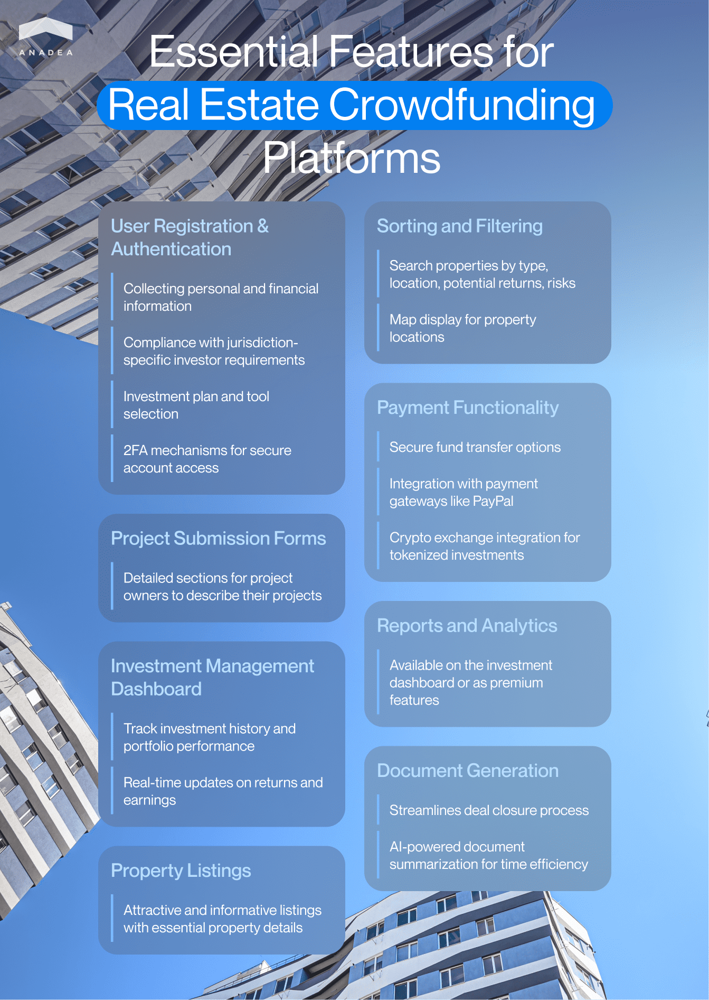
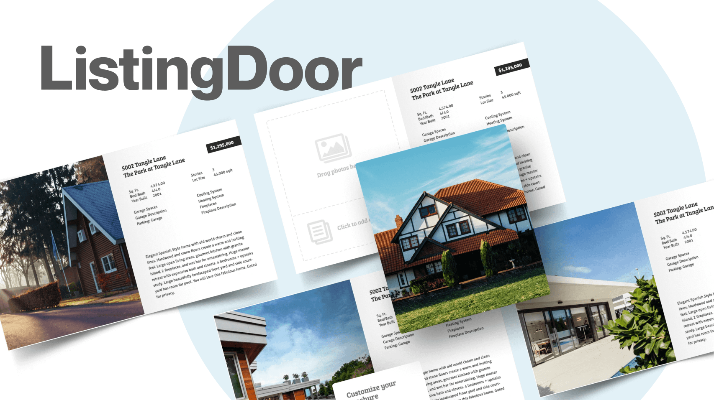

Such a way of raising money from a large group of investors as crowdfunding is a rather popular option in many industries today. And the real estate market is one of them. Crowdfunding real estate platforms that allow users to financially support real estate acquisitions are gaining popularity.

In this article, we'd like to talk about crowdfunding platforms for real estate, their functionality, and the new opportunities that they open to businesses and investors. Moreover, we will share our expertise in building [solutions for the real estate industry](https://anadea.info/solutions/real-estate-software) and will provide some practical recommendations that will be highly useful for you if you are considering the launch of a real estate crowding platform.

## What is a real estate crowdfunding platform?

Real estate crowdfunding platforms can be defined as software web or mobile solutions intended for pooling usually rather small amounts of money from a row of investors with a view to using them for real estate projects.

Very often, this way of getting investments is applied to socially important and highly innovative projects that can change the lives of the entire community. For example, this category of projects can include the restoration of culturally and historically significant monuments and buildings, the creation of sustainable infrastructure, or the development of renewable energy sources.

However, the projects listed on crowdfunding platforms for real estate may be also less significant than those mentioned above. It can be the purchase of a small building for a social club or the renovation of a local school. When an organization doesn't have a huge investor from the side of the government or from the business world, crowdfunding can become an excellent choice.

Real estate crowdfunding investment platforms have the same principle as platforms intended for traditional crowdfunding projects. It means that any crowdfunding campaign presupposes the participation of three parties. Each of them will have its specific role.

- **Host of the campaign**. As a rule, it is the project owner or manager who will be responsible for planning and overseeing the execution of the investment project. This person will find the necessary property, define the work that should be done, and negotiate with all the specialists that will be involved. Quite often this person may also be the key sponsor. However, the role of the host of the campaign will greatly depend on the specificity of the project that you will need to deal with.

- **Investors**. These are people who will be ready to financially support the project. Their interest may depend. Sometimes they will be offered a share of ownership. However, when we are talking about some social projects this point is not relevant. In these cases, their desire to commit their capital is driven by their desire to help the community.

- **A real estate crowdfunding platform.** In this case, a platform will act as a mediator that will help project owners and investors come together. However, building bridges is not the only function that real estate crowdfunding investment platforms typically have. These platforms also bear responsibility for ensuring the desired level of transparency and security for all its users. It means that the identities of project owners and investors should be verified following all the regulatory requirements. Platforms also need to take care of the diligent advertising and promotion of projects as well as providing the infrastructure for financial transactions. The funds should be properly collected and safely kept.

What makes crowdfunding differ from traditional real estate investing? The amount that you can invest. While in the traditional investment model, you need to be ready to allocate substantial capital, crowdfunding lets you become an investor with less money. However, you should understand that this second model provides you with fewer rights and responsibilities. For example, you won't be able to manage a property.

You also should know that there are several types of crowdfunding real estate platforms.

- **A real estate equity crowdfunding platform**. Such a platform provides investors with the possibility to get an equity stake in a real estate project. In return, they can receive a rental revenue share.

- **A lending-based platform**. In this case, users will invest in mortgage loans. When loans are partially repaid, a small percentage will be sent to the investor.

While speaking about software solutions of this type, we also should mention the method to monetize them. How do real estate crowdfunding platforms make money? This will be a very logical question. There can be a little bit different approaches to monetization. Platforms can take a percentage of the made investments or they can directly charge investors and project owners. Moreover, some other methods are commonly used by digital projects. They are premium subscriptions and ads.

Get a consultation

## Real estate crowdfunding market

According to experts, the world's real estate crowdfunding market [achieved](https://www.vantagemarketresearch.com/industry-report/real-estate-crowdfunding-market-2206)a size of $11.5 billion in 2022 and is projected to hit the mark of $161.8 billion by 2030. It will be skyrocketing growth for the industry. The expected CAGR for the forecast period from 2023 to 2030 will be 45.5%.

These impressive figures brightly demonstrate an enormous interest in crowdfunding activities in the real estate industry. As a result, it will be sensible to presuppose that the popularity of real estate crowdfunding platforms and the demand for reliable solutions of this kind will also gradually climb higher.

That's why if you are considering the possibility of launching an advanced [web software product for real estate](https://anadea.info/blog/how-to-create-a-real-estate-web-platform), we recommend you think about a commercial real estate crowdfund platform. Moreover, today there is a row of inspiring examples of crowdfunding solutions for this industry.

### The largest real estate crowdfunding platforms

We offer you to have a look at those crowdfunding real estate platforms that have already managed to win an excellent reputation among investors. Though there are different rankings created by different experts, in our article we'd like to rely on the list of the top real estate crowdfunding investment platforms prepared by [Forbes](https://www.forbes.com/advisor/investing/best-real-estate-crowdfunding-platforms/).

#### Fundrise

Apart from real estate, users of this platform can also invest in other private assets, including venture capital and private credit. Today the platform has a real estate portfolio over $7 billion. To become investors, users do not need to possess impressive amounts. Just $10 will be enough. The taken fees are also rather modest and comprise just 1% (0.85% asset management fee and 0.15% advisory fee). The platform offers a simple navigation and the process of account creation is not time-consuming.

#### Groundfloor

The platform provides fractionalized real estate investments and is available not just for accredited investors but for everyone. Groundfloor promises that every investor can leverage 10% returns. And that's not just pure luck. The secret behind consistent returns is diversification. Investors can spread their funds across various properties. The platform has over 200K customers and doesn't take fees. It has introduced Auto investor accounts. To work with them, you need to have just $100.

#### Realty Mogul

Today the platform boasts more than 270K investors and provides them with flexible options for investing their money in real estate properties. The investments can be done via REIT offerings (Real Estate Investment Trusts) among other options. The account minimum is not the lowest one and stands at the level of $5,000 but the returns of around 7-8% look very attractive for many investors. The fees for REITs are around 1%-1.25%.

Build my platform

## How to start a real estate crowdfunding platform?

If you want to wow the market with a solution that will stand out from the row of other available crowdfunding platforms for real estate, you need to start your project with serious research work. It won't be enough just to take one of the best platforms and fully copy its functionality and style.

Let us also mention that many companies may prefer to use a white label real estate crowdfunding platform and enrich it with their own branding and identity. That's why if you do not want to operate a crowdfunding business on your own, you can develop unbranded (white label) software and further lease it as a vendor.

Nevertheless, regardless of the exact goals of your project, the process of its realization will look practically the same in all cases.

Here is a brief step-by-step guide on how to start a real estate crowdfunding platform.

1. **Analyze the market**. It will be helpful to consider the top players not in order to copy them but to detect their strong sides and weaknesses. Based on this analysis, you will be able to understand what users like and what they usually want to avoid. As a result, you will get the required knowledge for ensuring the best user experiences. At this step, it will be also necessary to decide on your monetization strategy. You can read the reviews written by the users of the top platforms. Quite often they indicate their opinion on the fees and charges introduced by a platform.

2. **Study the regulation**. It is vital to think about the region or regions where your platform will be available. The rules and laws that regulate the real estate and investment markets may seriously differ. That's why if you want to operate in a particular region and avoid problems with regulators, you should be well-prepared.

3. **Think about the key idea of your project.** You should define your target audience, the type of your platform, and the niche that you are going to work in.

4. **Find a development team**. If you have in-house developers, this question will be easily solved. In other cases, you will need to look for external specialists. You can cooperate with freelancers or work with a professional software development team like Anadea. It is important to make sure that developers have already worked in the chosen business domain before and have an excellent understanding of the needs and requirements of users.

5. **Build an MVP**. After the team is chosen, you should discuss the requirements for your project, its concept, and its core goals. We always recommend our clients to build a minimum viable product at first. With an MVP that will include only the most basic features, you will be able to gather users' feedback and test your solution without serious financial risks.

6. **Develop and test a full-scale product.** When you have gathered the opinions of the first users and introduced all the required changes, your developers can start building a full-scale version of your real estate crowdfunding platform. It's also vital to properly test your software before making it available to a wide audience.

7. **Launch your platform**. When everything is ready, the platform can be released. You also need to think about the right marketing and promotion of your product to make sure that as many potential users as possible will learn about its existence.

8. **Maintain and timely update your solution**. When your platform successfully functions, you still have a lot of work to do. As such solutions deal with financial transactions, it is necessary to continually monitor and timely detect all the risks and vulnerabilities that can pose a threat to users' funds. Moreover, we recommend you track the changes in market trends and user expectations and regularly update not only the content platform but also its functionality.



## Features of crowdfunding platforms for real estate

If you have plans to build a solution of this kind, it may be useful for you to attentively analyze the list of features that you should create for it.

1. **User registration and authentication.** Though you need to get quite a lot of information about users at the stage of their registration, the entire process should be absolutely clear and straightforward to them. Depending on the rules accepted in the chosen jurisdiction, it will be required to get personal identification data, financial credentials, and documents that will confirm users' country of citizenship. In some countries, there also may be some additional requirements for investors.  At this step, users will also need to choose the investment plan and extra tools (like auto investment) that they want to use.  As for the authentication, it is recommended to introduce 2FA mechanisms. For example, users may be asked to provide a code when they log into their accounts. These codes may be sent by your platform to their emails or mobile phones via SMS.

2. **Project submission forms.** Such a form should contain different sections where project owners will be able to tell potential investors about the project's idea, its goals, and plans for realization.

3. **Investment management dashboard.** This section should provide users with the possibility to view the history of their investments, monitor the performance of their portfolios, as well as check real-time updates of their returns and earnings.

4. **Property listings.** Project listings should look attractive to potential investors and should include all the required data about the property.

5. **Sorting and filtering**. We recommend you allow users to search properties based on their types, locations, potential returns, and risks. It could be also a good idea to display properties on the map.

6. **Payment functionality**. It is vital to take care of the security of funds transfers. A platform should offer different payment options and escrow functionality. One of the most popular methods is the integration of an external payment gateway such as PayPal. If you want to offer the tokenization of investments, it is sensible to ensure the integration with a crypto exchange. As a result, users will be able to use funds from their exchange wallets to make investments.

7. **Reports and analytics.** Such features can be available directly on the investment management board or you can offer them as premium tools.

8. **Documents generation.** It is not an essential feature of real estate crowdfunding investment platforms but it can be very helpful for users as thanks to it, it will take less time to close deals. What's more, you can also use the power of AI to offer document summarization. By getting the most important abstracts instead of reading entire contracts, investors can save valuable time.

Hire software developers

## How much does it cost to build a real estate crowdfunding platform?

When it comes to project costs, it is always impossible to name any accurate figures before analyzing project requirements.

Many factors have an impact on this amount. Let us mention at least the most important of them:

- Rates of developers, the size and composition of the development team;
- Complexity and type of your solution;
- Tech stack;
- Integrations;
- Project timeframes.

On average, the development of a real estate crowdfunding platform will start at $50,000. However, it is a very approximate figure. You should understand that if you want to enrich your solution with the most innovative AI tools and ML algorithms, the final amount will go higher.

To get a quote, you should share your requirements with a development team. At Anadea, we can provide estimates for free.

Request for proposal

## Our real estate development expertise

At Anadea, we have rich experience in building solutions for the real estate industry. And we are happy to share our insights with the readers of our blog. For example, If you are interested in launching a mobile app for this market, you can read one of our previously published [articles](https://anadea.info/blog/how-to-embrace-the-power-of-mobile-apps-for-your-real-estate-business) with practical tips and theoretical knowledge.

To make sure that our developers are experts in building solutions for the real estate industry, you can have a look at our [software development portfolio](https://anadea.info/projects#real-estate).

One of the projects was [ListingDoor](https://anadea.info/projects/listingdoor), a SaaS web app that offers a wide range of tools for selling properties. The functionality of the platform is sufficient to allow people in the United States to sell their homes without the participation of brokers. As a result, people can avoid the necessity to pay commissions to real estate agents.

Users can not only list their properties directly on the platform but also create brochures and sale signs with its help. It is possible to use either all these services together or just choose some of them in any combination. It has integrations with Zillow, Trulia, Yahoo Homes!, AOL Homes, and other national syndication services.

After its launch, the platform has gathered a lot of positive opinions and has even managed to win a reputation of the "Uber for Real Estate Sales" (Forbes).

Our team is proud to make a serious contribution to the realization of this project by providing UI/UX design, front-end development, back-end development, and QA services.

## Final word

Given the active growth of the industry, it is expected that the demand for reliable real estate crowdfunding platforms will be actively increasing as well. That's why if you have an idea to launch such a project, it can be a very good time to do it.

However, to make sure that your platform will be secure and high-performing you should cooperate with a trustworthy software development team. At Anadea, we are always ready to help you in the realization of your projects. Just let us know what ideas you have and we will find the best solution.

Get in touch
