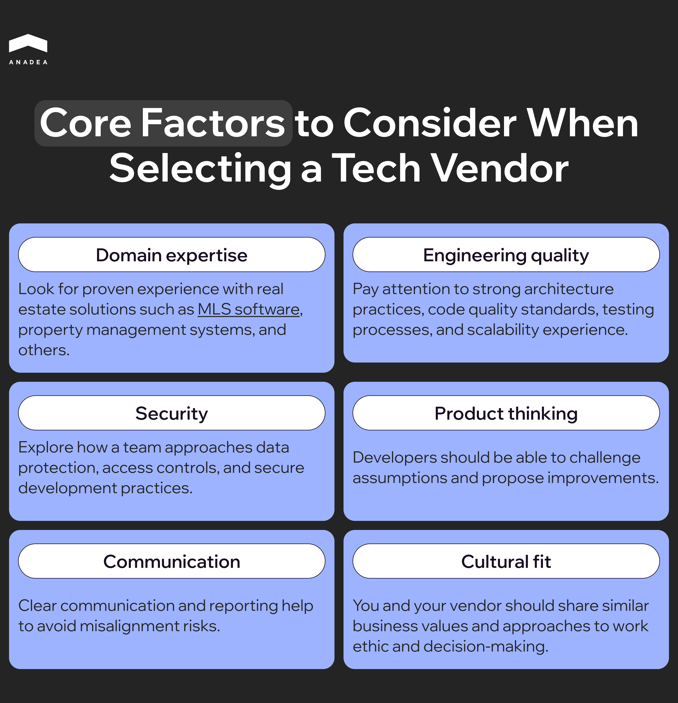

According to [Deloitte’s Global Outsourcing Survey](https://www.deloitte.com/content/dam/assets-shared/docs/services/consulting/2025/global-outsourcing-survey-2024.pdf), more than 70% of organizations outsource software development. Among the main reasons for using third-party services, businesses name improved access to talent and cost savings. Another important argument in favor of outsourcing is faster software delivery. 

For instance, today, a lot of real estate companies equip their existing platforms with highly demanded AI features. But does it make sense to hire in-house developers for this task? Outsourcing is often the most feasible solution. 

In this article, we will talk about the cases where real estate software development outsourcing can bring value. Apart from this, we will explain how to choose the right vendor for your project.

## When You Should Outsource Real Estate Software Development Services

Our team has more than 25 years of experience in software development. We deeply understand the peculiarities of different approaches to building software. Outsourcing is not a universal model. Whether to outsource depends on many factors. You need to analyze your project goals, internal resources, budget, and the stage of your product.

Here’s a practical questionnaire that can guide your decision. Answer these questions to figure out what matters most.

1. **When do you need to launch your solution?** Tight deadlines may require additional resources that your in-house team doesn’t have. Outsourcing helps ensure faster time-to-market.
2. **What budget can you invest in your project?** Outsourcing provides access to niche expertise, and this option can be much cheaper than hiring full-time staff.
3. **Are you looking for any specific skills?** If your project requires niche knowledge (for instance, advanced skills for [AI-powered real estate app development](https://anadea.info/blog/ai-in-real-estate/) or training property valuation models), outsourcing can fill that gap.
4. **Do you need extra help only for specific periods?** For short-term projects or active phases of development, you can scale your team through a real estate software development company. This approach prevents overstaffing and lets you scale as needed.

### In-House vs. Outsourcing for Different Tasks

In custom [real estate software development](https://anadea.info/solutions/real-estate-software), not every component needs the same approach. The creation of some features requires full control. At the same time, others can be efficiently developed by external teams. 

<table>

<tbody>

<tr>

<td>

<strong>Task Type</strong>

</td>

<td>

<strong>Best Approach</strong>

</td>

</tr>

<tr>

<td>

Core product features

</td>

<td>

In-house development maintains full control. External developers can bring unique niche expertise.

</td>

</tr>

<tr>

<td>

Compliance-heavy modules

</td>

<td>

Choose in-house development or cooperation with partners who have regulatory expertise.

</td>

</tr>

<tr>

<td>

Integrations

</td>

<td>

Outsourcing partners typically have specialized expertise in APIs and SDKs for complex integrations.

</td>

</tr>

<tr>

<td>

Non-core enhancements

</td>

<td>

External specialists can handle supporting tasks, while your internal team focuses on key functionality.

</td>

</tr>

</tbody>

</table>

### In-House vs. Outsourcing at Different Product Maturity Stages

The stage of your product influences the scope of outsourcing and the level of risk you can accept.

<table>

<tbody>

<tr>

<td>

<strong>Product Maturity</strong>

</td>

<td>

<strong>Best Approach</strong>

</td>

</tr>

<tr>

<td>

Proof of concept (POC)

</td>

<td>

This stage is experimental by nature. Outsourcing allows for quick validation of new ideas.

</td>

</tr>

<tr>

<td>

Minimum viable product (MVP)

</td>

<td>

You can outsource non-core modules and keep strategic features in-house.

</td>

</tr>

<tr>

<td>

Scale-up and growth

</td>

<td>

You need to ensure that outsourced teams have well-established QA processes and experience with scalable architectures.

</td>

</tr>

</tbody>

</table>

## How to Plan Your Custom Real Estate Software Development

To choose a tech partner for real estate software development outsourcing, you need to clearly define your scope. First of all, focus on business outcomes, not features.

### Primary Use Cases and User Personas

Identify who will use your software and their goals. In custom real estate software development, we can name the following key types of users:

* **Brokers and agents.** They use real estate apps to manage leads, listings, and client relationships.
* **Landlords and property owners.** Software enables users to oversee multiple properties and maintenance requests.
* **Tenants.** With the help of digital tools, tenants can pay rent, track maintenance requests, and execute other everyday tasks.
* **Investors.** Investors can monitor portfolios, analyze ROI, study market trends, as well as manage transactions.
* **Property managers.** Software allows property managers to coordinate operations, compliance, and tenant communications.

When you understand the needs of these personas, you can prioritize features and workflows that directly impact business outcomes.

### Product Types You Can Launch

At Anadea, we have experience in building a wide range of popular real estate app types, including:

* **Property management software.** Users can automate rent collection, maintenance, and occupancy tracking.
* **Listing and IDX portals.** These portals provide property listing management features, search functionality, and lead capture tools.
* **Real estate CRM.** CRM platforms offer features for tracking leads, follow-ups, and client interactions.
* **Transaction management platforms.** Such software streamlines contract and deal workflows.
* **Tenant and maintenance apps.** These apps enable tenants to submit requests and track resolutions.
* **Investor dashboards.** These platforms provide portfolio analytics, financial reporting, and ROI tracking.

### Must-Have Workflows Tied to Outcomes

To create a high-impact and user-centric solution, you shouldn’t focus on features alone. It’s better to think about workflows in relation to business outcomes.

* lead-to-lease workflow (conversion of leads into signed leases);
* listing-to-close workflow (management of property sales from initial listing to finalized transaction);
* rent collection and accounting (timely payments and transparent reporting);
* maintenance SLAs (request and resolution time tracking).

### Non-Functional Requirements

Apart from functionality, you should also pay attention to software quality and user experience. Key non-functional considerations include:

* performance (fast load times and responsive UI);
* uptime (availability for users at all times);
* accessibility (inclusivity for all users, including people with disabilities);
* localization (support for multiple languages, if needed);
* mobile-first approach (optimized experience on smartphones and tablets)

## Real Estate Software Development Outsourcing: Models to Consider

The right outsourcing model is a foundation of your project’s success. Real estate software projects often involve complex workflows and regulatory considerations. As a result, communication within a team and flexibility are critical. Each model offers a different balance of collaboration and control, as well as cost efficiency.

### Onshore vs. Nearshore vs. Offshore

Different locations open different opportunities for businesses. But apart from benefits, it’s also crucial to consider their trade-offs.

* **Onshore**. Working with local developers is the best choice for projects with strict compliance requirements and frequent stakeholder collaboration. This model offers a shared time zone and language, but comes at a higher cost.
* **Nearshore**. Hiring a real estate software development company from a geographically close country offers a strong balance of cost efficiency and collaboration. Thanks to similar time zones and cultural proximity, this model works well for iterative development and ongoing communication.
* **Offshore**. This model is often used for cost-sensitive projects with clearly defined scopes. Offshore teams can speed up software delivery, as this approach can allow for round-the-clock development. However, it requires strong documentation and processes to manage time zones and cultural differences.



### Engagement Models to Address Your Needs

The chosen engagement model should ensure the flexibility you need.

<table>

<tbody>

<tr>

<td>

<strong>Model</strong>

</td>

<td>

<strong>When It Works Best</strong>

</td>

<td>

<strong>Pros</strong>

</td>

<td>

<strong>Cons</strong>

</td>

</tr>

<tr>

<td>

Fixed-price

</td>

<td>

Short-term projects with a clear scope

</td>

<td>

Predictable cost, simple budgeting

</td>

<td>

No flexibility for scope changes

</td>

</tr>

<tr>

<td>

Time-and-materials

</td>

<td>

MVPs and projects with evolving requirements

</td>

<td>

Flexibility, transparency

</td>

<td>

Need for close budget monitoring

</td>

</tr>

<tr>

<td>

Dedicated team

</td>

<td>

Long-term products and scaling&nbsp;

</td>

<td>

Team continuity, high ownership

</td>

<td>

Higher long-term cost commitment and management overhead

</td>

</tr>

</tbody>

</table>

### Minimum Viable Team Composition

Real estate software projects require a mix of business and technical expertise. A typical minimum viable team may include:

* **Product manager/business analyst**. This expert is responsible for aligning features with business goals and user needs
* **Tech lead/architect**. Makes technical decisions.
* **UX/UI designers**. They design intuitive user experiences.
* **Frontend and backend developers.** Developers build core application logic and interfaces.
* **QA engineer.** This specialist ensures the reliability and usability of software.
* **DevOps engineer**. DevOps manage infrastructure and CI/CD pipelines.
* **Data/analytics specialist.** They support reporting and dashboards.

## Choosing the Right Real Estate Software Development Company

When you are looking for a provider of real estate software development services, you may face difficulties in choosing the best partner due to a great number of companies with similar offers in the market. 

Clear evaluation criteria will help you remove subjectivity. Here’s what you should concentrate on:

* **Domain expertise.** Look for proven experience with real estate solutions such as [MLS software](https://anadea.info/solutions/real-estate-software/mls), property management systems, and others.
* **Engineering quality.** Pay attention to strong architecture practices, code quality standards, testing processes, and scalability experience.
* **Security.** Explore how a team approaches data protection, access controls, and secure development practices.
* **Product thinking.** Developers should be able to challenge assumptions and propose improvements.
* **Communication.** Clear communication and reporting help to avoid misalignment risks.
* **Cultural fit.** You and your vendor should share similar business values and approaches to work ethic and decision-making.

It’s pretty difficult to make a well-grounded decision based only on sales presentations and marketing materials. That’s why it is always recommended to look for tangible evidence that proves a vendor’s capabilities.

1. Communicate with the company’s past or current clients in the real estate domain.
2. Try to detect potential pitfalls in collaboration with the chosen vendor.
3. Analyze available case studies. They should clearly explain the challenges and measurable outcomes.
4. Consider open-source contributions on GitHub.
5. Explore certifications and experience in working within SOC 2 or similar security frameworks.

At Anadea, we have a proven track record in delivering high-quality outsourcing services. For instance, for more than 12 years, our team has contributed to the development and enhancement of the leading US real estate marketplace, [StreetEasy](https://anadea.info/projects/streeteasy), owned by Zillow. Initially, StreetEasy had a monolithic architecture that limited its growth.

As an outsourcing partner, we helped with the platform’s modernization. This project included the introduction of microservices, Kubernetes orchestration, real‑time monitoring, improved search, interactive maps, and 3D tours. Such upgrades enabled the platform to handle heavy traffic. As a result, StreetEasy achieved a 115 % increase in sales leads and 33× faster page load times.

## Tech Stack for Real Estate Solutions

You also need to make sure that the hired team will be able to fulfill all the tasks and deliver the project as expected. To do it, check the tech stack that the real estate software development company works with.

The table below contains the most popular technologies for real estate app development.

<table>

<tbody>

<tr>

<td>

<strong>Tools and technologies&nbsp;</strong>

</td>

<td>

<strong>Examples</strong>

</td>

</tr>

<tr>

<td>

Frontend

</td>

<td>

Web: React, Vue, Angular

Mobile: Swift (iOS), Kotlin (Android), React Native, Flutter (or cross-platform frameworks)

</td>

</tr>

<tr>

<td>

Backend and APIs

</td>

<td>

Node.js, Python, .NET. Java

REST APIs, GraphQL APIs

</td>

</tr>

<tr>

<td>

Data and storage

</td>

<td>

Relational databases (PostgreSQL, MySQL)&nbsp;

NoSQL (MongoDB, DynamoDB)

</td>

</tr>

<tr>

<td>

Search and geospatial

</td>

<td>

Elasticsearch, OpenSearch&nbsp;

Map providers (Google Maps, Mapbox)&nbsp;

</td>

</tr>

<tr>

<td>

Cloud and infrastructure

</td>

<td>

Hosting (AWS, Azure, or GCP)

Containerization (Docker, Kubernetes)

</td>

</tr>

<tr>

<td>

Security

</td>

<td>

Role-based access control, encryption, audit logging

</td>

</tr>

</tbody>

</table>

## Final Word

Real estate software development outsourcing can become an excellent alternative to in-house hiring. External experts with specific skills can help you accelerate delivery and optimize costs. 

This engagement is especially valuable for projects that require rapid scaling. However, to achieve the desired results, you need to carefully evaluate vendors. Always choose the one that fully aligns with your requirements and expectations.

At Anadea, we build custom real estate software tailored to your business needs. Today, our portfolio includes a wide range of real estate software solutions. Property management platforms, CRM systems, listing portals, and tenant apps are among them.

Are you interested to learn more about our experience? Or are you ready to start your own project now? [Contact us](https://anadea.info/contacts) to discover how we can help you!
