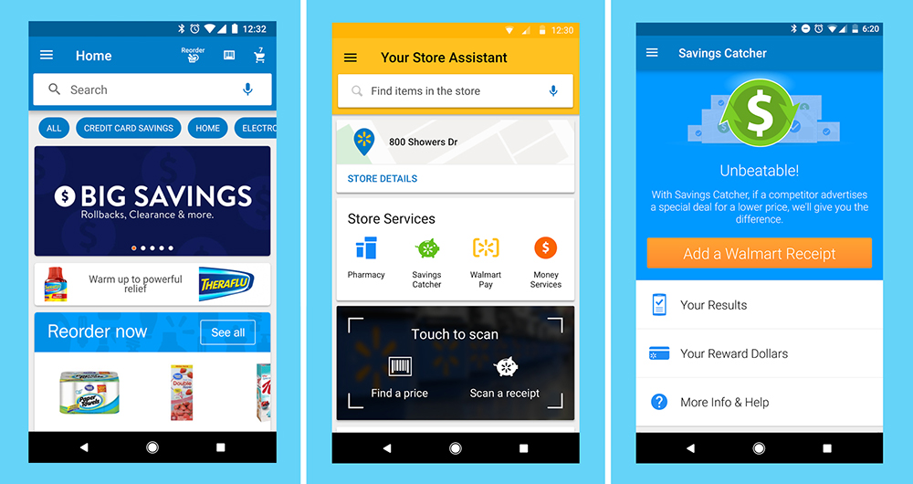
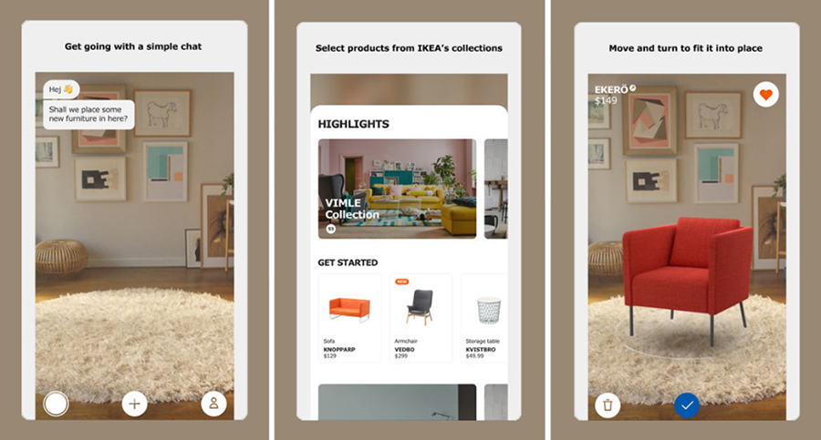
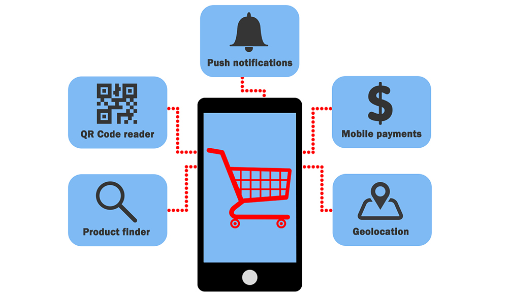

It's mind-blowing! A couple of years ago they said that the number of smartphones exceeded the number of toothbrushes - fact or fiction, who knows, and now… we've already got a <a href="https://itunes.apple.com/lu/app/oral-b-app/id698092608?mt=8" rel="nofollow" target="_blank">mobile app for electric toothbrushes</a>. Why do you think that apps are being created left, right and center? Because everyone and their mom seems to be smartphone holics. We all love facts and digits. So, here are some statistics on <a href="https://techcrunch.com/2018/01/17/global-app-downloads-topped-175-billion-in-2017-revenue-surpassed-86-billion/" rel="nofollow" target="_blank">app downloads, revenue</a>, <a href="https://techcrunch.com/2018/01/16/time-spent-in-apps-grew-just-6-last-year-down-from-11-in-2017/" rel="nofollow" target="_blank">time spent in apps</a> and some pieces of data on why mobile apps are useful for retail business.

As you can see, whilst overall mobile session growth was just 6%, the usage of shopping apps was up 54% in 2017. According to <a href="https://www.statista.com/statistics/461395/us-retail-app-download/" rel="nofollow" target="_blank">Statista</a>, nearly 80% of U.S. consumers already have at least 1 retailer app on their smartphone. Thus, retail customers are getting increasingly comfortable with purchases via their mobile devices.

Many consumers, who have already used retail apps, find it easier to do so than shopping in-store or through the website. So, don't let your competitors to capture the attention of your potential customers by hitting the home screens of smartphones with their own retail apps. Keep reading to find out how to develop a mobile app for retail business, which features to include in it and how much it would cost.

## Examples first. Retail businesses who successfully use mobile apps

To go beyond paying lip service to the benefits of creating an app, let's start with the value of retail mobile applications for business on examples.

Nearly one-third of the U.S. population visits the stores of this company every week. Here's a little hint: "Give me a W! Give me an A!" That's right, it's **Walmart**. The <a href="https://play.google.com/store/apps/details?id=com.walmart.android&hl=en&pid=Website&c=W-FY19Q1-Website-BTH-O-DG-2018OmniPush-WMmobilewebpage-AND-NA-NA&is_retargeting=true&veh=apm&adid=1500000000000040440690" rel="nofollow" target="_blank">Walmart</a> mobile app helps customers shop smart - to plan shopping trips, to check prices in-store, to reorder everyday essentials with a touch, to link a credit card to the app, to scan the barcode to get the price quick, and even to refill and transfer prescriptions from another pharmacy to Walmart.

**Sephora**, the cosmetics retailer, has found through market research that their customers often search for product reviews and recommendations straight from their smartphones in-store. Taking into account this data, Sephora launched the <a href="https://itunes.apple.com/app/sephora-to-go/id393328150?mt=8" rel="nofollow" target="_blank">Sephora</a> retail mobile app, that provides shoppers with customer reviews on products, beauty tips, virtual products try-on for eye, cheek and lip makeup and many more.

Homeware giant **IKEA** opened new horizons with augmented reality app. The <a href="https://itunes.apple.com/us/app/ikea-place/id1279244498?mt=8&ign-mpt=uo%3D4" rel="nofollow" target="_blank">Ikea Place</a> allows youe to place virtual copies of furniture in the home space: "arrange" sofas, tables, chairs, "hang" the shelves on the walls. The user is able to check how a particular product looks in the interior of his house, and purchase it.

So here are Walmart, Sephora, IKEA successful retail stores. What things do they have in common? All these retail companies have their own mobile applications. They note the increase in the number of loyal customers and, as a result, the growth of their sales. So what does custom [mobile app development](https://anadea.info/services/mobile-development) for retail business start with? Let's find out.

## Retail app development. The path to your customers' mobile phones

Mobile development is somewhat reminiscent of shooting a movie: if you want a terrific blockbuster, not a student work, then you need a professional development team to build your app. Basically, there are two choices - [do it in-house or outsource](https://anadea.info/blog/software-development-do-it-inhouse-or-outsource) - and each way has its benefits and side effects.

* **In-house developers.** Unless you can design and develop your retail app yourself or already have an experienced development team on board, it can be a cumbersome process. Spotting and hiring even a single IT expert is a kind of art and you will need an entire team, including UX/UI designer, developer and QA tester, at once. You will also have to deal with employment taxes, paid vacations as well as necessity to buy development tools, devices, and all sort of things needed to actually organize the development. These are huge overheads!

  You can also try an ecommerce app creation platform that lets you <a href="https://getsocio.com/support/mobile-apps" rel="nofollow" target="_blank">make a simple mobile app</a> easily, however this will not work if you would like to build an outstanding app with unique functionality.

* **Outsourcing.** There are a few choices here. You can hire a bunch of freelancers and assign various parts of development to them. There are lots of candidates on freelancer platforms and it seems like a good option. The dark side is that interviewing each of them, assessing their skills and managing a distributed team consisting of freelancers requires quite a lot of time and efforts.

  Another way to create a mobile app for retail store is to outsource it to a software company with a good track record in [retail software development](https://anadea.info/solutions/retail-software-development) and which can take your app through all stages of the development process. This is a more frictionless option that retains the same flexibility and cost-effectiveness as hiring freelancers while ensuring quality, efficiency and faster time-to-market for your app.

So, which development path to choose for your retail business app? This depends on the complexity of your application and your own views on how the development process should go. In any case, you have to take this choice very seriously as it will impact cost, duration and quality of your project.

### Assess perspectives of a retail app in your business area

To start your journey towards building a successful mobile app for retailers, you need to begin by identifying your business objectives and your customers' interests. The ultimate goal is to reach the top of the app stores, just like Scrooge McDuck swimming in gold. Proper preparation is essential to achieving this goal, and addressing the following questions can help you get there.

* Who is your target audience for the app? Consider their age, interests, and the languages they speak. Are they your customers, your employees, or both?
* Will your app be location-specific, or will it be available worldwide?
* What problem or business goal will your app solve, and why would people love to use it? Understanding your customers' needs and pain points is crucial to developing a successful app.
* How will the app work, and what actions do you want users to take? Are there any unique features or functions you want to include?
* What products or services will you be selling through the app? Are there any specifics to consider?
* How do your customers prefer to pay for purchases? Incorporating popular payment methods can improve user experience and encourage more sales.
* Do you need an app management or moderation system? This would allow you to add new products, manage users, view stats and analytics, and more.
* Should your app be available offline, or does it require an internet connection to function?
* Are there any similar apps in the market? What benefits will your app offer compared to its competitors?
* Which mobile platforms will you be developing for – iOS, Android, or both?
* What is your expected timeframe for retail app development and launch? Having a clear timeline and milestones can help keep your team on track and ensure a successful launch.

Having clear answers to these questions is important it it will help a software development company give you an accurate [time and budget estimate](https://anadea.info/free-project-estimate) for your project. Keep in mind that poorly defined goals and requirements is one of leading reasons for IT project failure.

### What features do best retail apps include?

**A retail app is a mobile application that facilitates and enriches the in-store shopping experience, improves the purchase process, provides new innovative ways to make purchase and interact with your brand for your customers.**

Domino, an omnichannel 57-year-old pizza company, puts strong emphasis on innovation and removing friction from the customer experience. Nowadays, over 60% of their orders are received digitally with more than half of those orders placed through mobile. And the gem in their armory for providing friction-free purchase experience is <a href="https://www.dominos.com.au/inside-dominos/technology/zeroclick" rel="nofollow" target="_blank">Zero Click app</a> with a zero-click ordering feature! The customer simply opens the app, waits for 10 seconds and the order is automatically placed. That's it!

> Embracing innovation in order to make a purchase so amazingly easy and fast is something that most people want today and something that can turn them into your loyal customers.

However, it often happens that retail businesses want to squeeze out the maximum from their mobile apps and add too many features from the start. The app becomes heavy and complex - consumers may not want to "clog" their phones with such an app and may get lost in all available options. If you still "want them all!" this would be reasonable to start from [building an MVP](https://anadea.info/guides/what-is-mvp) - a light version with a simple and understandable flow, and then gradually add new features.

Modern technologies deliver nearly endless features list for a mobile app. Let's name some functionalities that apps for retail business can benefit from:

**Product finder.** If you are going to offer your customers hundreds of items, add smart search to your app. It is more convenient to find everything that is available under the given characteristics (for example, color, size, collection) rather than to scroll through the pages of the catalog. A camera-based search feature would be very useful for mobile apps of fashion offline and online retail businesses. <a href="https://techcrunch.com/2017/08/10/asos-adds-search-by-photo-to-its-fashion-ecommerce-app/" rel="nofollow" target="_blank">Asos app</a> is a great example of successful implementation of this feature.

**QR code reader.** Customers, as well as in-store staff, will appreciate QR-scanner in your app since they do not need to type the name of the product manually. They can simply scan the QR code with their smartphone and the app will provide them with product information, reviews, shopping trends, etc. Getsocio QR/barcode scanner, for example, can do it.

**Push notifications.** With the help of push notifications, shoppers can keep track of available specials, promotions, news and receive personalized offers from retailers. Moreover, notifications may be interactive and allow users to take actions, e.g. answer a question, with simple button taps from outside of an app. It's an effective way for retailers to connect with customers on the go, identify their preferences and retarget them according to their responses.

**Mobile payments.** Consumers feel comfortable paying for purchases through mobile apps and there are many alternative payment options growing in popularity. Retail apps need to be integrated with platforms like PayPal, Apple Pay and Android Pay to ensure that shoppers can use their preferred payment method.

**Location-based services.** Using iBeacons for mobile applications provides great opportunities for improving interaction with customers. Thanks to this technology, information comes to the user in the right place at the right time. With such a feature in a retail app, brands can greet customers when they enter their store, offer products based on previous purchases, inform about special offers and deals. Beacons also allow accepting payments, creating virtual guides and engaging in-store games for shoppers.

So, while creating apps for retail stores, it is necessary to keep them simple and focus on creating a seamless, convenient purchasing process. Besides, apps for retailers have to ensure a consistent user experience for shoppers no matter which way of making purchase they choose - mobile, online or in-store. This requires integration of the retail store apps with retail store website, inventory management and other systems used in a retail company. The app may also need an admin panel to manage app users, add new products, view stats, etc.

## Mobile apps for retail industry: from idea to cost

*How much will it cost to develop my app?* This is the question that many clients ask software companies before even explaining what they actually want to do. Those who want to create a retail app are not an exception and the cost of development can range from as little as a few thousand dollars for a basic app to tens of thousands of dollars for savvy custom apps. You can even try some DIY mobile app builders for just a few bucks if their built-in components are sufficient for your app idea. However, the vast majority of business apps requires custom development.

The key factors that define the cost of building your retail app are:
* **Size and scale of the app.** It is quite obvious that the more features you want to add, the more advanced these features are, the more devices and platforms the app should be designed for, the more integrations with third-party services are needed and the more elaborated app management system is required, the higher the app development cost is.
* **Design and development rates.** Though size and scale of the app define the time needed to make it, the rates of developers vary significantly (from $15/hr to over $200/hr) depending on their country income level. So, with the same timeframe and level of quality, the final cost for building an app with US/UK developers may be a few times more expensive than with developers from countries like Ukraine or Belarus.
* **Testing and refining.** The design and development account for the majority of expenses, however testing also constitutes a notable part of an app creation budget. QA is required both as a part of the development process to ensure continuous monitoring of all possible issues and before public release to check that all requirements are met.

In any case, it is not possible to give an estimate for creating an hypothetical retail app. Every project has its specifics and requires an individual approach. The more details you provide to the developers the more realistic estimate you will get.

> [Contact us](https://anadea.info/contacts) for a precise quote and consultation!

Hopefully this information will help you make the first steps towards realizing the full potential of your business with your brand new retail app.

> We are recognized as a top <a href="https://www.designrush.com/agency/ecommerce" target="_blank">E-Commerce Design & Development Company</a> on DesignRush.
