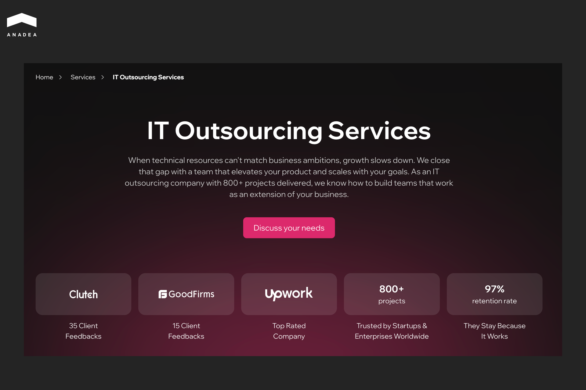
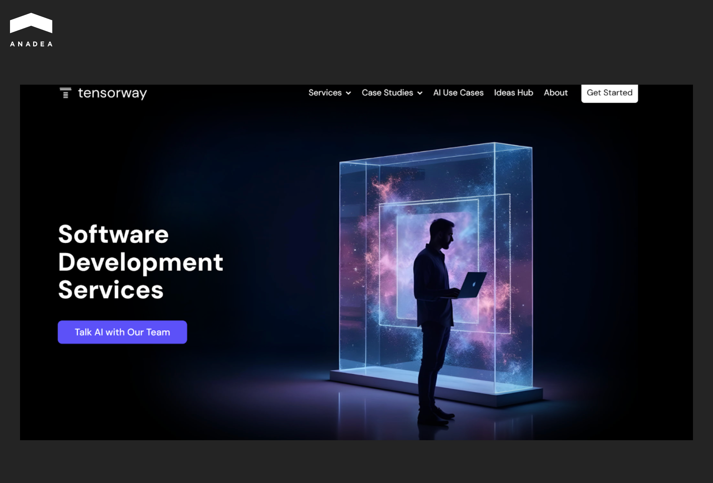
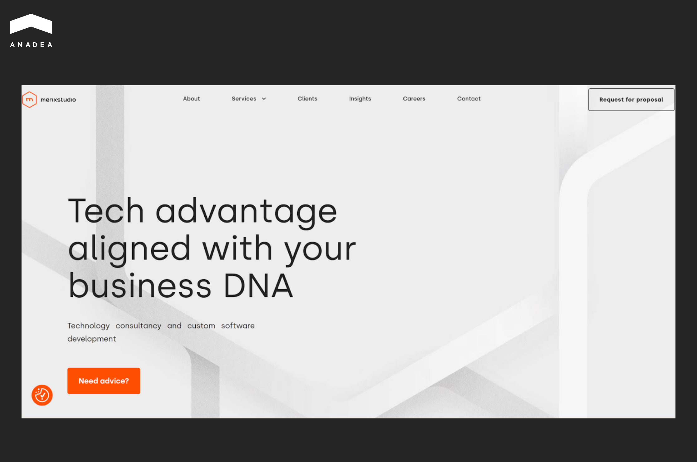
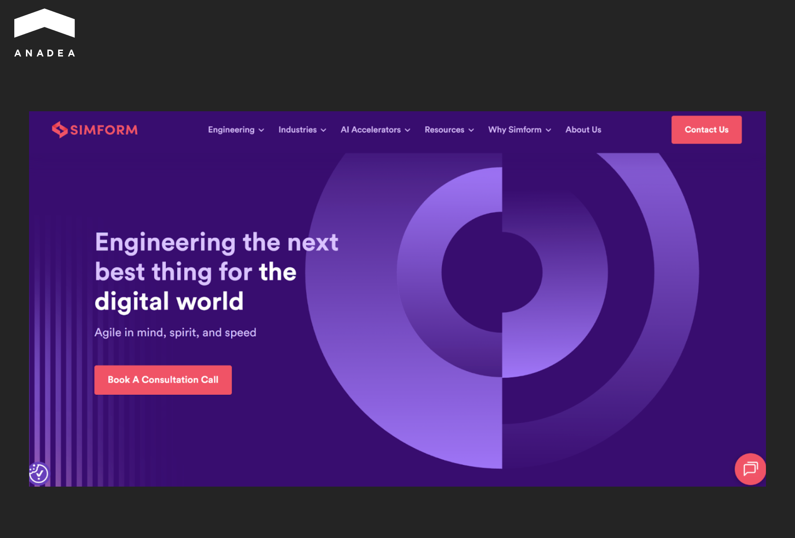
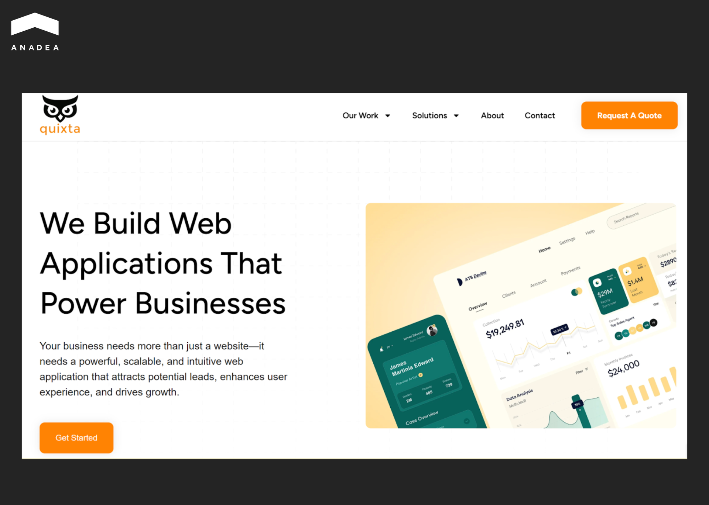

As of January 2026, there are more than 45,800 software development companies registered on [Clutch](https://clutch.co/developers?page=0), including giants with a strong market presence. EPAM Systems and SoftServe are examples of such firms. For over three decades, these giants with Eastern European roots have defined what it means to outsource engineering at scale. 

In 2026, under the influence of tech advancements and the emergence of AI, requirements for service providers are rapidly increasing. Businesses are looking for vendors that can ensure agile delivery and deep technical expertise. But are EPAM and SoftServe the only possible variants for your project? Or should you also consider other alternatives?

This guide offers a detailed SoftServe vs EPAM comparison and introduces five reliable vendors that can become viable options for your [custom software development](https://anadea.info/services/custom-software-development) project.

## EPAM vs SoftServe: Quick Overview

Before we proceed to a detailed EPAM vs SoftServe analysis, let’s start with a quick comparison. The table below contains the key facts about both firms that will help you better understand their core peculiarities.

<table>

<tbody>

<tr>

<td>

<strong>Comparison criteria</strong>

</td>

<td>

<strong>EPAM</strong>

</td>

<td>

<strong>SoftServe</strong>

</td>

</tr>

<tr>

<td>

Founding year

</td>

<td>

1993

</td>

<td>

1993

</td>

</tr>

<tr>

<td>

Headquarters

</td>

<td>

Newtown, Pennsylvania, USA

</td>

<td>

Austin, Texas, USA

</td>

</tr>

<tr>

<td>

Headcount

</td>

<td>

62,350 (as of Q3 2025)

</td>

<td>

11,697 (as of July 2024)

</td>

</tr>

<tr>

<td>

Revenue growth

</td>

<td>

$4.7 billion in 2024 (+0.8% from 2023);

$1.394 billion in Q3 2025 (up 19.4% YoY)

</td>

<td>

This info is not publicly available. Based on its long-term targets, the company planned to reach $1 billion in revenue by 2025.

</td>

</tr>

<tr>

<td>

Public/private status

</td>

<td>

Public (NYSE: EPAM), member of the S&amp;P 500

</td>

<td>

Private

</td>

</tr>

<tr>

<td>

Notable verticals

</td>

<td>

<ul>

<li style="font-weight: 400;">Financial services;</li>

<li style="font-weight: 400;">travel and hospitality;</li>

<li style="font-weight: 400;">retail and distribution;&nbsp;</li>

<li style="font-weight: 400;">business information and publishing;</li>

<li style="font-weight: 400;">media and entertainment;</li>

<li style="font-weight: 400;">software and hi-tech;</li>

<li style="font-weight: 400;">life sciences and healthcare</li>

</ul>

</td>

<td>

<ul>

<li style="font-weight: 400;">Healthcare and life sciences; financial services;</li>

<li style="font-weight: 400;">retail;</li>

<li style="font-weight: 400;">high tech;</li>

<li style="font-weight: 400;">energy, oil and gas; manufacturing</li>

</ul>

</td>

</tr>

<tr>

<td>

Delivery models

</td>

<td>

Global delivery model (onshore, nearshore, offshore)

</td>

<td>

Nearshore-first approach for European and North American clients

</td>

</tr>

<tr>

<td>

Presence

</td>

<td>

Strong presence in the US and Western Europe for architecture and client-facing roles;

massive hubs in India and Poland, with growing hubs in Latin America (Mexico, Colombia, and Argentina)

</td>

<td>

Growing consulting presence in North America and the UK;

heavy focus on Ukraine, Poland, Romania, and Bulgaria for EU clients;

recent focus on Mexico, Colombia, and Chile.

</td>

</tr>

</tbody>

</table>

## Side-by-Side SoftServe vs EPAM Comparison: Services and Differentiators

Now, let’s examine SoftServe’s and EPAM’s core competencies in detail.

### Core Service Lines

Both firms cover the full software development life cycle. However, their main strengths differ.

EPAM Systems leads in enterprise transformation at scale. The company excels at multi-year legacy modernizations and building complex, feature-rich software solutions. Their primary focus areas are financial services (trading platforms) and AI implementation (preparing legacy data infrastructure for AI/ML workloads). The client base includes more than 340 Forbes Global 2000 businesses.

Meanwhile, SoftServe leads in high-touch product experience and specialized data. The company is known for its deep compliance expertise (HIPAA/HITRUST) and human-centric design. This makes it a top choice for healthcare and life sciences projects. In 2025, SoftServe received [Cisco’s AI Trailblazer](https://www.softserveinc.com/en-us/news/softserve-cisco-ai-trailblazer-of-the-year-2025) of the Year Award. This recognition reflects its contribution to AI development through engineered solutions.

### Talent Quality and Team Stability

Both EPAM and SoftServe have built sophisticated engines to supply skills. However, their internal cultures influence delivery quality.

EPAM relies heavily on its massive global recruiting reach and long-standing university pipelines. This approach means the company excels at staffing standard enterprise stacks quickly. Nevertheless, niche roles often experience a slower time-to-fill as candidates are filtered through internal transfer processes. 

Clients typically benefit from exceptional knowledge retention facilitated by standardized onboarding playbooks and deep documentation.

SoftServe takes a more specialized approach. The company blends internal academies with a focus on senior hires, particularly for cloud-certified engineers and AI specialists. This strategy allows them to staff cloud, data, and machine learning roles fast. The company uses internal tools and processes designed to accelerate staffing, like candidate tracking systems and internal talent pipelines. For example, one [initiative](https://www.softserveinc.com/en-us/resources/staffing-tools-accelerate-staffing-process) aimed to hire up to 30 candidates within a 4‑week period for certain roles.

### Engagement Models

The most prevalent model for both vendors is the managed team. In this case, the provider takes full responsibility for team composition and delivery outcomes.

For enterprises that want to own their delivery center, both firms have optimized their Build-Operate-Transfer (BOT) frameworks. This model allows clients to reduce the risk of setting up a legal entity before expanding their own organization with new talent. 

 Time-and-materials remains the go-to for discovery and R&D phases. Fixed-price models are still available but are increasingly rare for large-scale digital builds, typically reserved for well-defined, short-term proofs-of-concept.

### Final Verdict: EPAM vs SoftServe

EPAM is well-suited for organizations requiring massive-scale stability and global reach. It can be the most efficient choice for:

* Complex platform engineering;
* global managed services;
* massive delivery needs;
* stability and long-term roadmap execution.

SoftServe positions itself as an innovation partner for projects where outstanding human experience and cutting-edge data compliance are required. SoftServe is a strong choice for:

* Regulated industries;
* digital product design;
* rapid nearshore scaling;
* high-touch consultative engagement.



## Best EPAM and SoftServe Alternatives for Software Development

EPAM and SoftServe are major players in enterprise-scale engineering. They have established a strong market presence in IT outsourcing. This makes them a primary choice for many companies looking for a reliable partner for their software development projects. Nevertheless, in 2026, businesses also prioritize agility and specialized technical depth over headcount.

Here are five alternatives to consider. These companies match industry giants in capability while also offering focused, niche expertise.

### Anadea

This company was established in 2000, and today it is headquartered in Alicante, Spain. With over 25 years in the market, it has successfully delivered more than 800 projects for more than 400 global clients. The company works with different industries, with a focus on real estate, fintech, healthcare, eLearning, and private equity.

The giants, like SoftServe and EPAM, are often generalists. At the same time, Anadea is a recognized leader in AI and ML development. The team specializes in building custom AI agents and complex web ecosystems using high-velocity frameworks like Ruby on Rails, Scala, and Go.

When it comes to hiring, Anadea maintains a strict quality bar. 100% of their developers hold engineering degrees.

Key strengths: 

* **AI software development.** The team goes much beyond just using APIs. Anadea builds custom ML models and AI-driven automation tools.
* **Custom web and mobile solution.** Anadea’s experts offer full-stack development with a focus on high-performance, secure architectures.
* **UI/UX design.** The company follows a product-first design approach that prioritizes user experience over simple aesthetics.
* **Code audits and technical consulting.** Anadea can join projects to fix or optimize codebases.

Anadea offers flexible engagement models (project-based outsourcing, [staff augmentation](https://anadea.info/services/staff-augmentation),  and dedicated teams), as well as direct developer-to-client communication. Thanks to this, it can become a reliable partner for high-growth startups and mid-market innovators.

### Tensorway

Founded in 2019, Tensorway is an AI-focused software development and innovation company. While EPAM and SoftServe are large, full-spectrum technology and consulting firms, Tensorway offers a more specialized alternative. 

It serves organizations that are specifically looking to integrate advanced AI, machine learning, and data-driven capabilities into their products and operations. Today, Tensorway is trusted by 20+ companies for AI and digital innovation.

Types of services offered by Tensorway:

* AI strategy and consulting;
* AI integration;
* full engineering of AI/ML software;
* AI software modernization
* Support and optimization.

The company’s expertise has been acknowledged in independent industry rankings. For instance, it was named among the Top Artificial Intelligence Companies in Spain by Clutch and Tech Behemoths.

### Merixstudio

Merixstudio is a technology consultancy and custom software development firm. It entered the market in 1999. It is headquartered in Poznań, Poland. The company works with a global client base that includes various businesses, from mid-market firms to enterprise organizations. 

Since its foundation, it has served 250+ clients, including notable names like Expo City Dubai, Six Flags, Juilliard School, Volkswagen, Toshiba, GS1, and HSBC.

With a rich tech stack, its team delivers high-quality custom web and mobile applications, cloud solutions, and digital transformation services.

Merixtudio’s expertise covers a wide range of business domains:

* Smart city and sustainability;
* logistics and facility management;
* financial services;
* entertainment;
* travel;
* manufacturing;
* education.

In 2024, Merixstudio was named to the [Clutch 1000 list of the top B2B service providers](https://clutch.co/press-releases/clutch-1000-fall-2024). It ranked 5th overall and earned 1st among software development companies worldwide.

### Simform

Simform is a digital product engineering and software development company founded in 2010. It has 13 locations in different regions, 1,200+ employees, and 350+ platform-certified engineers. It partners with startups, high-growth tech firms, and large enterprises. Among its clients are the world’s leading companies, like Twilio, Cisco, Cameo, Fujifilm, Red Bull, Mitsubishi Electric, and others.

The range of modern software solutions that its team builds spans:

* Custom applications;
* cloud-native platforms;
* AI/ML systems;
* digital experience engineering. 

Simform implements a co-engineering delivery model. It means that it blends agile, product-centric thinking with enterprise-grade execution to accelerate innovation. Apart from this, it offers end-to-end product delivery and managed application services. 

Each project has a dedicated customer success manager. This expert is responsible for delivery planning and continuous tracking of the project’s progress.

### Quixta

It is a digital product and custom software development studio that started its business journey in 2017. Quixta is based in Bengaluru, India. The company has grown from a boutique agency into a global technology partner that serves clients across more than 27 countries.

Over the years of work, Quixta has accumulated strong cross-sector experience (healthcare, real estate, logistics, media and others) and shaped efficient domain-specific development practices.

Quixta’s key services cover the full digital product development lifecycle:

* Custom web application development;
* MVP and product engineering;
* business web platforms and automation tools; 
* e-commerce and marketplace solutions;
* team extension and dedicated development teams.

The company is known for its competitive pricing combined with quality engineering under an Indian offshore model.

## Transition Plan: How to Switch Vendors Without Downtime

Switching engineering partners may seem to be quite challenging, especially if you plan to do this during the course of the project. However, with a structured transition plan, you can mitigate risk and improve velocity during the handover.

Here is a step-by-step guide for a seamless migration from your current vendor to a more agile partner.

### Phase 1. Audit & Access Control 

What you should do before notifying the incumbent of the termination:

* **Repository audit.** Make sure that the incoming vendor performs a deep code review. They must verify that the build is reproducible, the commit history is clean, and there are no hardcoded secrets or proprietary dependencies locked to the old vendor.
* **Environment access** Audit all IAM roles, VPN keys, and 3rd-party service accounts (AWS, Stripe, Twilio). Prepare a Kill Switch list to revoke access instantly on the final cutover day.
* **Artifact ownership.** Verify that you possess all design source files, infrastructure-as-code scripts, and database schemas.

### Phase 2: Structured Knowledge Transfer

This step is dedicated to specific knowledge transfer sessions for architecture, CI/CD pipelines, database logic, and known bugs. 

The outgoing vendor should be ready to provide all the required documentation, including  API documentation and deployment runbooks.

### Phase 3. Parallel Runs and Shadow Sprints

This is the most critical stage for risk mitigation.

* **Shadow sprints.** The new team observes the old team’s sprint planning and daily standups. They pick up small, non-critical tickets to test the deployment pipeline.
* **Parallel execution.** For critical data processing or algorithm changes, both teams should run the process in parallel and compare outputs to ensure zero regression.

### Phase 4. Cutover and Stabilization 

The cutover presupposes revoking all access for the old vendor. Reset all shared secrets and API keys immediately.

The new vendor enters a so-called hypercare mode with elevated support and monitoring to catch any issues that arise from the transition. This period typically lasts for 2 weeks.

## Final Word

Both EPAM and SoftServe remain the gold standard for large-scale enterprise delivery. However, for many projects, their size can bring higher costs and slower agility. 

As we have explored, alternatives like Anadea offer a golden middle. Its tech expertise can be compared with that of the giants. But at the same time, it ensures the flexibility and cost-efficiency of a smaller team. 

Regardless of the option you choose, always prioritize transparency and never settle for a vendor that doesn’t understand your business goals.

Want to learn more about what Anadea offers? [Contact us](https://anadea.info/contacts) to get answers to all the questions you may have.
