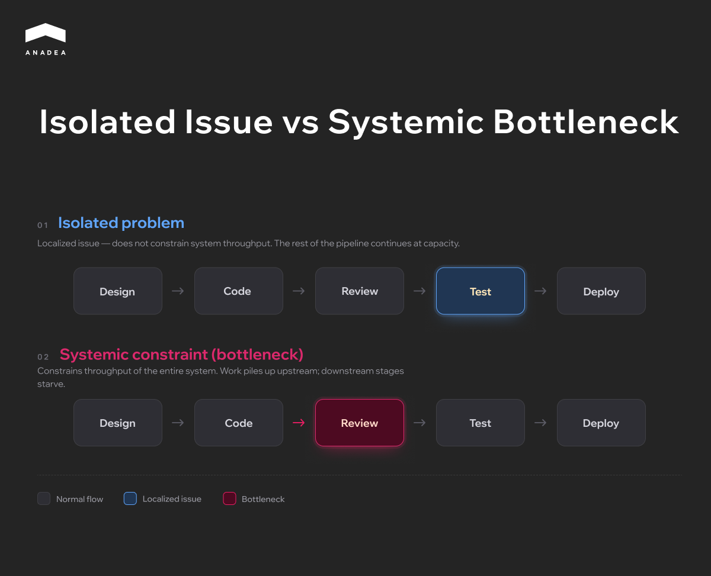
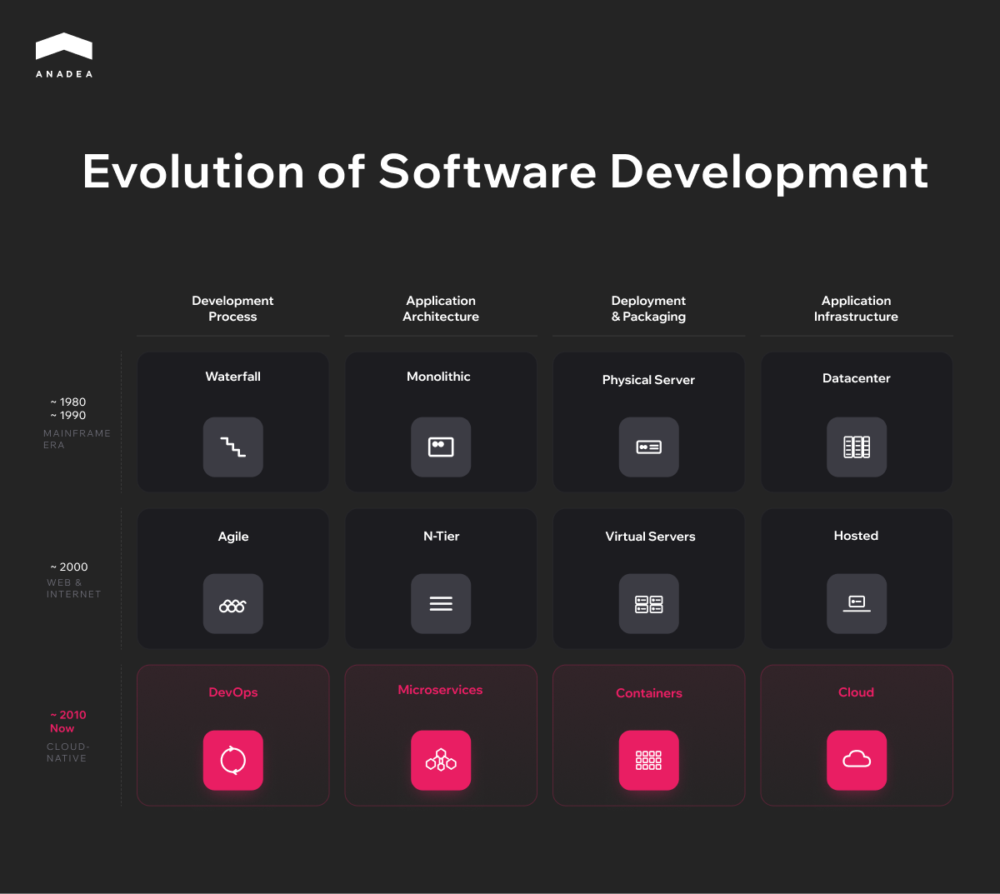
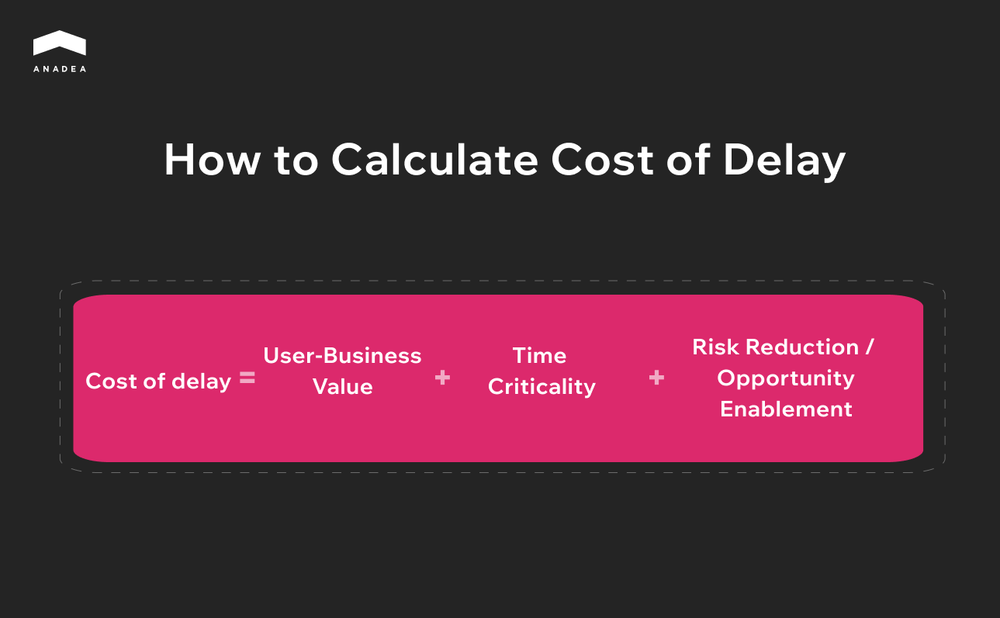
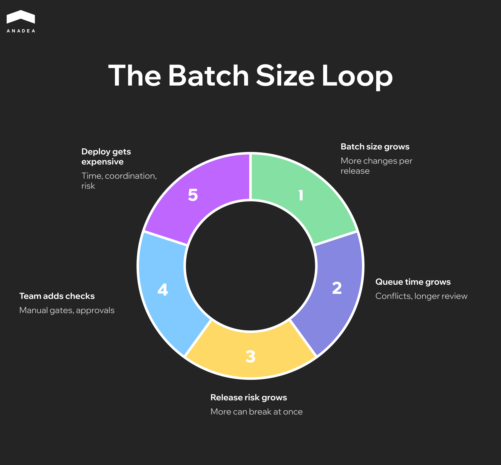

In October 2025, [Faros AI](https://www.faros.ai/blog/ai-acceleration-whiplash-takeaways) published a report based on two years of telemetry from 22 000 developers. The headline number was this. The probability of a production incident on a merged pull request climbed 242.7% during the peak AI adoption period. Time to first review grew by 156.6%. The share of PRs with zero reviews added another 31.3%.

Companies sped up the top of the pipeline and lost control of everything downstream, and software development delays that used to be tolerable suddenly became visible on the roadmap. The [DORA Report 2025](https://cloud.google.com/blog/products/ai-machine-learning/announcing-the-2025-dora-report) framed it differently. AI amplifies the engineering system it runs inside. Healthy systems get faster. Unhealthy ones break faster.

AI didn't create engineering bottlenecks. It simply exposed the software development challenges teams had learned to live with. Back in 2024 none of this was alarming. When code generation gets three times faster, every one of those weaknesses starts showing up on the roadmap as a real constraint.

What follows in this article is four types of software development bottlenecks drawn from Anadea's work across production AI, architectural migrations, and[ 25 years of custom software development](https://anadea.info/services/custom-software-development). Plus four questions that senior leaders should be asking their CTO this quarter.

## What Are Engineering Bottlenecks in Software Development

An engineering bottleneck is the point in a development system where capacity caps the entire downstream flow. Investing in any other part of the pipeline won't lift overall delivery as long as that point stays narrow. Unlike most software development challenges, a bottleneck rarely announces itself. That's why diagnosis calls for a structural approach rather than a quick look at the metrics.

### Isolated Problem vs Systemic Constraint

Not every delivery problem qualifies as a bottleneck. If a targeted fix makes the team feel better but doesn't move the needle on system throughput, what you have is a local issue. Real development bottlenecks reveal themselves differently. You remove one, throughput jumps across the downstream flow, and the next constraint surfaces almost immediately.

The distinction matters for planning. Local issues call for a quick, targeted response. Bottlenecks call for a plan, because removing them tends to touch process, architecture, and org structure all at once.

### Categories of Engineering Bottlenecks

Software development bottlenecks rarely come from a single origin. They usually fall into one of three categories, each with its own source, how it surfaces, and how you diagnose it.

<table>

<thead>

<tr>

<th>

<strong>Category</strong>

</th>

<th>

<strong>What it constrains</strong>

</th>

<th>

<strong>Where it becomes visible</strong>

</th>

<th>

<strong>Why it persists</strong>

</th>

</tr>

</thead>

<tbody>

<tr>

<td>

Process-related

</td>

<td>

The rhythm at which work moves between stages of development

</td>

<td>

Engineering analytics, cycle time metrics, PR flow

</td>

<td>

Teams adapt to the constraint and stop noticing it

</td>

</tr>

<tr>

<td>

Technical

</td>

<td>

The capabilities of the system itself and the ability to evolve it

</td>

<td>

A gradual creep in estimates on the same kinds of tasks

</td>

<td>

The cost of fixing it is high, the cost of inaction shows up on a delay

</td>

</tr>

<tr>

<td>

Organizational

</td>

<td>

The flow of coordination and knowledge between people and teams

</td>

<td>

Conversations and retrospectives, rarely in quantitative data

</td>

<td>

It disguises itself as a process or technical constraint

</td>

</tr>

</tbody>

</table>

The three categories rarely exist in isolation. A process bottleneck is often propped up by a technical constraint, which itself traces back to an organizational decision made years ago. A diagnosis that stops at the first category it finds usually treats the symptom rather than the source.

## Architectural Bottlenecks

Architectural bottlenecks are constraints that live inside the system itself. They don't show up in sprint metrics and they don't surface as discrete incidents.

This is the most expensive category of engineering bottlenecks. Process constraints can be resolved in a quarter. Organizational ones take six months to a year. Architectural ones often require multi-quarter migrations where a single mistake costs production downtime.

### How to Recognize an Architectural Bottleneck

Engineering teams usually feel an architectural constraint long before anyone articulates it at the leadership level. The signals appear in three layers.

1. **In the codebase**. The test suite grows nonlinearly with the size of changes. Certain modules become ones nobody wants to edit, and new features route around them, building parallel logic on the side. Every such workaround is technical debt that the next team pays for with interest. The harder question is how to pay it down without freezing the roadmap, and[ this practical guide to managing technical debt](https://anadea.info/blog/how-to-manage-technical-debt-in-mobile-apps/) covers the prioritization framework Anadea teams use on live products.
2. **In the delivery process**. Estimates on the same kinds of tasks creep up quarter after quarter with no obvious cause. Release cycles stretch. The team starts shipping large PRs instead of small ones because running the pipeline often is just too expensive.
3. **In product decisions**. Entire directions get declined on the grounds of technical infeasibility. New integrations demand work that's out of proportion with their scope. Pivoting the product toward an adjacent segment gets blocked at the system level rather than the team level.

When two of the three layers are signaling at once, the constraint is architectural. When all three are signaling at once, the migration is already overdue.

### Common Classes of Architectural Bottlenecks

<table>

<thead>

<tr>

<th>

<strong>Class</strong>

</th>

<th>

<strong>Symptom</strong>

</th>

<th>

<strong>Typical cause</strong>

</th>

<th>

<strong>Main path out</strong>

</th>

</tr>

</thead>

<tbody>

<tr>

<td>

Tight coupling

</td>

<td>

A simple change touches several modules

</td>

<td>

Shared state or direct calls between domains

</td>

<td>

Separate domains into independent services with async communication

</td>

</tr>

<tr>

<td>

Data layer mismatch

</td>

<td>

Real-time queries running on a batch-optimized database

</td>

<td>

The data architecture was designed around one use case

</td>

<td>

CQRS, read replicas, or a dedicated analytical layer

</td>

</tr>

<tr>

<td>

Legacy runtime

</td>

<td>

Library upgrades and security patches get blocked

</td>

<td>

An outdated framework or language version

</td>

<td>

A staged runtime migration in tight windows

</td>

</tr>

<tr>

<td>

Unclear service boundaries

</td>

<td>

Releasing a feature requires coordinating three deploys

</td>

<td>

Boundaries were drawn by teams rather than by domains

</td>

<td>

Redraw boundaries using Domain-Driven Design

</td>

</tr>

<tr>

<td>

Scalability ceiling

</td>

<td>

Horizontal scaling is blocked by the design itself

</td>

<td>

Sticky sessions, shared state, a monolithic DB

</td>

<td>

Pull out stateless components and decouple storage

</td>

</tr>

</tbody>

</table>

These classes rarely show up in pure form. Tight coupling eventually leads to data layer mismatch. Unclear service boundaries naturally evolve into a scalability ceiling as load grows. Diagnosis starts with one class, but the migration plan has to account for every visible interconnection.

### Monolith-to-Microservices as the Most Common Transition

Migrating from a monolith to a modular or service-oriented architecture is the most common architectural transition and also the one written about more than any other. That doesn't mean microservices are automatically better. A well-structured modular monolith is often optimal for teams under 50 engineers and products with a single domain. Moving to microservices makes sense when the monolith has already become a bottleneck. The stakes climb higher in regulated domains. For fintech specifically, Anadea has documented a step by step roadmap for[ future-proofing legacy systems without breaking compliance](https://anadea.info/blog/legacy-systems-fintech-future-proofing-roadmap/), worth reading before you commit to a migration plan.

The diagram shows that architecture is only one of four parallel layers. Each has its own trajectory, and architectural bottlenecks often emerge not from the monolith itself but from the layers falling out of sync. A monolithic system on cloud infrastructure doesn't capture the benefits of the cloud. Microservices on physical servers lose their flexibility. Migrating one layer without the rest rarely delivers the expected result.



## Delivery Pipeline Bottlenecks

The previous section looked at bottlenecks in architecture. This one is about what happens between the moment code gets written and the moment it reaches the user.

Most teams evaluate their pipeline in engineering terms. Build speed, deploy time. Those metrics matter, but they describe mechanics rather than engineering productivity as a whole. The pipeline is the mechanism that turns business decisions into a working product, and the delays inside it carry a financial cost that almost nobody bothers to count.

### Cost of Delay Illustrated by Maersk Line

Cost of Delay is a concept formalized by [Donald Reinertsen in The Principles of Product Development Flow](https://www.researchgate.net/publication/247645409_The_Principles_of_Product_Development_Flow_Second_Generation_Lean_Product_Development_by_Donald_G_Reinertsen). Every week a feature spends in a queue rather than in production has a concrete cost in lost revenue.

One of the best-known examples is the Maersk Line case, documented by [Joshua Arnold of Black Swan Farming](https://blackswanfarming.com/cost-of-delay/). Arnold applied Cost of Delay to Maersk Line's IT portfolio, and once the team started counting, they discovered that one feature had been sitting in various queues for 38 weeks at a Cost of Delay north of $200,000 a week. Roughly $8M of lost revenue.

38 weeks of waiting, not of development. The feature moved from an approval queue into a resource queue, then into a release queue. Maersk, like most organizations, had been optimizing for the efficiency of individual parts of the process rather than the speed of delivery as a whole. At every stage someone was optimizing their own patch, and nobody was watching the flow.

The case is usually presented as an argument for better prioritization. But even perfect prioritization won't help when the pipeline itself manufactures queues.

### Why Expensive Deploys Create a Loop That's Hard to Break

When the cost of moving through the pipeline is high, long builds, manual testing, release coordination across teams, teams naturally grow the size of each release. Why run the whole process for one change when you can batch ten.

The dependency here isn't linear. Reinertsen showed that doubling the batch size can increase wait time by four or five times due to conflicts, coordination overhead, and review sprawl. A loop emerges.

Every step, taken on its own, looks rational, which is why the loop is so durable. The only way to break it is to drive the cost of a single deploy down to the point where small releases become the cheaper choice.



## Organizational Bottlenecks

When delivery slows down, the first reaction is almost always the same. Hire more people. Intuitively this looks right. If five engineers can't keep up, ten should do twice as well.

Frederick Brooks laid out the problem with this logic back in 1975 in The Mythical Man-Month. His observation was straightforward. Adding people to a late project makes it later. Every new person creates communication links with every existing one, and the number of those links grows quadratically. Ten engineers have 45 communication pairs. Twenty have 190. In practice this means more meetings, more alignment, more misunderstandings, and more conflicting changes landing in the same code. The share of working time spent on coordination instead of writing code grows faster than the number of people writing that code. At some point every additional hire adds more coordination overhead than productivity.

Fifty years on, nothing has fundamentally changed. What has changed is the scale of the consequences.

### Onboarding Into a Broken System

When the bottleneck is structural, a tangled architecture, missing documentation, informal processes, every new engineer goes through the same cycle. For the first two or three months they don't write productive code. They're figuring out how everything works, and that work gets done for them by someone from the existing team. Behind most of these onboarding delays sits a weaker problem:[ knowledge management across agile teams](https://anadea.info/blog/knowledge-management-across-agile-project-teams/) that never got formalized. Knowledge lives in three senior heads instead of in documentation, decision logs, or shared systems.

If you hire aggressively, say ten engineers in a quarter, you're effectively shrinking the team's throughput for three months rather than growing it. Hiring in this case doesn't solve the bottleneck. It amplifies it – engineering productivity drops quarter over quarter instead of climbing.

### When Staff Augmentation Works and When It Doesn't

There are situations where external engineers solve a real problem. If the bottleneck is a missing competency, ML, platform engineering, a migration onto an unfamiliar stack, augmentation closes a specific gap. A team can't do what it doesn't know how to do, and learning from scratch will take longer than bringing in people with the experience.

But if the bottleneck is procedural or architectural, augmentation turns into an attempt to solve a structural problem with a quantitative approach. More people in a broken process means more people standing in the same queue.

Anadea's approach to augmentation rests on engineers contributing from the first week. That's possible not because they somehow learn exceptionally fast, but because the engagement starts with diagnosis. Before adding people, you need to understand whether people are actually what's missing.



## AI Readiness

[Gartner estimates](https://www.gartner.com/en/newsroom/press-releases/2024-07-29-gartner-predicts-30-percent-of-generative-ai-projects-will-be-abandoned-after-proof-of-concept-by-end-of-2025) that at least 30% of generative AI projects will be abandoned after proof of concept by the end of 2025 because of poor data quality, inadequate risk controls, escalating costs, or unclear business value. Most pilots stall on the way to production because there's no architecture underneath them capable of holding them up.

### Three Preconditions Without Which AI Doesn't Make It to Production

An AI component in production isn't a model wrapped in an API. It's a model embedded in a live system with real data and real consequences when it gets things wrong. That requires three things most systems don't have.

1. The first is a data layer with real-time access. Most enterprise systems are built around batch ETL. Data gets collected overnight, transformed, and loaded into a warehouse. For reporting this works. For an AI agent that needs to react to events as they happen, it doesn't. An agent analyzing yesterday's data is making decisions on a stale picture.
2. The second is service boundaries that let an AI component slot into a specific point in the process without rewriting half the system. If a monolithic architecture demands a coordinated release across five modules for a single new endpoint, no AI integration is going to be fast.
3. The third is observability for non-deterministic output. Classical monitoring is built around binary states. A service is up or down, a request went through or returned an error. AI doesn't fall over. AI starts producing worse answers, and without specialized monitoring of output quality nobody notices until the complaints start coming in.

When even one of these preconditions is missing, the pilot stays a pilot.

### What It Looks Like When the Architecture Is Ready

One of Europe's largest PE funds, with assets under management running into the billions of euros, was reviewing thousands of potential deals every year. Each one called for market analysis, evaluation across dozens of criteria, and comparison against prior cases. Analysts were spending roughly 60 hours a week on market monitoring, 15 to 20 of those hours going just to reading news, reports, and press releases.

Anadea built a platform for this fund made up of [five specialized AI agents](https://anadea.info/projects/agentic-ai-platform-private-equity), each closing a specific bottleneck in the deal sourcing process. One agent monitors Factiva and FactSet around the clock, filtering divestiture signals against the fund's criteria. Another handles market sizing, pulling data from Gartner, IDC, Statista and reconciling discrepancies through weighted averages with confidence bands. A third generates structured company profiles from dozens of sources in a single unified format.

The outcome. The team now analyzes more than 5,000 company profiles in a matter of hours, preparation of materials for the investment committee has compressed from days to minutes, and the volume of identified opportunities has tripled, from 15 to 45 leads a month.

The platform integrates internal documents, financial databases, CRM systems, and web-sourced data into a single environment. The architectural decisions, a real-time data layer, clean service boundaries, a unified knowledge graph, were made before the agents ever saw a request. Without that underlying layer, the same agents would have been working on fragmented data and producing fragmented results.



## Four Questions C-Level Should Ask Their CTO This Quarter

Every one of the software development bottlenecks described above shares one trait. It's invisible at the level of business metrics until it starts shaping the roadmap. The four questions below are designed to make the bottleneck visible before it becomes critical.

### What is our architecture making impossible for us right now? 

A concrete answer names the features, integrations, or product directions currently blocked at the system level. That means the team understands its own constraints and can plan a migration. A vague answer, or phrasing along the lines of the system will handle anything, we just need time, points to an architectural bottleneck that hasn't yet been articulated at the leadership level.

### What percentage of engineer time goes into creating value, what percentage goes into friction, and how are we measuring that? 

Friction covers everything that doesn't move the product forward. Waiting on reviews, rerunning flaky tests, coordinating releases, manual testing. An answer with numbers means the delivery pipeline is under control and the team can see its own throughput. The absence of numbers rarely traces back to a lack of tooling. More often it means the conversation about engineering productivity is happening at the level of feelings rather than systems.

### If we had to ship an AI feature to production in three months, what would break first? 

This question stress-tests every layer at once. The answer reveals where the system isn't ready. In the data layer, in service boundaries, in observability, or in the release process. A ready answer is the first step toward a concrete plan. An answer like we'd need to do some research first means that in the current architecture, the AI initiative is going to live as a pilot longer than anyone planned.

### If we hired 20 engineers tomorrow, where exactly would they go, and what would change in a quarter? 

A sharp answer names the teams, the subsystems, and the expected throughput gain. That's a sign the organizational structure can support scaling. An answer that boils down to a distribution across teams without any link to a specific outcome points to an organizational bottleneck. In that situation, hiring reinforces the constraint rather than removing it.

The CTO's business role in this exercise isn't to have every answer on hand. It's to recognize the question that doesn't yet have an answer and put it on the agenda for the next quarter.

## Conclusion

Engineering bottlenecks rarely surface all at once. By the time a constraint reaches the board, it has already cost the company several quarters of strategic options. The most expensive mistake here isn't the bottleneck itself. It's the delay in naming it. If you suspect the roadmap is being held back by something that doesn't yet have a name, [get in touch with us](https://anadea.info/free-project-estimate). We'll help you put it into words.
