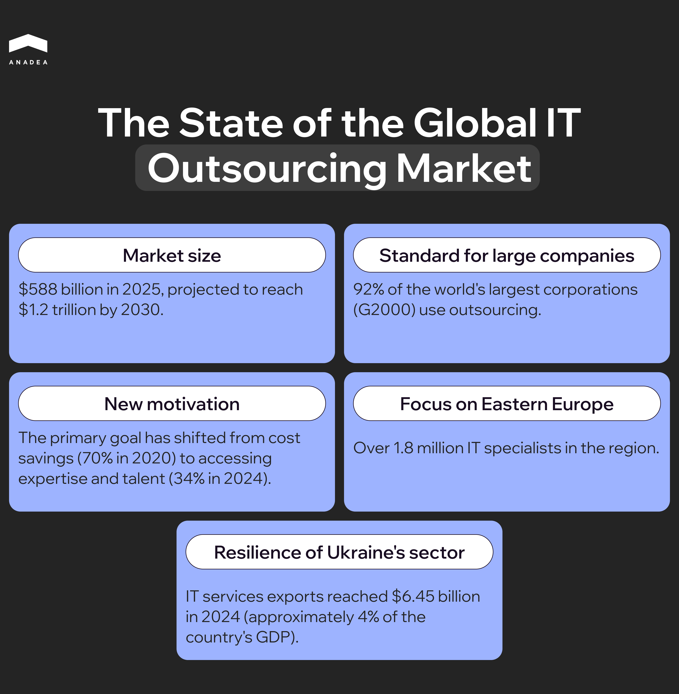
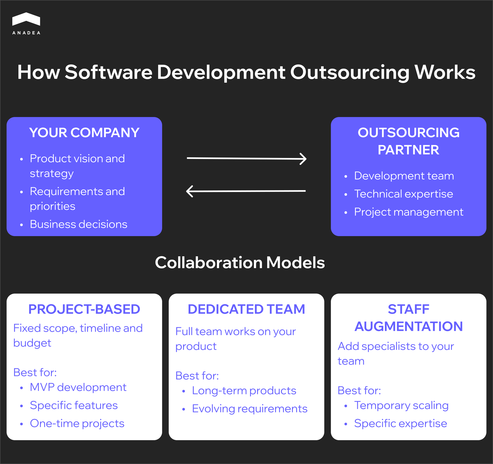
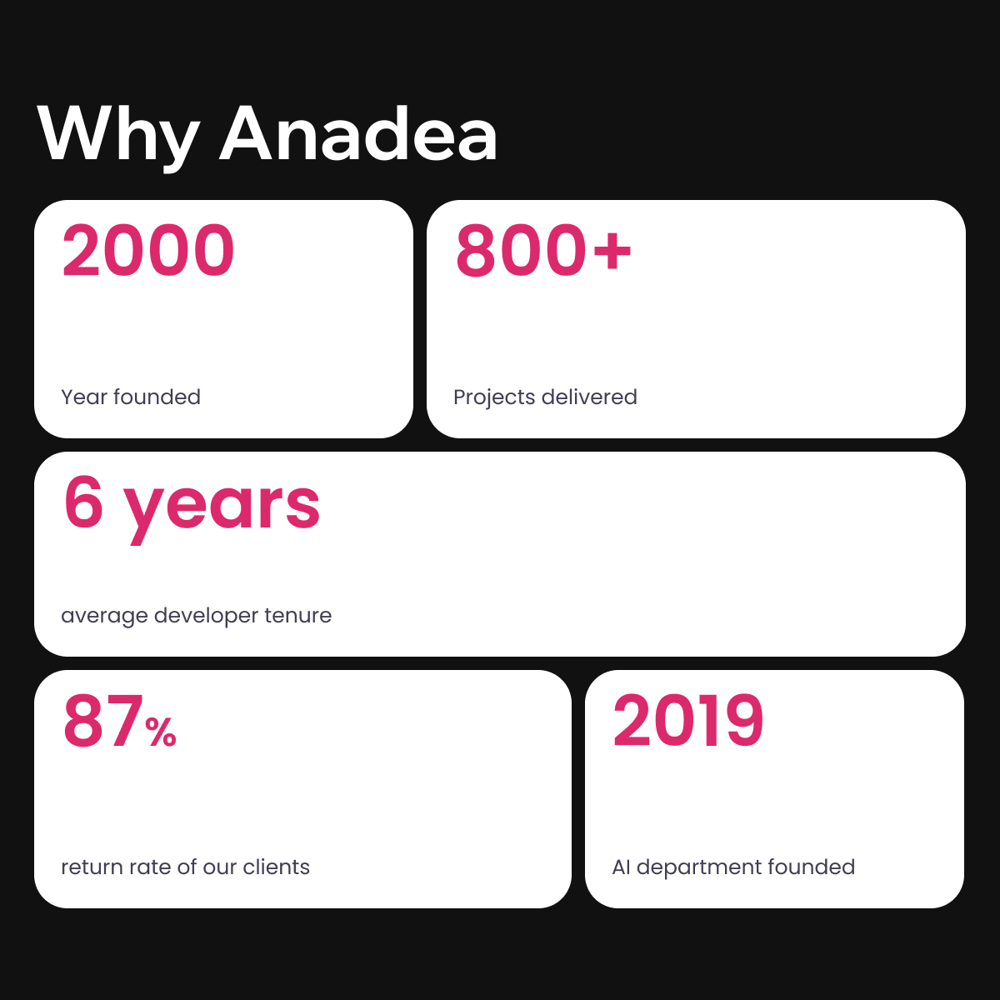

The in house vs outsourcing software development question comes up in almost every company that works with technology. And there is still no clear answer, because there cannot be one. Too many variables are involved: company size, product development stage, available budget, time constraints, even geography.

We are not here to argue that one approach is better than the other. Instead, we will break down how each of them actually works and most importantly, how to figure out what suits you. Because the right choice here saves time, and in development, time is expensive.

## IT Outsourcing: Numbers Worth Knowing

The debate around in house software development vs outsourcing is not new, but the context keeps changing. Before diving into the comparison of models, let us look at the IT outsourcing market as a whole.

The global IT outsourcing market in 2025 is estimated at approximately [$588 billion](https://www.statista.com/outlook/tmo/it-services/it-outsourcing/worldwide), and by 2030 it is projected to reach $806 billion. Other estimates, which include adjacent services, suggest the market could exceed [$1.2 trillion by 2030](https://www.grandviewresearch.com/industry-analysis/it-services-outsourcing-market).

Outsourcing has long ceased to be the domain of startups with limited budgets. According to ISG, [92% of G2000 companies](https://www.demandsage.com/outsourcing-statistics/) (the world's largest corporations) have active IT outsourcing contracts. Among them are Google, Microsoft, and Apple, all of which delegate portions of their infrastructure, development, and support to external partners.

What is interesting is that company motivations are shifting. In 2020, [70% of organizations ](https://www.deloitte.com/global/en/issues/work/global-outsourcing-survey.html)cited cost reduction as the main reason for outsourcing. By 2024, that figure had dropped to 34%. Instead, access to talent and specialized expertise is becoming more important, particularly in AI, cybersecurity, and cloud technologies.

Eastern Europe deserves a separate mention. The region remains one of the key hubs for IT outsourcing, with over [3,500 companies](https://d11n7da8rpqbjy.cloudfront.net/emergingeurope/30984958_1723037112809Future_Of_IT_2024_spreads.pdf) offering development services and a combined pool of technical specialists exceeding 1.8 million. Poland, Ukraine, Romania, and Bulgaria rank among the top destinations thanks to a combination of highly skilled developers, cultural proximity to Western markets, and competitive pricing. Salaries here are on average 46% lower than in the United States.

Despite geopolitical challenges, the Ukrainian IT sector has shown resilience. In 2024, IT services exports totaled [$6.45 billion](https://varyence.com/blog/it-outsourcing-in-ukraine-in-2025-market-overview-rates-and-benefits/), and the industry accounts for roughly 4% of the country's GDP.

## What Is In House Development

In house development means a company builds and maintains its own team of developers. These people work exclusively for you. They are on the payroll, receive salaries and benefits, attend company events, and ideally share the company's values. They are not spread across multiple clients, they do not disappear when a project ends, and they know your product from the inside.

The size and makeup of the team depend on the company's stage. An early stage startup can get by with three to five people, where everyone wears several hats. A mature product company will have dozens or hundreds of specialists organized into cross functional teams, often called squads or feature teams, each working on a separate part of the product.

### Advantages of In House Development

Here is what you gain when development stays in house.

#### A Team That Shares the Company's Values

An internal team consists of employees who immerse themselves in the company culture, understand its mission, and see the full picture. They attend company wide meetings, hear customer feedback, and know why the business makes certain decisions. They suggest alternatives, see risks, and think about the end user. This kind of engagement is built over years of working together and cannot be imported along with an external contractor.

#### Direct Communication Without Intermediaries

Product development involves a constant flow of changes. When a team works nearby, whether physically or in the same time zone, these conversations happen in real time. This speed is especially critical during active development phases or right after a release, when every day of delay means lost opportunities or dissatisfied users.

#### Protection of Intellectual Property

Code, architectural decisions, algorithms, internal tools: all of it stays within the company's perimeter. For businesses where technology is a key competitive advantage, this is critically important.

There is no need to worry that your work might migrate to other projects at a contractor's firm. There is no need to rely solely on NDAs, which are difficult to enforce if violated. Control over IP remains complete and unquestionable. This is especially relevant for companies in regulated industries such as fintech and healthtech, where requirements for data and code confidentiality are significantly higher.

### Disadvantages of In House Development

An internal team comes with trade offs that are easy to underestimate at the start. Here is what you should be prepared for.

#### It Is Expensive. Very Expensive

A developer's salary is just the tip of the iceberg. Add taxes, health insurance, paid vacation and sick leave, bonuses, equipment, software licenses, office space or remote work stipends. In the United States, the average developer salary is around $82,000 per year, but the actual cost of maintaining an employee can be twice that.

And these are fixed costs. Whether there is an active project right now or the team is waiting for the next sprint, you are still paying. For startups and small companies, this model can become a serious financial burden, especially during periods of uncertainty.

#### Hiring Is Hard. Retention Is Harder

The IT job market is one of the most competitive in the world. Good developers are constantly being headhunted. You need to convince someone to work specifically for you. And then the retention race begins. Competitors offer more money, more interesting projects, remote work from Bali. Staff turnover in the tech industry reaches 13 to 21 percent per year depending on the region.

#### Scaling Becomes a Problem

Imagine you urgently need to double your team because a major client appeared or an investor wants to see an MVP in three months. With an internal team, it does not work that way. Sourcing candidates, interviews, offers, notice periods at previous jobs, onboarding, and three to four months have passed while you are still in the process.

#### Limited Expertise

Your team knows what it knows. If you suddenly need a specialist in machine learning, blockchain, or a specific legacy system, you will either have to find a new hire (which again takes months) or train someone from the existing team (which also takes months, plus the risk that it may not work out).

#### Continuous Learning

Technology changes faster than anyone can keep up with. What was relevant three years ago may be deprecated today. To keep the team competitive, you need courses, conferences, certifications, and time to experiment with new tools.

These are both direct costs (training costs money) and indirect ones (a person who is learning is not writing code). For smaller companies, maintaining this process systematically is a challenge in itself.

## What Is Development Outsourcing

If in house is about building your own team, outsourcing is about partnering with an external one. You do not hire developers as employees. Instead, you work with a company that already has the right specialists, established processes, and experience with similar projects.

In practice, it looks like this: you come up with a product or an idea, discuss requirements, sign a contract, and the partner assembles a team to match your needs. From there, you either work together until a specific project is completed or collaborate long term.

Among the companies that actively use this model are Google, Slack, Skype, and GitHub. For them, outsourcing was not a compromise due to lack of resources. It was a strategic choice: get to market faster, gain access to specialized expertise, and maintain flexibility.

### Collaboration Models

Outsourcing does not mean handing everything off to someone and waiting for results. The format depends on what exactly you need.

1. **Project based**. This works when you have a clearly defined task with a set scope, such as building an MVP, creating a mobile app, or integrating a payment system. You agree on the deliverable, timeline, and budget, and the contractor takes responsibility for execution.
2. **Dedicated team**. A team that works exclusively on your product. Legally, they are employees of the partner, but in every other sense, they are part of your process. The point is to get a stable team without the administrative burden that comes with hiring.
3. **Staff augmentation**. Targeted reinforcement of your internal team. If you are short a frontend developer for a few months or need a narrow specialist for a specific task, the partner provides the right person, who then integrates into your processes.

Companies often combine these approaches. They start with project based work for an MVP, then move to a dedicated team for product development, and occasionally bring in individual specialists through staff augmentation. For a deeper dive into this model, see our [team extension guide](https://anadea.info/blog/software-development-team-extension-guide/).

### Advantages of Outsourcing

Outsourcing is often seen as a compromise, as if you would prefer your own team but lack the money or time. In reality, for many companies it is a deliberate choice that offers benefits unavailable with an in house model.

#### Predictable Budget 

When you hire in house, you take on obligations: salaries, taxes, sick leave, vacation, equipment. These costs are not going anywhere, even if the project is put on hold or priorities change.

Outsourcing operates on different logic. You pay for work, not for maintaining people. There is also the matter of geographic arbitrage. A senior developer in San Francisco and a senior developer in Krakow or Kyiv may have comparable skill levels, but the invoices will look very different.

#### A Team in Weeks

An outsourcing partner already has people. They have been vetted, they work in coordinated teams, and they have experience ramping up quickly on new projects. From the first call to the start of work can take two to three weeks. When deadlines are tight or a window of opportunity opens, that speed is critical.

#### Access to Expertise You Do Not Have

You have a product built on Ruby, and now you need to add an ML component. Or someone who understands security or the specifics of fintech regulations.

Searching for such people to hire in house is slow and expensive. Training someone from the team takes even longer and comes with no guarantees. Outsourcing gives you the expertise you need right away. A partner who has already done similar projects brings experience: what works, what does not, and where the common pitfalls are.

#### Focus on the Business

Managing a team is a job in itself. One on ones, performance reviews, resolving conflicts, planning career development, quality control, building processes. If you do not have a CTO or an experienced engineering manager, this part can consume a disproportionate amount of time.

With an outsourcing partner, much of this falls on their shoulders. You work at the level of product and priorities rather than figuring out why a developer is burning out or how to set up code review. This is especially relevant for nontechnical founders who want to focus on the business.

#### Flexibility That Is Hard to Get Any Other Way

Business rarely grows at a steady pace. There are periods of active development and periods of calm. There are moments when you urgently need three more people, and moments when there is not enough work for two.

An internal team does not adapt well to these fluctuations. Firing and hiring is painful, slow, and expensive. Outsourcing allows you to scale resources up and down relatively painlessly. One phase ends and you reduce the team. The next begins and you expand. It is not perfect, but it is far more flexible than the alternative.



### Disadvantages of Outsourcing

It would be unfair to talk about outsourcing only in a positive light. This model has its limitations, and it is better to know about them in advance than to encounter them along the way.

#### Less Control Over Day to Day Work

When a team sits in another office or another country, you cannot physically see how their work is organized. Good partners compensate for this with transparency through regular calls, access to the task tracker, and demos at the end of each sprint. But it is still a different level of visibility than when the team lead sits two desks away from you. For those who need to control the process, not just the outcome, this can be uncomfortable.

#### Communication Requires Effort

Time zone differences are an obvious problem. An urgent question that would be resolved in five minutes with an internal team may have to wait until tomorrow. There are less obvious things as well. Language nuances, cultural differences in communication. Nothing critical, but it requires conscious effort from both sides to avoid misunderstandings.

#### Knowledge Leaves With the Team

An external team builds up expertise in your product, but that expertise stays in their heads. If the collaboration ends, the knowledge goes with it. You can minimize this with documentation and proper knowledge transfer, but it does not eliminate the problem entirely. With an in house model, knowledge accumulates inside the company over years. With outsourcing, you are partly dependent on the partner.

#### Not Every Partner Will Be a Good One

The outsourcing market is enormous and highly uneven in quality. Alongside companies that genuinely know how to build products, there are those who simply sell developer hours without much concern for the outcome. Telling one from the other at the selection stage is not a trivial task.

A mistake in choosing a partner can cost months of lost time, damaged code, and the need to start over. That is why due diligence before signing a contract is not a formality but a necessity. If you want to approach this systematically, our [IT vendor management guide](https://anadea.info/blog/it-vendor-management-guide/) covers the key steps.

## The Hybrid Model

The choice does not have to be binary. For companies still weighing in house vs outsourcing software development, the hybrid approach often turns out to be the most pragmatic answer.

A typical setup looks like this: a small internal team is responsible for architecture, key components, and product vision. These are people who know the system inside and out, make strategic technical decisions, and keep the long term picture in mind. An outsourcing partner provides reinforcement during active development phases, helps with areas where internal expertise is lacking, or takes on separate modules or products.

The advantages of this approach are that control over critical decisions stays inside, knowledge accumulates within the company, yet there is flexibility in resources and access to a broader pool of specialists. There is no need to inflate headcount for a peak workload that may last only a few months.

But a hybrid works only with clear division of responsibility. Who makes architectural decisions? Who does code review? How is knowledge transfer organized between the internal and external parts of the team? What tools are used for communication and tracking? Without answers to these questions, instead of synergy you may end up with chaos and conflicts. When evaluating software development in house vs outsourcing, there are several criteria that help structure the decision beyond gut feeling.

## Why Anadea

We have been in business since 2000. Over that time, we have delivered more than 800 [custom software development ](https://anadea.info/services/custom-software-development)projects for clients in the United States, the United Kingdom, Germany, Australia, and the Middle East.

One example of long term collaboration is [StreetEasy](https://anadea.info/projects/streeteasy), one of the largest real estate platforms in the United States, now part of Zillow Group. We have been their outsourcing partner for over ten years, providing support, developing individual modules, and growing alongside the product.

Our strongest expertise lies in PropTech, healthcare, EdTech, and travel. We also have particular experience working with private equity portfolio companies on technical due diligence, optimization, and scaling.

[AI software development](https://anadea.info/services/ai-software-development) has become one of our key focus areas in recent years. LLM integrations, computer vision, NLP, and predictive analytics are not R&D experiments for us but part of products running in production.

What clients most often highlight about working with us is how deeply we engage with projects and how proactive we are. We do not wait for detailed specifications before we start thinking. We ask questions, suggest alternatives, and flag risks before they become problems.

Our collaboration formats include dedicated team, project based, and staff augmentation. We adapt to the situation. The average tenure of a developer at the company is over six years. Some clients have been with us for five, seven, or ten years.

Looking for a technology partner? [Let's talk](https://anadea.info/free-project-estimate).

## Final Word

The in house software development vs outsourcing debate has no winner. Both models work. The question is which one better suits a particular company at a particular moment.

If technology is the core of your business and you have the budget and a long term planning horizon, an internal team will give you maximum control and depth. If you need to start quickly, maintain flexibility, or gain expertise you do not have internally, outsourcing will address those needs more effectively.

Often the best option is a combination: an internal core for strategic decisions plus an external partner for scaling and specialized tasks.

The key is to honestly assess your situation, including your resources, goals, and constraints. And if you go the outsourcing route, invest the time in choosing the right partner. It is a decision that either pays off or costs dearly.
