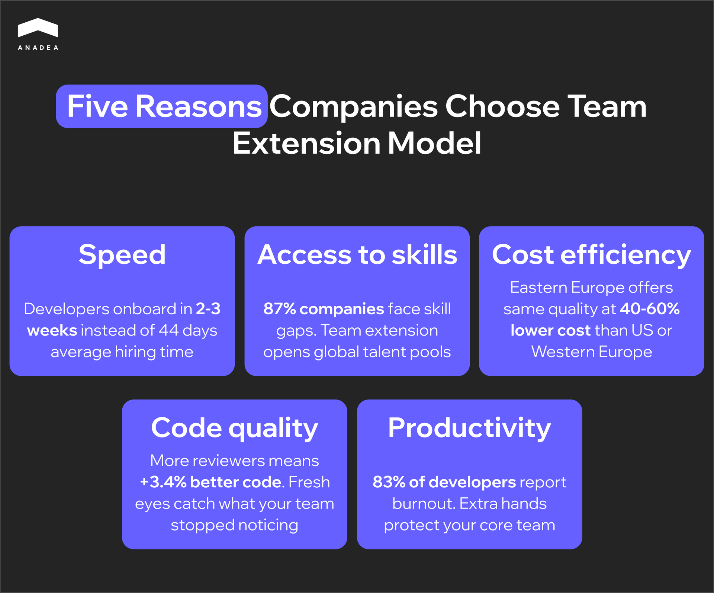
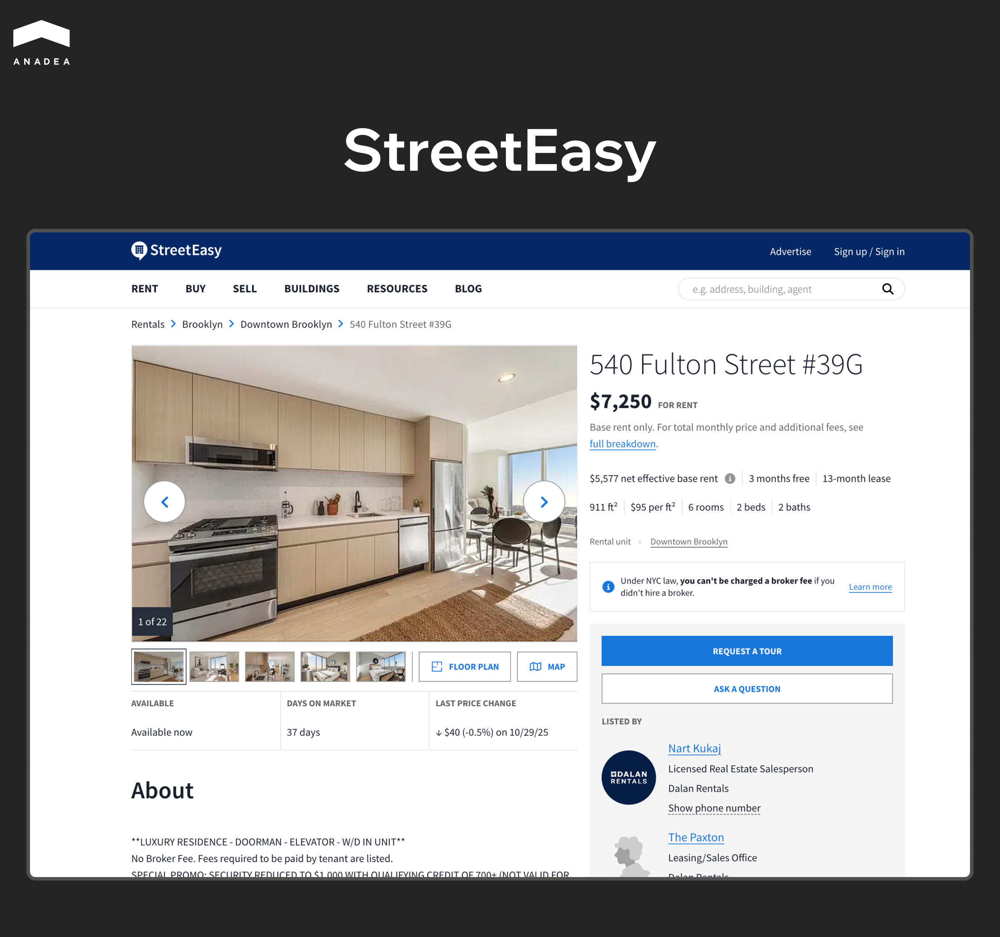
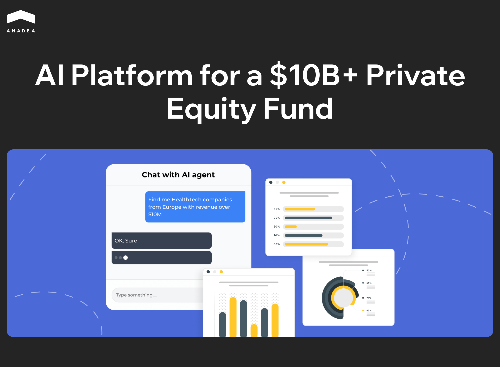

When your product grows faster than your team, it's a win and a headache at the same time. Features sit in the backlog for months, deadlines keep slipping, and developers quietly burn out under a workload that's simply impossible to keep up with.

Hiring takes forever. And it's not your HR's fault. [IDC](https://my.idc.com/getdoc.jsp?containerId=US48223621) projects a global shortage of 4 million IT specialists by the end of 2025. The local talent market just can't keep pace with demand.

Team extension emerged as a direct response to this problem. External developers join your team and work within your processes. On paper they're employed by another company. In practice they're your people.

Sounds simple enough, but reality often looks quite different. Without proper onboarding, clear processes, and solid communication, team extension quickly turns into an expensive illusion of progress. You have more people on the team yet nothing moves faster.

This article is about doing software team extension differently. We'll look at when the model actually works, how to choose the right partner, and which mistakes will derail everything.

## What Team Extension Actually Means

Software team extension is a model where external developers become part of your internal team. They report to your tech lead, follow your processes and share responsibility for the product just like everyone else. The only difference is legal. Their employment contracts sit with a partner company, not yours.

This is not outsourcing in the traditional sense. With outsourcing you hand over a project and wait for results. You manage scope and budget while the vendor manages everything else. Team extension works the other way around. You manage the people directly. You assign tasks, run standups, do code reviews. The partner company handles recruitment, payroll and admin so you don't have to.

### What This Looks Like Day to Day

In a well-run development team extension, members plug into your existing setup. Same Slack channels, same Jira board, same sprint rituals. From a workflow perspective there is no difference between internal and extended engineers.

The partner company stays in the background. They make sure developers get paid on time, handle equipment questions and step in if someone needs to be replaced. But all engineering work and decisions remain with you.

### Where Things Can Go Wrong

Communication takes more effort when part of your team sits in a different timezone. Small misunderstandings pile up if you don't address them early.

Extended developers need proper onboarding. Throw them into the codebase without context and you'll wonder why velocity isn't improving.

If an extended engineer leaves and all their context walks out the door with them, you have a problem. Documentation and shared code ownership matter here more than usual.

And the biggest issue. Some companies keep extended team at arm's length, exclude them from important discussions and micromanage every task. This kills motivation and defeats the entire purpose of the team extension model.

### Team Extension vs Other Models

Before you decide, it helps to see how outsourcing IT team extension stacks up against other ways to bring in development talent.

<table>

<tbody>

<tr>

<td>

<strong>Criteria</strong>

</td>

<td>

<strong>Team Extension</strong>

</td>

<td>

<strong>Outsourcing</strong>

</td>

<td>

<strong>Freelance</strong>

</td>

<td>

<strong>In-house</strong>

</td>

</tr>

<tr>

<td>

Who manages the work

</td>

<td>

You

</td>

<td>

Vendor

</td>

<td>

You

</td>

<td>

You

</td>

</tr>

<tr>

<td>

Integration depth

</td>

<td>

Full

</td>

<td>

Minimal

</td>

<td>

Minimal

</td>

<td>

Full

</td>

</tr>

<tr>

<td>

Typical duration

</td>

<td>

6+ months

</td>

<td>

Until project ends

</td>

<td>

Weeks

</td>

<td>

Years

</td>

</tr>

<tr>

<td>

Product involvement

</td>

<td>

Deep

</td>

<td>

Surface

</td>

<td>

Surface

</td>

<td>

Deep

</td>

</tr>

<tr>

<td>

Time to start

</td>

<td>

2-3 weeks

</td>

<td>

2-4 weeks

</td>

<td>

Days

</td>

<td>

1-3 months

</td>

</tr>

<tr>

<td>

Admin burden on you

</td>

<td>

Low

</td>

<td>

Low

</td>

<td>

High

</td>

<td>

High

</td>

</tr>

<tr>

<td>

Cost

</td>

<td>

Medium

</td>

<td>

Medium-high

</td>

<td>

Low-medium

</td>

<td>

High

</td>

</tr>

</tbody>

</table>

Outsourcing fits when you have a well-defined project and you're ready to hand over delivery responsibility to someone else.

Freelancers cover short isolated tasks lasting a few weeks. They're flexible and cheaper per hour but they work for multiple clients at once.

In-house gives you maximum control. These people are fully yours. But it takes time, costs more and leaves you with fixed headcount even when workload drops.

Development team extension sits in between. People who feel like your own without the overhead of traditional hiring. For those who want to scale their team and aren't ready to let go of control.



## What Your Business Gets Out of This

The rise of AI has pushed market expectations to a whole new level. If you want to deliver results and keep clients, you have no choice but to work fast and work well. The average time to fill a single developer position is [44 days](https://www.shrm.org/content/dam/en/shrm/research/benchmarking/Talent%20Access%20Report-TOTAL.pdf). That's six weeks of tasks sitting idle, product progress slowing down, and momentum slipping away. Stalled progress always turns into money problems.

Software team extension solves the time issue. That much is obvious. But there are other advantages you might not think about at first glance.

### Speed 

With team extension, developers can join your team in two to three weeks instead of months. For a product racing to market, that difference can determine who captures the niche first.

### Skills 

McKinsey reports that [87% of companies are already facing skill gaps](https://www.mckinsey.com/capabilities/people-and-organizational-performance/our-insights/beyond-hiring-how-companies-are-reskilling-to-address-talent-gaps) or expect to encounter them soon. When you urgently need an engineer with experience in a specific framework or someone who has already built a similar integration, the local market rarely delivers. IT team extension removes geographical constraints and opens access to specialists worldwide.

### Economics That Work in Your Favor

A senior developer in the US costs a company [over $150,000 per year](https://www.glassdoor.com/Salaries/senior-software-developer-salary-SRCH_KO0,25.htm) once you factor in salary, taxes and benefits. An engineer at the same level from Eastern Europe will cost 40-60% less. The quality of work remains comparable. The price difference comes down to regional economics, not the qualifications of the people.

### Fresh Eyes on Your Code

This one is less obvious but still important. [Google's DORA 2024 research](https://cloud.google.com/blog/products/devops-sre/announcing-the-2024-dora-report) found that involving more engineers in code review raises overall code quality by 3.4%. External developers bring a fresh perspective. They notice architectural decisions that your internal team has grown accustomed to and stopped questioning.

### Protecting Your People From Burnout

And finally, there's your team. Your actual team. [Haystack Analytics found that 83% of developers](https://www.usehaystack.io/blog/83-of-developers-suffer-from-burnout-haystack-analytics-study-finds) report experiencing burnout, with excessive workload cited as the main cause. When the same engineers carry new features, technical debt and urgent bug fixes all at once, something eventually breaks. Team extension lets you distribute the pressure and keep the people your product depends on.

## How to Choose a Reliable Team Extension Partner

The partner you choose will determine whether software team extension becomes your competitive advantage or a source of constant headaches. The good news is that most problems can be anticipated if you ask the right questions before signing anything.

### Start With Yourself

Before looking at providers, get clear on your own needs. Not at the level of a general request for developers, but specifically.

1. What roles exactly? Two senior backend engineers with Python and fintech experience is a brief you can work with. A few fullstack developers do not. The clearer your requirements, the faster a partner can tell you whether they can deliver. And the less time you waste talking to those who cannot.
2. How long do you need people for? Six months for a specific project or indefinitely because the team is growing? This affects the team extension model and even the type of partner that will suit you.
3. What is your budget? You do not need an exact figure down to the dollar, but you do need to understand the range. Otherwise you risk spending a week negotiating with a provider who turns out to be twice as expensive as you expected.
4. Who will manage the extended development team on your side? If you do not have a tech lead or PM to handle the daily work with new people, the model will not work. External developers need the same management as internal ones. If there is no one to take on this role, look for a partner who provides not just engineers but a team with its own lead.
5. And finally, processes. What do you already have in place? What is missing and will need to be built? An external team will not bring order if there is none inside. They will only amplify what already exists. Chaos scales just as well as efficiency.

Without this clarity you cannot evaluate any provider. Because you will not know what criteria to evaluate them against.

If there is no one to take on this role, look for a partner who provides not just engineers but a team with its own lead. Learn more about [staff augmentation](https://anadea.info/services/staff-augmentation) and how it differs from other engagement models.

### Where to Look

1. The first instinct is to Google "team extension company" and start calling whoever shows up on the first page. The problem is that search rankings are determined by SEO budgets, not service quality. The best partners are not always the best optimized.
2. Clutch, GoodFirms, TopDevelopers are platforms where IT team extension companies receive ratings from actual clients. You can filter by size, location, technologies and industry. But read the reviews carefully. If they all sound similar and are written in perfect English without any specifics, they were probably written to order.
3. LinkedIn works differently. Find companies with a similar profile to yours and see who they work with. Sometimes this is visible directly in posts or employee profiles. You can message CTOs directly and ask who they would recommend. 
4. Recommendations from peers in your industry remain the most reliable source. Someone who has already walked this path will tell you things you won't find in any rating. 
5. Conferences and meetups also work, though slower. Face-to-face conversations give you a sense of company culture that is hard to get from website presentations.

Put together a shortlist of five to seven companies. This gives you enough options to compare approaches, pricing and communication styles.

### What to Look for When Evaluating a Provider

Once you have a shortlist of a few companies, the real work begins. You need to figure out who can actually deliver what you need and who is just good at selling.

#### Experience in Your Industry

Fintech, healthtech, e-commerce are different worlds with different requirements for security, compliance and domain expertise. An engineer who has built payment systems looks at code differently than someone who has worked on marketplaces. Ask the provider about projects in your niche. Ask for case studies, not just logos on a website.

#### How They Vet Their Engineers

Good companies have rigorous selection processes. Technical interviews, test assignments, soft skills evaluation. Ask what percentage of candidates make it through their hiring. If they take everyone who applies, quality will reflect that.



#### Transparency in Communication

Pay attention to how they communicate with you before signing any contract. Do they answer uncomfortable questions? Are they willing to show CVs of specific candidates? Do they honestly admit when something is outside their expertise? 

#### What Happens When Things Go Wrong

A developer might quit in the middle of a project. Or simply not fit your team. This is normal. What's not normal is when a provider has no clear plan for these situations. Ask about the average time to replace someone. Find out if they have engineers on the bench or if you'll be waiting a month while they search for a replacement.

#### Retention Rate

Staff turnover at the provider is your risk. If engineers are leaving the partner company in droves, they will leave your project too. Ask about the average tenure of developers at the company and on client projects. Numbers below a year are a bad sign.

#### Real Feedback From Real Clients

Clutch and GoodFirms give you a general picture but that's not enough. Ask for contacts of two or three current clients and call them. Don't just ask about successes. Ask about problems that came up and how the provider handled them. 

### Trial Period is Non-Negotiable

Never sign a long-term contract without a pilot period. Two to four weeks with one or two developers will show you more than any presentation or promise ever could. You'll see how quickly people get up to speed with your codebase, how comfortable they are to communicate with, and whether the actual code quality matches what you heard on sales calls.

A good development team extension partner will suggest a pilot themselves. They understand that long-term collaboration is built on trust, and trust requires verification. If a provider pushes for a lengthy contract right away and avoids any conversation about a trial, that's a serious red flag.

During the trial, pay attention to what matters. How does the developer ask questions? Can they figure things out on their own or do they wait for step-by-step instructions? How do they respond to feedback? How proactive are they about communicating blockers? You can't evaluate these things from a CV. They only show up in actual work.

One more thing. The trial should be paid. A free test period sounds appealing but it actually devalues the work. A quality engineer won't work for free, and a company that agrees to this will probably send you their weakest people.

### Questions Worth Asking a Provider

Most companies ask surface-level questions in their first meetings. How long have you been in business, what technologies do you work with, do you have experience in our industry. This information is already on the website. It tells you nothing about what the actual collaboration will look like three months in.

Here are questions that will give you real insight:

* How many engineers with the stack I need do you have available right now and when can they start?
* Can you show me CVs of specific candidates before we sign anything?
* What is your retention rate and why do people stay?
* What happens if a developer doesn't work out or leaves mid-project?
* If I'm unhappy with an engineer's work but they're technically completing tasks, how do you handle that?
* How is communication structured and who will be my main point of contact?
* What's included in the rate and what additional costs might come up?
* Can I speak with your current clients?
* Can I speak with a client who left?

## What Does Team Extension Actually Cost

Pricing depends heavily on where your engineers are based. The difference between regions can be significant, so understanding the landscape helps you plan realistically.

North America sits at the top. According to Glassdoor, a senior software developer in the US earns an average of [$173,000 per year](https://www.glassdoor.com/Salaries/senior-software-developer-salary-SRCH_KO0,25.htm). Once you add benefits, taxes and office costs, the total can push well above $200,000 annually.

Western Europe comes next. The UK pays developers an average of [£70,000 per year](https://ravio.com/blog/software-engineer-salary-trends), while Germany sits around €74,000. Switzerland leads the region with salaries exceeding [$115,000](https://ginitalent.com/global-software-engineer-salary-guide-2025/).

Eastern Europe offers a different equation. Poland leads the region with senior developers earning [$53,000 to $60,000 annually](https://www.index.dev/blog/average-developer-salaries-eastern-europe). Ukraine averages $48,000 to $54,000 per year. English proficiency is high, time zones overlap with Western Europe, and the quality of work is comparable to more expensive markets.

Latin America has emerged as a popular nearshore option for US companies. Countries like Brazil, Argentina and Mexico offer rates similar to Eastern Europe with the added benefit of real-time collaboration during US business hours.

Asia provides the lowest rates, often [$20,000 to $40,000 annually](https://theemployerofrecord.com/blog/services/average-software-engineer-salary-by-country). India remains a major outsourcing hub with developers earning $7,700 to $30,000 per year. However, significant time zone differences and potential language barriers can create hidden costs in communication overhead and slower iteration cycles.

The cheapest hourly rate is not always the most economical choice when evaluating a team extension model. Factor in communication efficiency, cultural alignment and the true cost of onboarding when comparing regions.

## Anadea as a Team Extension Partner

Anadea has been providing team extension services since 2000. Over these years we have worked with startups, mid-sized companies and enterprises across real estate, fintech, healthcare and private equity. 

Two examples show how team extension works in practice.

### StreetEasy

[StreetEasy](https://anadea.info/projects/streeteasy) is the largest real estate marketplace in New York with over 180 million annual visits. Our team joined the project in 2013 after Zillow acquired the platform. What started as a technical engagement turned into a 12-year partnership that continues today.

Anadea engineers became part of StreetEasy's product team. We led the migration from a monolithic architecture to microservices, rebuilt the search infrastructure and developed new features. The interactive map we shipped in 2022 increased sales lead generation by 115%. Page load times dropped from 10 seconds to 0.3 seconds after we implemented Elasticsearch.

At any given time, 5 backend developers, 4 frontend engineers and 4 QA specialists from Anadea work alongside StreetEasy's internal team. 

### AI Platform for a $10B+ Private Equity Fund

[A European private equity fund](https://anadea.info/projects/agentic-ai-platform-private-equity) came to us with a different challenge. Their analysts were drowning in manual work. Reviewing thousands of potential deals each year, collecting data from scattered sources, preparing investment committee presentations. 

We built an agentic AI platform that now analyzes 5,000 investment opportunities in hours instead of weeks. Five specialized AI agents handle everything from market monitoring to company profiling to business quality scoring. The fund's team reduced screening time by 80% and identified three times more qualified opportunities than before.

The project started in October 2023 and continues as we expand the platform's capabilities.

Beyond team extension, Anadea also delivers end-to-end [custom software development](https://anadea.info/services/custom-software-development) for clients who need a product built from scratch.

## Wrapping Up

Software team extension works when you treat it as a real partnership, not a quick fix for a hiring problem. The companies that get the most out of this model are the ones who integrate external engineers fully, invest in proper onboarding and hold everyone to the same standards. The ones who fail usually make the same mistakes: unclear requirements, poor communication, keeping extended team members at a distance.

Anadea has been building partnerships like this since 2000. Some have lasted over ten years. If your backlog is growing faster than your capacity to deliver, [let's talk about how Anadea can help](https://anadea.info/free-project-estimate).
