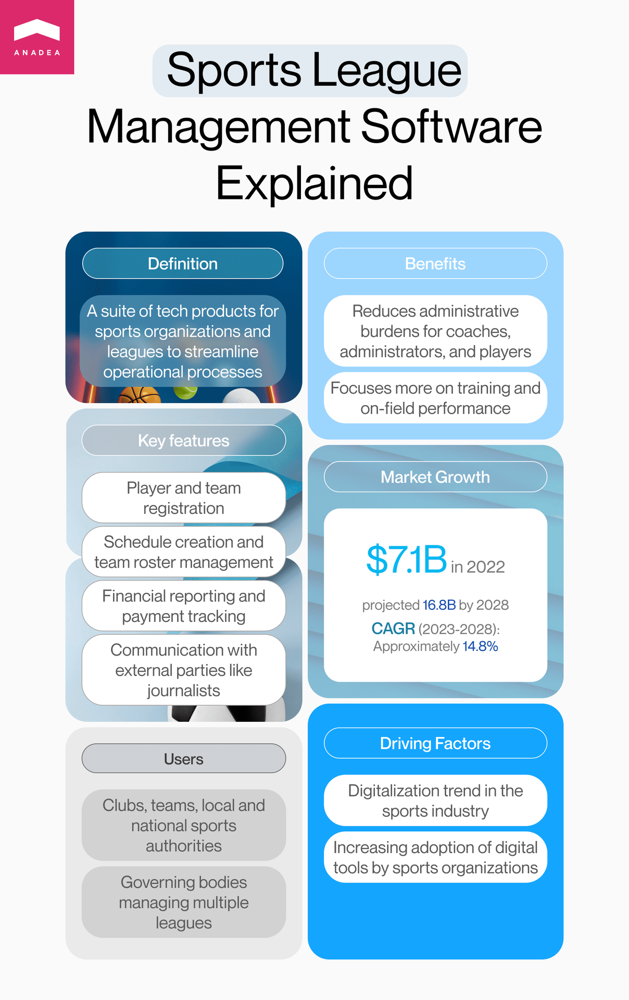
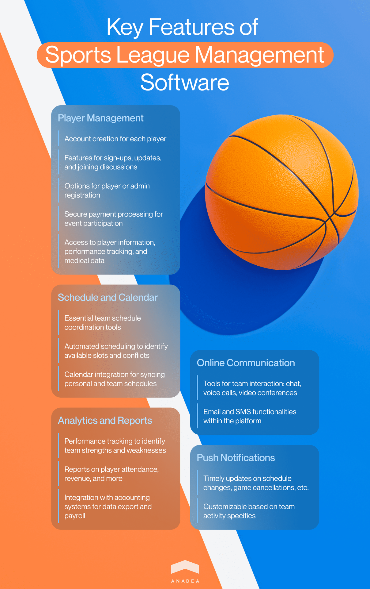
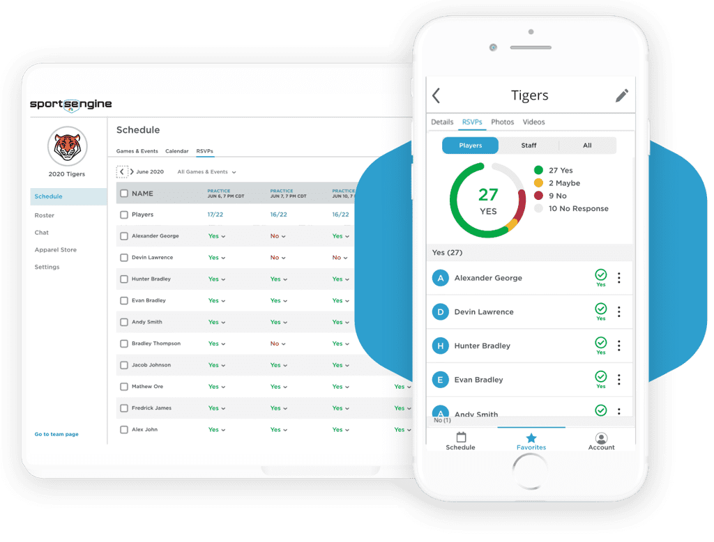
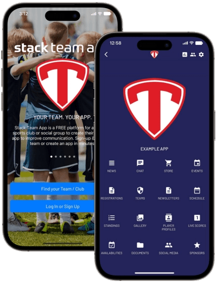
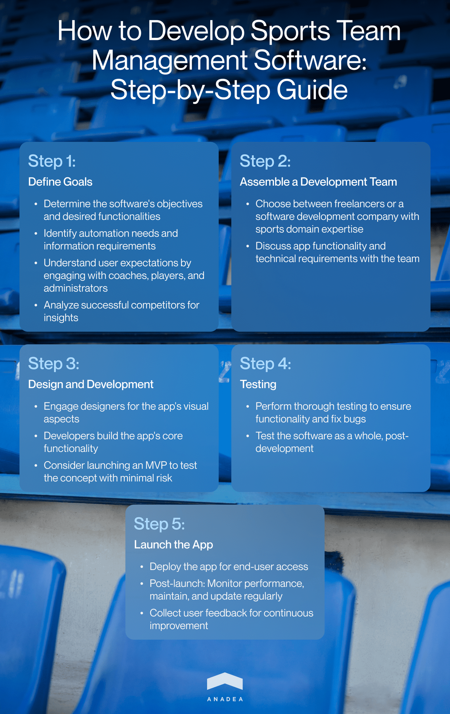

When talking about sports apps, the majority of people start thinking about applications for yoga, fitness trackers, or solutions that help to plan routes for runners. <a href="https://anadea.info/solutions/sports-app-development" target="_blank">Sports app development</a> is gaining momentum and such services enjoy a rather high popularity these days. Nevertheless, the range of software products for this market isn't limited to applications aimed at improving the efficiency of training. The sports industry is one of those that are actively adopting new technologies in its many processes, including the administrative ones. In this article, we are going to talk about one particular type of such tech product for this industry. It will be sport team management software.

We will explain what it is, what benefits the use of such products can bring to sports organizations, and what key points businesses need to bear in mind if they are interested in launching sports team management websites.

## What is sports league management software?

Sports team management software can be defined as a group of tech products that are intended for facilitating, enhancing, and streamlining the operations of sports organizations or leagues. Such solutions typically have relevant functionality that allows users to register players and teams, create schedules and team rosters, prepare financial reports, conduct and track payments, communicate with external audiences (such as journalists, for example), and do many other things that help to ensure the successful work of the entire organization.

This software can be used not only by a particular club or team. It can be of great use for local and national authorities and governing bodies that need to administer the activity of several leagues via a single platform. In other words, a sports team management app (it can be a mobile solution or a traditional web application) helps coaches, team administrators, and players concentrate more on training and performance on the field and focus less on various administrative responsibilities.

In 2022, the sport team management software market achieved a level of $7.1 billion. In 2028, it is [expected](https://www.imarcgroup.com/sports-management-software-market) to hit $16.8 billion which means that the projected CAGR for the period from 2023 to 2028 will be around 14.8%.

The growing market size is explained by the common digitalization of the sports industry which takes place amid the increasing interest from the side of sports organizations in using different digital tools.

## Reasons to use sports team management software

If you asked us why so many organizations rely on sports team management websites or apps today, our answer would be very simple. This way of organizing various administrative processes is very convenient and efficient. But let's dive deeper into the details and consider the key use cases of sports management systems.

- **You can create accurate plans and schedules**. The task of creating a schedule of games and tournaments that your team will participate in can be a very time- and effort-consuming task. When you are doing everything manually, it is very simple to forget, skip, or lose some information. As a result, your schedules may lack important events or your team may face such issues when there is no time to prepare for the game. Even due to one mistake, the entire season may turn out to be a disaster. To avoid such disappointing situations, you can opt for an easy-to-use digital tool that will help you to track the plans of your team, view the history of games and results, monitor the changes in the season stats, and add any important information related to the games. When you have all the team-specific data under one roof, you always know where you can find any information that you need and you will never forget about important matches as your app can send you a notification.

- **It is easy to coordinate all team players**. A sports team management app can become an excellent collaboration tool for the entire sports club. Administrators and coaches can use such solutions for creating individual schedules for each player, managing all player-related data, and informing all team members about any changes in plans for training or matches. It means that such applications can unite all team players and coaches which makes their cooperation more efficient.

- **This software helps to better manage all team-related materials and documents**. Sports team management websites can also be enriched with special sections for maintaining records that are related to all athletes, competitions, games, press conferences, and other events. Thanks to this, it is always easy to quickly find all the required information and share it with journalists, administrative authorities, and other people and bodies to whom it may concern.

Talk to our team

## What are the main benefits of using sport team management software?

There are still a lot of sports organizations that still haven't implemented special tools for managing their players and coordinating their activities. If they are ready to change their approach to management, they should be aware of the following advantages that they can leverage thanks to these software products.

- Efficient and easy coordination;
- Better accountability;
- Optimized operational costs (thanks to making processes paperless and much better organized than ever before, it is possible to greatly reduce the required resources for performing the same tasks);
- Higher player engagement and sense of community;
- Enhanced communication with administrative bodies.

## Essential features of sports league management software

All the above-mentioned advantages and new opportunities that the use of sports team management websites and applications can bring look really appealing. But the possibility of enjoying them greatly depends on the functionality of the software product that you have chosen for introducing at your sports organization.

What are the most important tools and features that your app should be enriched with?

### Player management

A good sports team software will have appropriate tools for creating accounts for each player, which will make it possible for each of them to sign up, check updates, individual plans, join discussions, etc. Depending on the exact type and goals of your app, you can make it possible for players to register on their own or it can be done by an administrator. If your activity presupposes receiving payments from players for participation in different events, your software can also have features for secure payment processing.

With the help of player management tools, team administrators and managers should be able to view information about each player, and track their performance and attendance. It will be also a good idea to add all the important medical data and contact details that may be required in the case of an emergency.

### Schedule and calendar

The functionality for coordinating a team schedule is a must. And actually, here we can stop our description of this point because everything may seem to be already clear. However, it's also worth mentioning that today modern technologies allow us to make this functionality much more advanced than it used to be before. For example, it is possible to leverage automated scheduling. It means that your software will offer you empty slots when your team is available. Or it will inform you if there are any scheduling conflicts.

The integration of the calendar will be also a useful thing as it will allow all team players, managers, and administrators to synchronize their personal schedules with team and/or league calendars.

### Analytics and reports

For managers, it is always crucial to track the performance of the team, detect its strengths and weaknesses, identify the aspects that can be improved, and understand competitive advantages. Reporting and analytics features can help to get the required insights.

The generated reports may be related not only to the performance of players but also to their attendance and revenue. Quite often sports team management software is also integrated with accounting systems for exporting data and conducting payrolls.

### Online communication

Efficient communication is one of the key components of the successful work of a sports team. That's why it is recommended to enrich a sports team management app with tools for organizing interaction between team players, coaches, and managers. Among the possible tools that you can create, we should mention online chat, voice calls, or video conferences, as well as the features for sending emails or SMS directly via the online platform.

### Push notifications

It is a widely applied feature that is common to all users of various applications. Nevertheless, its value in sports management systems shouldn't be underestimated. All team members should be timely informed about various changes that may happen in the team's plans. What information can be sent via push notifications? Actually, everything depends on the peculiarities of your activities but, as a rule, notifications can contain changes in schedule, cancellation of games, and other updates.

Of course, the exact functionality of each product can vary, especially given the fact that such apps can be intended for team sports and individual sports. That's why if you are planning to offer such a product to a wide audience and you expect different sports clubs to use it, it will be sensible to make your app customizable so that every organization will have the possibility to adjust it for its needs. For example, if you have an idea for launching an online platform for team sports, it may be highly useful for you to [follow this link](https://anadea.info/projects/online-platform-for-team-sports) and study the basic information about such products.

Create my application

## Best sports team management software available today

If a sports club needs to find a management software solution, it won't be very difficult these days as there are a lot of off-the-shelves products. Many of them have already proven their efficiency and are being actively used by various organizations from different corners of the world.

We offer you to have a look at some of the examples that we have chosen for you.

### SportsEngine HQ

This sports team software was built to be used throughout entire organizations. It means that a subscription will presuppose that not only league managers, but also players, coaches, administrators, and other staff will be able to use it.

The solution includes all the basic tools for creating schedules, managing teams, communicating with players, tracking their performance, accepting payments, sending notifications, invoicing, and performing various administrative tasks. But it also offers some extra tools like an easy-to-use builder of websites for teams and newsletter functionality. SportsEngine HQ also offers a mobile app.

The solution has a free version with a limited set of available features. However, the price of the subscription is believed to be rather high which is the key disadvantage of this product.

### TeamLinkt

It is a free sports team software tool, which means that it can become a perfect choice for teams with limited budgets. You may ask us how this application earns money if users do not need to pay for it. It has a different business model and is supported by advertisers who are offered to place their ads in the app. Moreover, the application can process payments made by teams for participating in tournaments and it takes a small processing fee for each transaction.

Team administrators and players can create their profiles, elaborate a game schedule, register for events, view their training plans, etc. There are also features for viewing statistics, communicating, sharing photos, and live video streaming, among others.

The platform also has its mobile application which allows users to stay tuned with all the updates regardless of their location.

### Stack Team App

This is another sports team management software on our list that can be used for free. This platform offers all the required tools for creating mobile apps with dynamically changing websites that will help social groups and sports teams enhance their interaction.

It has a range of useful features that teams can choose from for designing their applications. For example, there are tools for tracking the presence of players at games and training, as well the tools for creating schedules and managing documents, selling merchandise, and accepting payments. You can also leverage the benefits of conducting surveys within your team, creating a news feed, or communicating with the help of an in-app chat.

## Why build custom sport team management software?

While the number of ready-made solutions is continuously growing, a lot of organizations prefer to turn to custom software development services. And this idea is true not only when we are talking about sports team management websites but also about software in general. According to the [forecasts](https://www.globenewswire.com/news-release/2022/12/20/2577242/0/en/The-Global-Custom-Software-Development-Market-size-is-expected-to-reach-85-9-billion-by-2028-rising-at-a-market-growth-of-20-3-CAGR-during-the-forecast-period.html)published by experts, the size of the global custom software development market will achieve $85.9 billion by 2028.

Why is custom development so popular? It allows companies to transform all their ideas into real products based on their requirements. As a result, such solutions demonstrate the highest efficiency.

In the case of custom sports management systems, users can get the following benefits:

- Coverage of all the required business processes (and their automation);
- All the most comfortable communication tools;
- All the desired management tools that are needed;
- Support for all the necessary user roles;
- The possibility to ensure different accesses to different user roles in accordance with the organizational structure;
- Support for all the required platforms and devices.

When an organization is building a sports team management app, it is possible not only to get all the tools that will fully reflect the organization's needs but also to avoid overpaying for the functionality that is not required.

## How to develop sports team management software

If you are considering custom development, it will be useful to understand how this process should be organized in advance. The realization of this project will include several important steps with each of them covering a range of tasks.

1. **Define the goals of your sport team management software.** First of all, you will need to understand what you want to get by launching your solution. What tasks should be automated? What info should be accumulated? Who will use your app? If you launch a solution for a precise team or league, it will be helpful to communicate with coaches, players, and administrators to find out what expectations they have. You can also analyze the successful apps that are available in the market in order to detect why users like them.

2. **Find a team that will build your solution and discuss requirements**. If you do not have an in-house team. you will need to find developers. You can work with freelancers or establish cooperation with a software development company like Anadea that has expertise in the sports domain. Together with developers, you will need to discuss the future functionality of your app and the tech stack that will be used.

3. **Let professionals design and develop your solution**. This stage traditionally includes a lot of creative and technical work. Designers will take care of the look and feel of your product while developers will build the functionality of your app. Very often companies prefer to launch an MVP (the initial version of the app that has only the most basic features) first to evaluate the idea itself without serious financial risks.

4. **Conduct testing.** When your sports league management software is ready, it is still too early to deploy it. It should be tested first. Though some tests are usually conducted in parallel with development, after the entire functionality is created, it is necessary to test the solution as a whole and timely fix all the bugs.

5. **Launch your app.** That's the final stage of your software creation. After you have made sure that everything works as it should, the app can be made available to end users. However, even after the launch, it is necessary to conduct monitoring of its performance, maintain, and regularly update it. It will be also helpful to gather feedback from users to improve your system based on their opinions.

Hire app developers

## Final word

Sport team management software can fully change the workflow of a sports organization. By automating various tasks, eliminating paperwork, and uniting a lot of processes on a single platform, it is possible to greatly increase the efficiency of managers' and administrators work. Moreover, thanks to such solutions coaches and players can get access to all the latest updates related to the schedule of training sessions and games.
 Thanks to the possibility of creating custom systems, you can address even the most specific needs of each team or league.

Already have an idea for a sports team management app? Share your thoughts with us and we will estimate your project costs for free.

Get in touch

## Frequently Asked Questions

### Who uses sports management systems?

Such systems can be used by coaches, team administrators, managers, players, and their relatives, as well as various sports administrative bodies. Depending on the goals of such an app, there can be also features for facility managers and companies that organize sports events.

### How much does it cost to build sports league management software?

The cost of custom software development is always calculated based on a row of parameters, such as app complexity, the required tech stack, the number of integrations, as well as the rate and size of the team that you are working with. It is possible to estimate the budget for your project only after analyzing your requirements. On average the investments in products with basic features start at around $15,000-$25,000 and may go higher in the case of more complex solutions.
