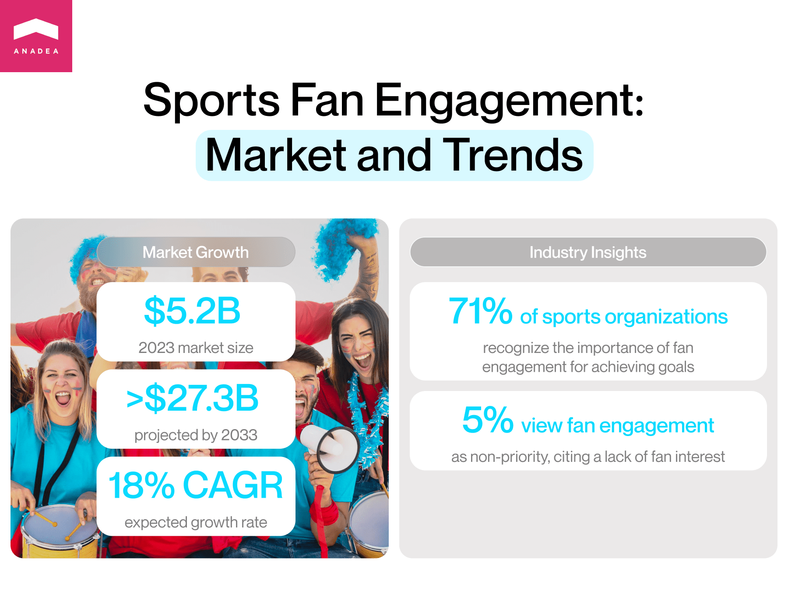
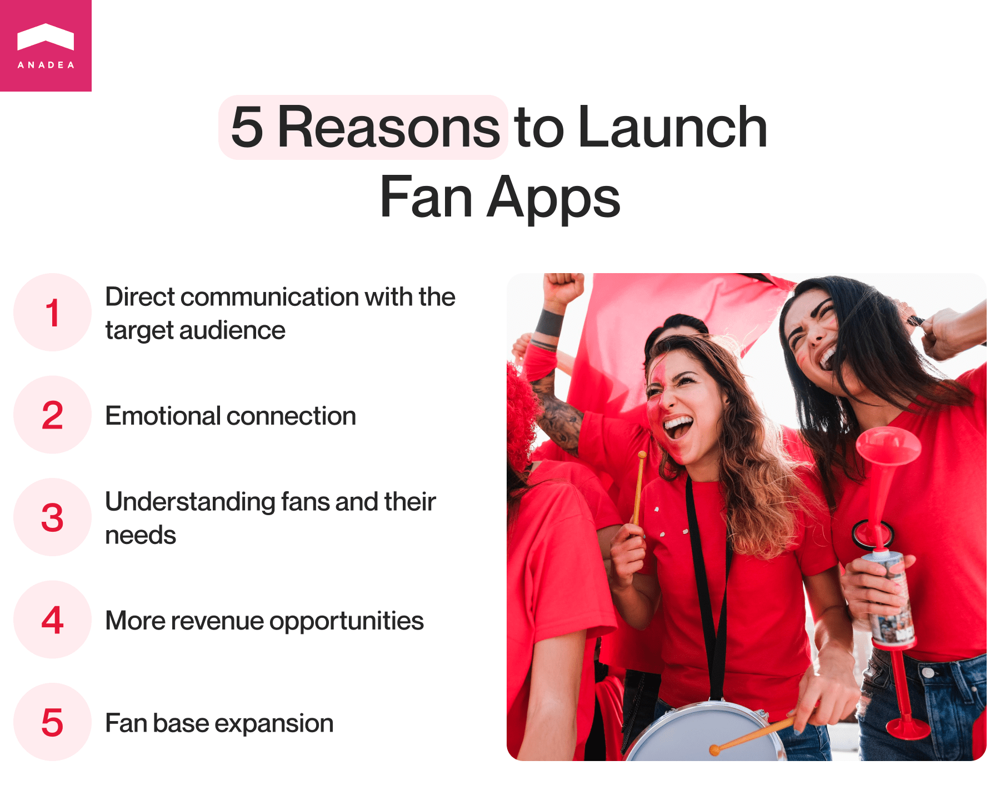
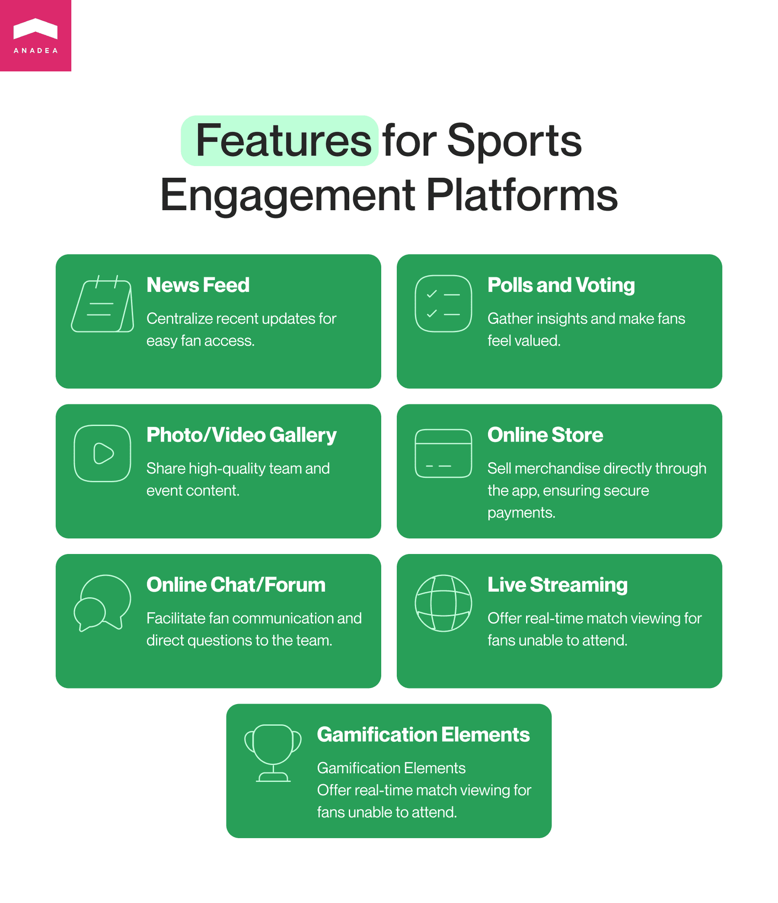
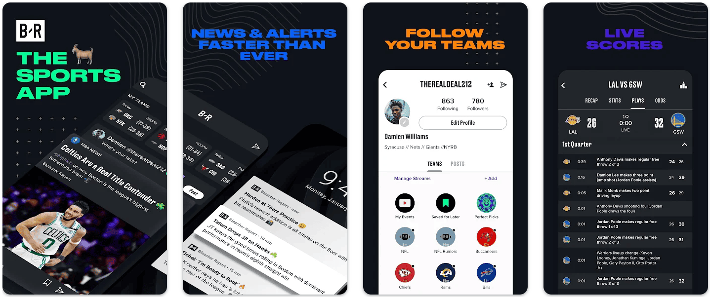
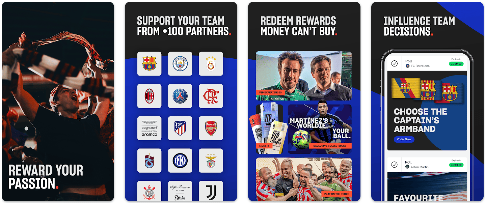
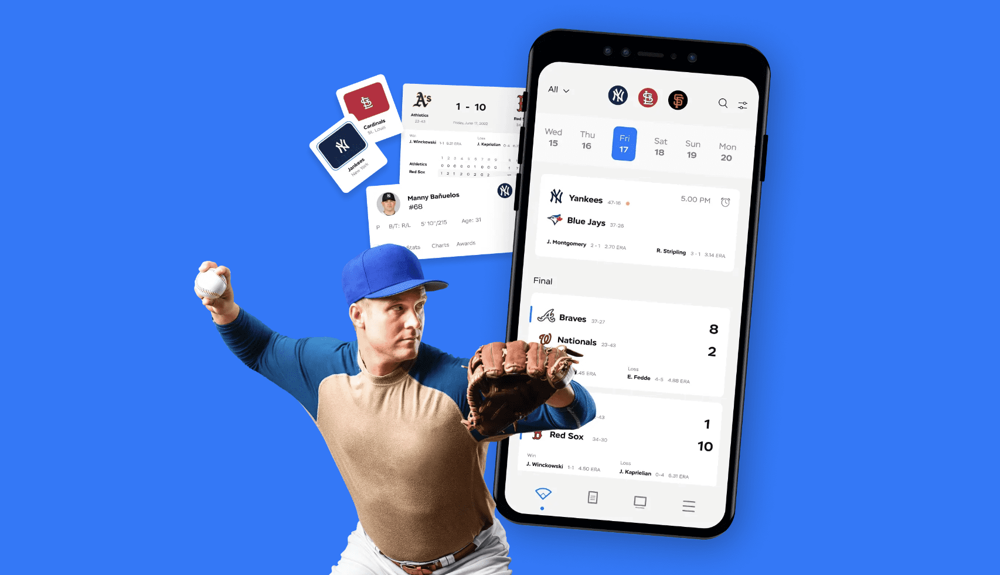

When somebody is talking about <a href="https://anadea.info/solutions/sports-app-development" target="_blank">sports app development</a>, people would typically think about solutions built for training. And it is a very clear association given the wide adoption of such applications. However, the category of sports software products is much bigger than that and unites a lot of groups of solutions and fan engagement platforms are also among them. In this article, we are going to talk about the development of sports fan apps, the role that they play in the sports industry, and the key tasks that can be solved with their help.

## What is a fan engagement platform?

First of all, let us mention that engagement platforms can be launched not only for sports fans. Such solutions (apps or websites) can be also created by different brands with a view to establishing and maintaining closer relations with their target audiences.

The fan engagement industry is gradually growing. In 2023, the <a href="https://futuremarketinsights.com/reports/fan-engagement-market" target="_blank">market size</a> was close to $5.2 billion and it is projected that by 2033, it will hit the mark of over $27.3 billion. It means that the expected CAGR for this period will be close to 18%.

There aren’t any restrictions regarding the forms that such solutions may take. For example, it can be a simple forum or, vice versa, a feature-rich super app. While some brands use such solutions for sharing their own content, others actively encourage their followers to do it, participate in discussions, and share their thoughts. It means that such platforms are focused more on user-generated content.

The same principles are relevant to the development of fan engagement apps in the sports industry. Such solutions allow athletes and sports clubs to build closer connections with their supporters, share the latest updates, and establish a strong community around them.

Digital fan engagement solutions can fully revolutionize the traditional ways sports organizations and players communicate with their fans. Now, instead of just publishing news in sports magazines they can offer different formats of content, updates in real-time, and interactive experiences.

## Sports fan engagement platforms: Benefits

Why does fan engagement matter? It ensures the creation of closer and more valuable connections with fans over a long period of time. As a result, it will become possible to talk about higher loyalty in the community which greatly affects the readiness of fans to support sports clubs not only emotionally but also financially (by means of buying merchandise, visiting events, paying for the most exclusive content, etc.).

Today sports organizations already have a rather good understanding of the role of fan engagement. According to <a href="https://www.choicely.com/state-of-sports-fan-engagement-2023" target="_blank">research</a> conducted in 2023, 71% of organizations (like sports federations and clubs) believe that sports fan engagement helps them achieve their goals. And only 5% said that this aspect is not a priority to them as they do not see any interest from the side of fans in any initiatives of this type.

## Top 5 reasons to launch sports fan apps

### Reason 1. The possibility to communicate with your target audience directly

A lot of sports organizations today use social media platforms to reach their fans. Though it is a good approach, in this case, there is always a risk that the existing algorithms that recommend their content to users will work not well enough. As a result, their content will be shown to people who are not interested in it. With a digital fan engagement solution, you can be sure that your content is consumed by those users who need it.

### Reason 2. Fans will feel a stronger emotional connection with your club

The more unique and personalized formats of interaction and experiences you offer, the more loyal audience you will have.

### Reason 3. You will better understand the needs of your fans

The fan engagement technology allows you to get valuable insights into the interests and preferences of the users of your platform. By getting this information, you will be able to make better-informed strategic decisions and tailor your content to the needs of your target audience.

### Reason 4. You will get new opportunities to increase your revenue

The launch of fan engagement apps traditionally provides sports clubs with new revenue sources. For example, they can offer access to some content on a paid base.

### Reason 5. It can become easier for you to expand your fan base

Passionate sports fans can encourage other people to become fans. Very often when people decide on whether they are ready to support this or that club, they look at the fan community to analyze the general environment. When sports fan engagement is high, other people are highly likely to be interested to learn more about your club.

Get started

## Popular features of sports engagement platforms

As we’ve mentioned earlier, such solutions may come in various formats and types which explains why the list of their features can greatly differ. We offer you to consider the following options for your platform.

1. **News feed**. At first glance, it may seem to be a too simple feature but that’s exactly what your fans may need. You can publish all the most recent information in one place and make it convenient for users to track your updates.

2. **Polls and voting.** Various surveys will help you get valuable insight into the thoughts and preferences of your target audience. At the same time, your fans will feel that their opinions matter.

3. **Photo/video gallery.** You can share high-quality content from matches and conferences as well as some casual photos and videos of team members.

4. **Online store.** You can sell merchandise directly via your app. But in this case, do not forget to take care of the security and reliability of payments.

5. **Online chat/forum.** You can build features that will allow users to communicate with each other. Moreover, you can provide a possibility for fans to ask questions directly to the team.

6. **Live streaming.** This feature will let fans watch matches in real time even if they do not have the possibility to attend a stadium.

7. **Gamification elements**. It would be a cool idea to organize various contests and quizzes that will be able to boost fan engagement. To encourage more fans to take part in such activities, you will need to offer attractive prizes related to the team.

Request a free quote

## Sports fan engagement examples

When you are thinking of building your own fan engagement platform, it will be helpful to have a look at some of the solutions that have been already released and have already gained popularity among their target audience.

One of such apps is **Bleacher Report: Sports News**. It provides access to all the latest news, stats, and live scores across all football leagues, as well as major baseball, basketball, and hockey leagues among others. This info can be of great value for those who participate in fantasy sports. Users can enjoy the benefits of real-time updates and personalized content recommendations. Moreover, there is some social functionality which means that fans can take part in various discussions, share their opinions, and get connected with other people with similar interests.

Among other examples, it’s worth mentioning **Socios** which is a fan engagement and rewards app that provides users with the possibility to buy Fan Tokens. These tokens give fans voting rights. It means that they can participate in the decision-making process and influence the fortune of their favorite clubs.

## Our experience

At Anadea, we have already successfully developed a row of sports software products and in this article, we’d like to tell you about one of them.

Our client had an idea to build a **mobile app for baseball fans**. The app was expected to become a platform that would provide fans, coaches, and athletes with the freshest info about the players and their performance.

After the discussion of the client’s requirements and needs, it was decided to provide a set of features for creating user accounts, building different teams, and monitoring the results and history of each player. The company was also going to use this app as a tool for advertising merchandise and driving sales. The first version of the application has been already officially released. Find more details <a href="https://anadea.info/projects/baseball-fan-app" target="_blank">here</a>.

You can also read about one of our other solutions built for the sports market by following <a href="https://anadea.info/projects/sports-social-network" target="_blank">this link</a>.

Build my app

## Sports fan engagement app development process

Our team has rich experience in <a href="https://anadea.info/blog/how-to-develop-sports-app" target="_blank">building solutions for the sports industry</a> which allows us to gain a deep understanding of how this process should be organized. Though different development teams may have different visions of the steps that should be included in the project realization, at Anadea, we always recommend our customers keep in mind the following plan.

- **Step 1. Study the needs of your fan base.** It is vital to start with an analysis of the interests and preferences of your target audience. Based on this, you will be able to understand what type of fan engagement technology you should invest in, what kind of software should you develop, and what strategies in building interaction with your fans you should apply.

- **Step 2. Create the general idea and prepare your requirements**. When you know what your fans like, you can already build a common concept of your future product, decide on the core features that it will have, and think about the experiences that it will provide to the audience.

- **Step 3. Discuss your project with a development team.** The team should deeply study your requirements, make estimates, prepare a plan, and set timeframes for your project realization. Here you will need to define the key milestone for the development process, speak about the general approaches to product creation, and choose the technologies that will be used.

- **Step 4. Build your solution.** This step traditionally includes a lot of tasks for developers and designers who will create your product in accordance with the set requirements. Quite often before developing a full-scale platform, we recommend our customers build an MVP with a limited set of features. In such a way you can test your idea and have the possibility to introduce the required changes without serious financial losses.

- **Step 5. Test your product.** This stage is highly important as you need to find and fix all the bugs before users start their interaction with your platform.

- **Step 6. Launch your product and further provide the required tech support.** When you are satisfied with the performance and quality of your software, it can be released. Also, you need to regularly track its functioning to address possible issues and introduce necessary updates.

Contact our team

If you want to learn more about the approaches to the development of other solutions for this industry, you can read out article on <a href="https://anadea.info/blog/sport-team-management-software" target="_blank">sport team management software</a> development.

## Instead of the closing word

Today when the distance between celebrities and their fans has been reduced (first of all thanks to the popularity of social media platforms), fan engagement solutions are more important than ever before. When it comes to sports, for fans, it is not enough just to attend games or track the results of matches now. They want to feel a connection with sports clubs and to get the possibility to interact with them. The launch of sports fan apps is a win-win game for teams and their supporters. That’s why you can be sure that the investments in such projects will bring their results.

If you are looking for a professional team that will build such a solution based on your needs and requirements, do not hesitate to contact us. At Anadea, we are always open to fresh ideas and new projects!

Get in touch

## Frequently Asked Questions

### How much does it cost to build a fan engagement platform?

The cost of any software development project should be calculated individually. The final amount is always affected by such parameters as the complexity of the project, the tech stack that should be applied, the number of integrations that you want to have, as well as the size and composition of the team that will work on the realization of your project. Such a project may cost $15K-$30K, however, it is a very approximate figure. To get a better understanding of the size of the required investment, it’s better to contact a development team that will analyze your requirements and provide an estimate.

### Where can I hire developers to build a sports fan app?

For the majority of sports organizations, it is not feasible to have in-house developers. But given the variety of engagement models that exist today in the business world, it is not a problem. You can establish cooperation with a professional software development agency that has the required expertise in the chosen business domain.
