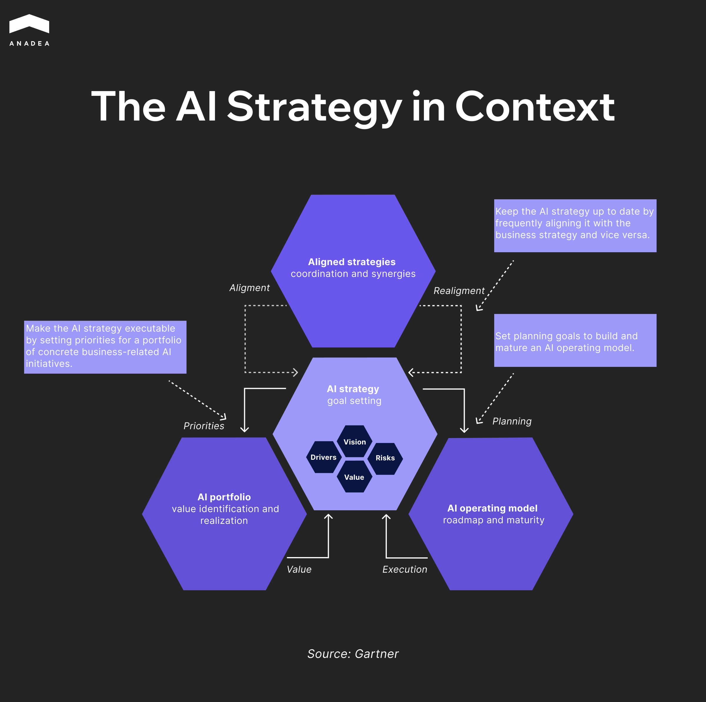
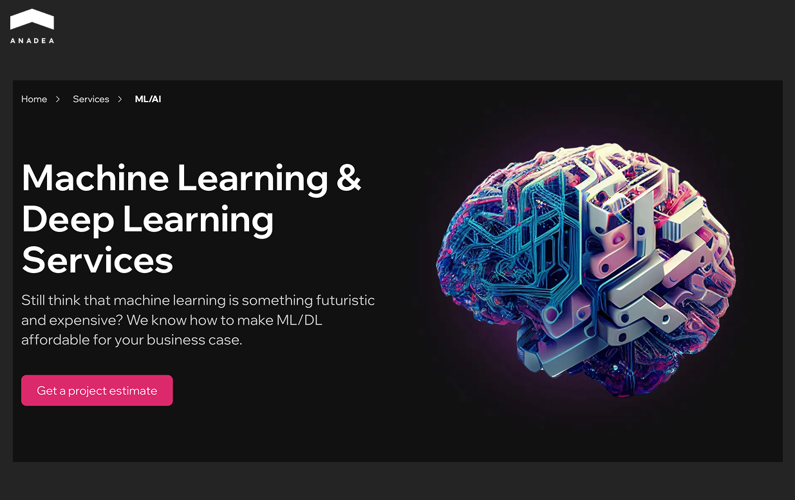
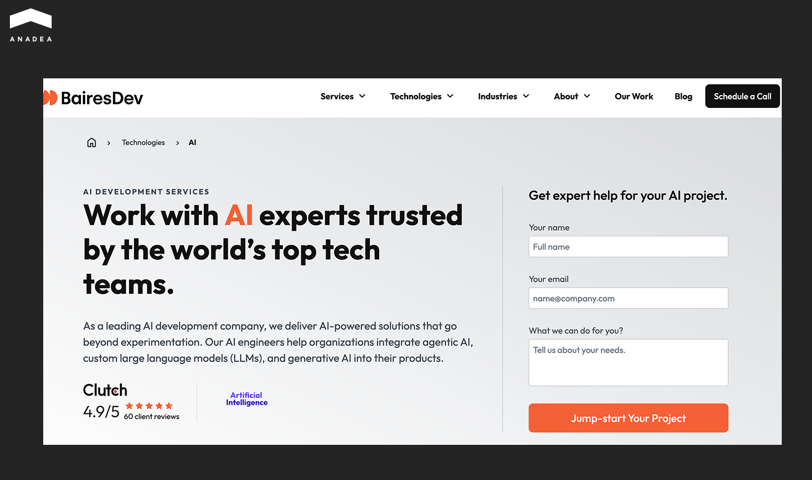
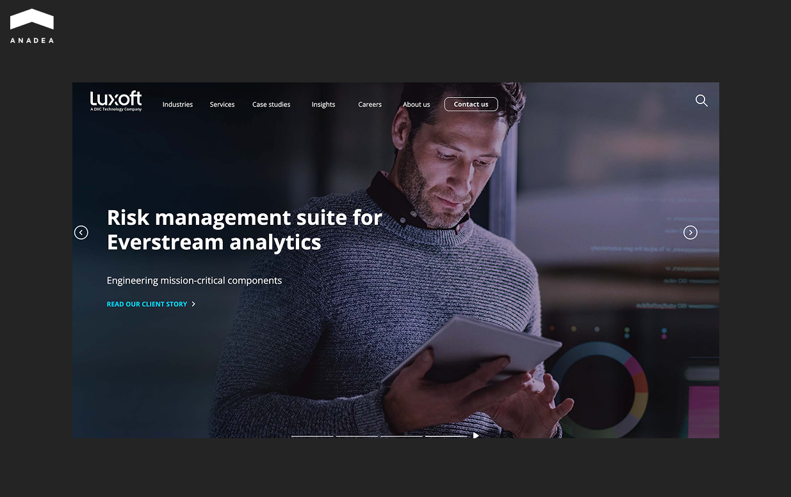
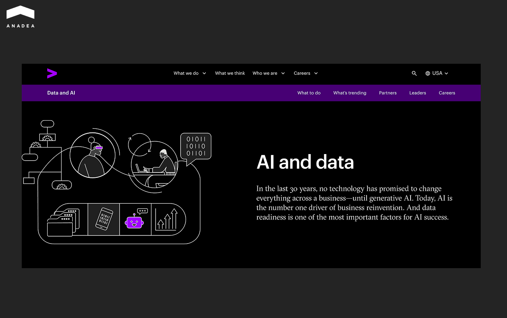
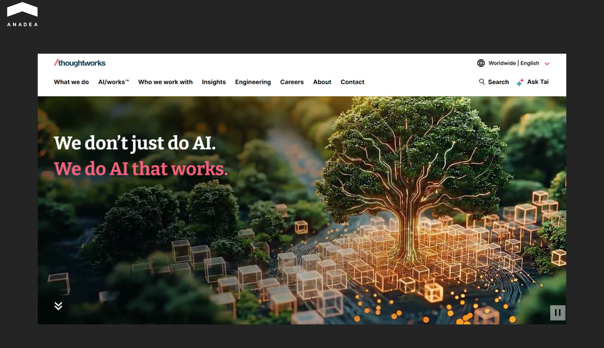
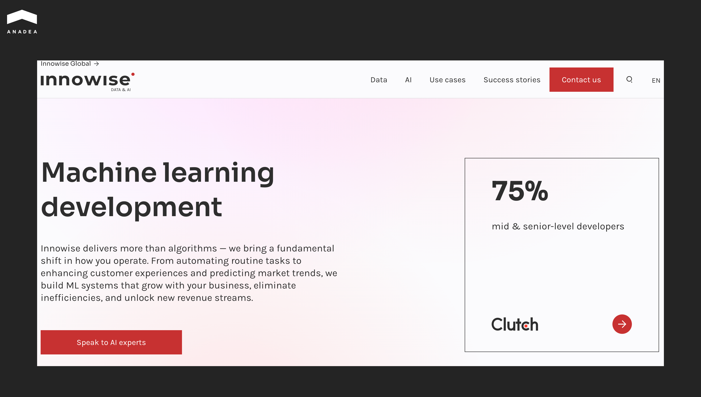
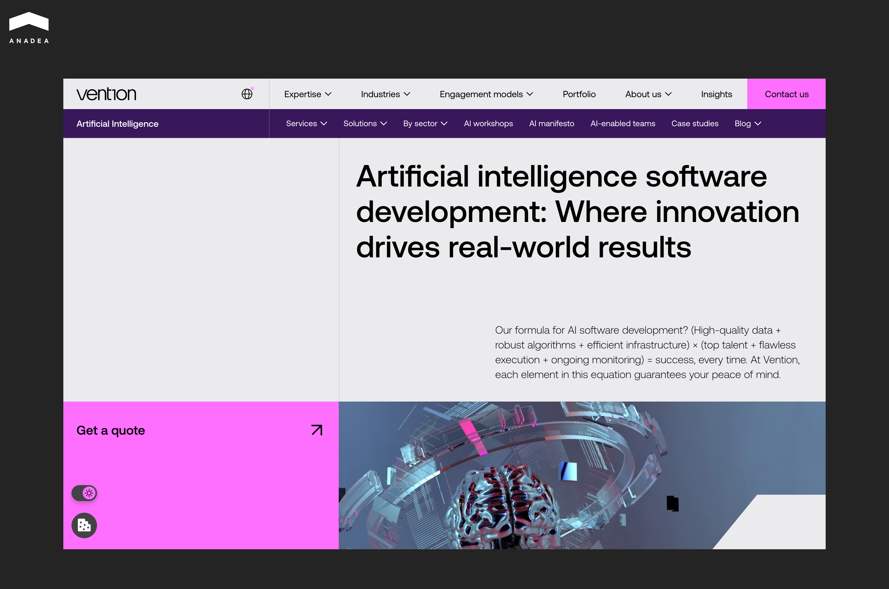

According to the[ McKinsey State of AI 2025](https://www.mckinsey.com/capabilities/quantumblack/our-insights/the-state-of-ai) report, 78% of companies now use AI in at least one business function, yet more than 80% of them report no measurable impact on EBIT. Most organizations spent the budget, ran the projects, and walked away without numbers they could actually stand behind.

More often than not, the technology itself is not the issue. AI tends to arrive before a company is genuinely ready for it.[ Mercer](https://www.mercer.com/en-us/insights/talent-and-transformation/future-of-work/is-your-company-keeping-pace-with-the-ai-revolution/) found that 54% of senior executives believe their business will struggle to stay competitive past 2030 without meaningful AI adoption. That pressure is a large part of why demand for end-to-end transformation partners has grown so consistently over the past two years.

The providers listed below approach AI transformation as a long-term engagement rather than a delivery project. Each was selected based on demonstrated industry experience, real client outcomes, and the ability to operate effectively within complex enterprise environments.

## What AI Transformation Services Actually Include

The term gets used loosely, so it helps to be specific. AI transformation services cover everything that happens before, during, and after a model reaches a real business environment. That includes auditing existing data infrastructure, identifying where automation actually moves the needle, redesigning workflows around new capabilities, and preparing the people who will work within them.

Gartner frames AI strategy as the interaction of three elements: goal setting at the center, an AI portfolio focused on value identification and realization, and an AI operating model built around roadmap maturity and execution. All three continuously align with each other and with the broader business strategy. It is an ongoing process, not a project with a close date.

Some providers concentrate on the technical layer, building custom models or integrating third-party AI tools into legacy systems. Others lead with strategy, helping organizations decide where to begin and how to sequence changes without disrupting what already works. The stronger ones handle both.

What sets AI transformation apart from a standard software project is the organizational scope involved. A new feature ships and the team moves on. A transformation effort reshapes how decisions get made and how entire business units are structured. If you want a broader picture of what that looks like in practice,[ this overview of digital transformation](https://anadea.info/blog/digital-transformation/) covers the organizational side in more depth.



## Who Delivers AI Transformation Services Today

Not every company that offers AI services has actually run a transformation. The list below focuses on providers with real delivery track records across different industries, team sizes, and engagement models.

### Anadea

Anadea has been building custom software since 2000. The AI practice started in 2019 and grew from the company's existing engineering work rather than being added as a separate service line. That background shapes how they approach projects: understanding the business context and the state of a client's data before deciding where AI actually belongs.

The team covers the full delivery cycle. That includes data sourcing, preparation and labeling, model development, system integration, MLOps, and ongoing production support. On the model side, the work spans NLP, computer vision, ML-based forecasting, and generative AI, with a growing focus on agentic architectures and LLM-powered workflows. For companies where legacy systems need to stay operational during the transition, Anadea's experience with incremental integration tends to be relevant. You can see the full scope of[ Anadea's AI software development services](https://anadea.info/services/ai-software-development) on their website.

Industry depth is concentrated in fintech, healthcare, real estate, insurance, and edtech, with a newer but notable specialization in private equity. A recent project involved building a[ multi-agent platform for a large European PE fund](https://anadea.info/projects/agentic-ai-platform-private-equity) that cut initial deal screening time by 80% and tripled qualified leads per month. The system runs five specialized AI agents coordinated through LangGraph, each targeting a specific bottleneck in the investment process.

The company is currently pursuing ISO certification and works primarily with clients from the US, Europe, and Australia.

### BairesDev

BairesDev was founded in 2009 and built its reputation on nearshore software delivery for the US market. The AI practice grew from that same foundation: over 4,000 engineers across 50 countries, with machine learning becoming the fastest-growing skill area in 2024 at 383% year-over-year increase in client demand.

The company works across the full AI development cycle, from data engineering and model development to MLOps and production integration. Their engineers carry an average of 8 years of experience in data science and machine learning, and the hiring process is selective enough that the company positions its talent pool as the top 1% from Latin America. Clients include Google, Adobe, Johnson & Johnson, and a growing number of Fortune 500 enterprises.

BairesDev suits organizations that need to scale AI delivery capacity quickly without building an internal team from scratch. The nearshore model means timezone overlap with North American clients, which matters more than it sounds once a project is in active development. In late 2025 the company acquired Modal Learning, an AI upskilling platform, which points to where they are headed with enterprise enablement beyond pure delivery.

### Luxoft

Luxoft was founded in 2000 and has been part of DXC Technology since 2019. The company operates across 44 cities in 21 countries, with its strongest domain concentration in financial services and automotive.

In financial services, Luxoft works across capital markets, wealth management, and banking infrastructure. That includes data analytics platforms built on Dataiku and Snowflake, MLOps implementation within strict IT governance frameworks, AI models for risk and attrition forecasting, and compliance monitoring in capital markets environments. Clients include Deutsche Bank, UBS, and Finastra. In automotive, the company has over 20 years of domain experience and has developed proprietary tooling for the sector — including scenARI.Lux, a generative AI application that converts natural language scenario descriptions into machine-readable formats for autonomous driving simulation, reducing the need for deep domain expertise at every step of the testing process.

### Accenture

Accenture reported $3 billion in new generative AI bookings in fiscal year 2024 and currently holds an estimated 7% share of the generative AI services market according to IoT Analytics, ahead of Deloitte at 3% and IBM at 2%.

The company has built dedicated Business Groups with OpenAI, Anthropic, Snowflake, NVIDIA, and Dell, each staffed with trained practitioners on joint client deployments. The proprietary AI Refinery platform bundles 12 industry-specific AI solutions built on NVIDIA infrastructure, designed to get agentic AI into production without clients assembling the underlying stack themselves.

Most of the focused work lands in regulated sectors: financial services, healthcare, life sciences, and public sector. These are also the areas where Accenture and Anthropic are co-developing solutions, targeting compliance automation, clinical workflows, and legacy modernization under strict governance requirements.

### Thoughtworks

Thoughtworks is a global technology consultancy with over 10,000 people across 47 offices in 18 countries. The company has been recognized in the Forrester Wave for AI Technical Services Q4 2025, where clients specifically called out the technical depth of Thoughtworks engineers and their ability to work at an AI infrastructure scale most providers haven't reached yet.

The work tends to be engineering-heavy. Thoughtworks builds the platforms, guardrails, and operating models that allow AI to move from pilot into production reliably. In practice that means robust data foundations, evaluation frameworks, human-in-the-loop governance, and the kind of context engineering that determines whether an agentic system actually holds up under real business conditions. In December 2025 the company earned AWS Agentic AI Specialization, recognizing demonstrated production-ready deployments of autonomous AI systems.

Client work includes a cloud-native AI platform for BMW Group that enabled proactive maintenance detection from vehicle data, and a data engineering project for Bayer AG that turned siloed preclinical datasets into a usable analytical asset. The biannual Technology Radar the company publishes has become a reference point for engineering teams tracking how practices like RAG, prompt engineering, and agentic architectures are actually maturing across the industry.

### Endava

Endava operates across Europe, the Americas, Asia Pacific, and the Middle East with around 11,600 people. The company positions itself as AI-native, meaning AI is embedded into how Endava itself delivers work, not just what it delivers to clients.

The practical expression of this is Dava.Flow, their proprietary delivery methodology that integrates AI across the full engagement lifecycle from discovery through production. In early 2026 the company expanded its partnership with Cognition, embedding Devin and Windsurf into Dava.Flow to bring governed agentic engineering to client projects. The reported results include meaningful reductions in task cycle times and improvements in testing consistency across complex programmes.

On the partnerships side, Endava joined OpenAI's exclusive Beta Services Partner Program in 2025, one of the few firms to be part of the program from its early stages. Industry focus spans payments, banking, insurance, healthcare, and telecommunications. The company also formed a Global Advisory Board in 2025, with members drawn from former CIO and CDO roles at companies including Maersk and the LEGO Group.

### Innowise

Innowise was founded in 2007 and has grown into a full-cycle software development company with over 3,000 professionals and 15 offices across Europe, North America, and Asia. The company has appeared on the IAOP Global Outsourcing 100 list four consecutive years from 2022 to 2025, recognized specifically for strategic partnership and delivery outcomes.

The AI practice covers the full technical stack: NLP, computer vision, anomaly detection, RAG-based enterprise search, AI agents for finance and operations, and MLOps with model governance built into delivery from the start. On the infrastructure side the team works across AWS SageMaker, Azure ML, Vertex AI, LangChain, and LangGraph, which gives them flexibility across different enterprise environments rather than locking clients into a single cloud stack.

Industry experience runs across fintech, healthcare, logistics, retail, and public services. Client work includes a data engineering project where processing time was reduced by over 30% for compliance and reporting, and a clinical trial data platform that cut processing time by 27%. The company tends to work well for organizations that need a reliable delivery partner for complex AI integration rather than a large consultancy with a broad service portfolio.

### Vention

Founded 2002, grown into a software development company with 100+ AI professionals across 150+ completed AI projects. Holds ISO certification and maintains active partnerships with AWS, Microsoft, and Google. Clients span from early-stage startups to Fortune 500 enterprises across fintech, healthtech, real estate, retail, and edtech.

AI practice covers the full delivery cycle: data preparation, model development, enterprise AI integration, and post-deployment monitoring. Technical stack spans TensorFlow, PyTorch, LangChain, major cloud ML platforms (SageMaker, Azure ML, Google AI Platform), and a broad range of MLOps tooling. Also offers PoC and MVP development for organizations that need to validate an approach before committing to full-scale implementation.

Client work includes an AI-powered leasing assistant for EliseAI that boosted conversions 65% and cut onboarding time 30%, and a neural network monitoring solution for Comet used to track model training in production. Publishes an annual State of AI report. Works well for companies that need a reliable engineering partner with genuine multi-industry depth rather than a narrow vertical focus.

## How to Choose the Right AI Transformation Partner

Most companies spend more time comparing pricing decks and technology stacks than understanding how a provider actually operates once the project is running. That part tends to matter more in the end.

The first signal worth paying attention to comes before any work begins. A serious partner will ask to see your data before proposing anything. If the conversation jumps straight to solutions, that's a pattern worth noting. AI transformation that delivers results starts with an honest assessment of what you have, and what you don't.

The second is whether they can say no. A provider willing to tell you that your data isn't ready, or that a particular problem doesn't require a custom model, is one that understands the work. One that agrees to everything on the first call is optimizing for the contract, not the outcome.

Third is what happens after deployment. Most problems don't surface during development. They appear when a model hits real production conditions — data drift, edge cases, business logic that changed. Ask specifically how a potential partner handles monitoring, retraining, and production support. The answer will tell you more than any case study.

For larger organizations, there's a fourth dimension that often gets overlooked. AI transformation services for large enterprises operate in a different environment than startup or mid-market projects. Legacy infrastructure, compliance requirements, procurement cycles, internal approval layers. Providers with genuine experience in regulated industries like financial services or healthcare have learned to navigate this. Those without it tend to underestimate the friction.

Finally, delivery model matters more than it looks on paper. Staffing engineers to join your team is a different engagement than a partner who owns outcomes, brings a PM, runs discovery, and stays accountable through production. Both can work, but they require different things from your side.

None of this replaces a thorough evaluation. But asking these questions early tends to surface the gaps that pricing comparisons miss entirely.



## Final Notes

Most companies spend more time comparing pricing and tech stacks than figuring out how a provider actually operates once the project is running. That part tends to matter more in the end.

The providers on this list vary in size and approach, but each has real delivery experience behind them. Which one fits your situation depends on where you are right now. Still working out the strategy, deep in implementation, or trying to move a stalled pilot into production.

If you have a specific challenge in mind or simply haven't decided yet, Anadea's team has been running AI transformation projects since 2019.[ Reach out](https://anadea.info/contacts) and we'll take a look together.
