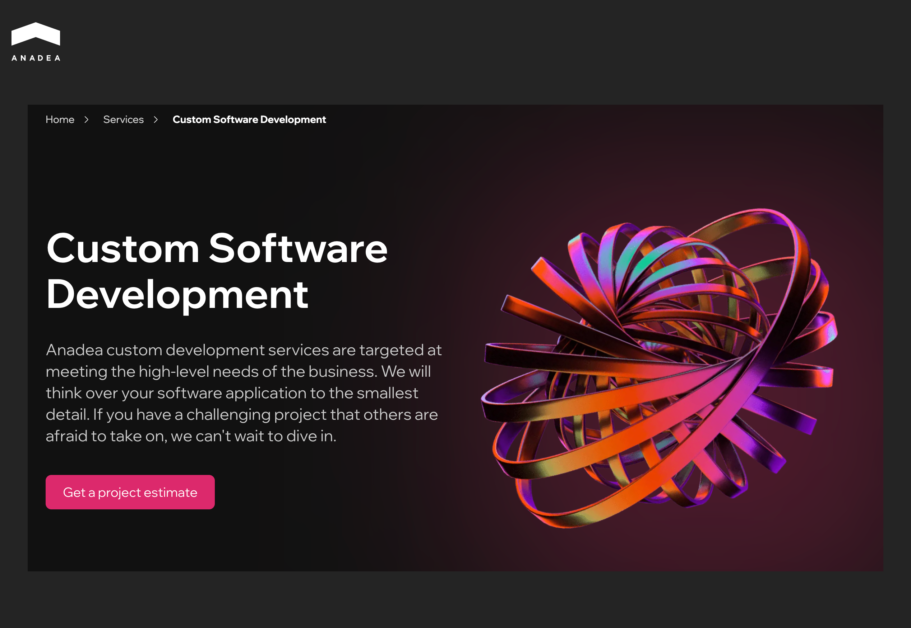
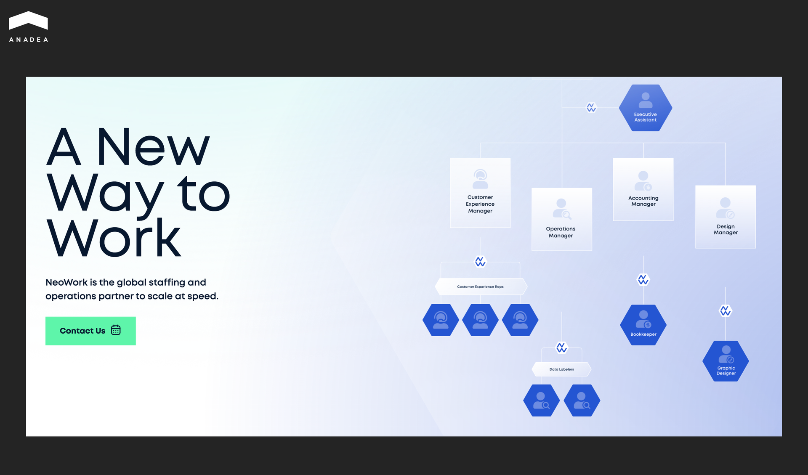
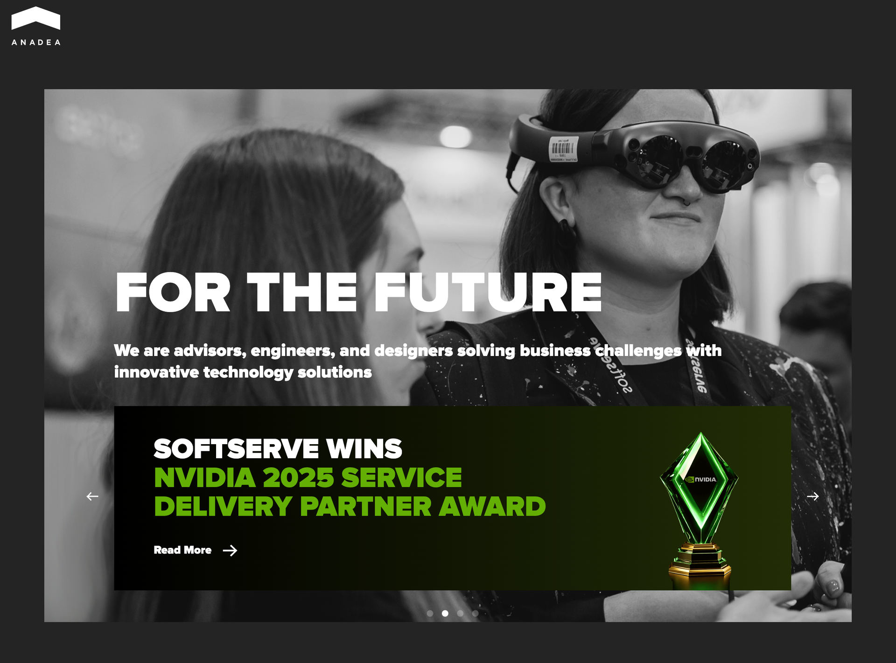
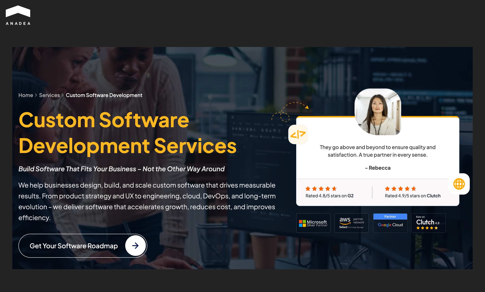
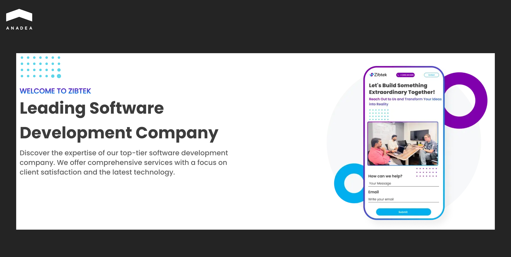
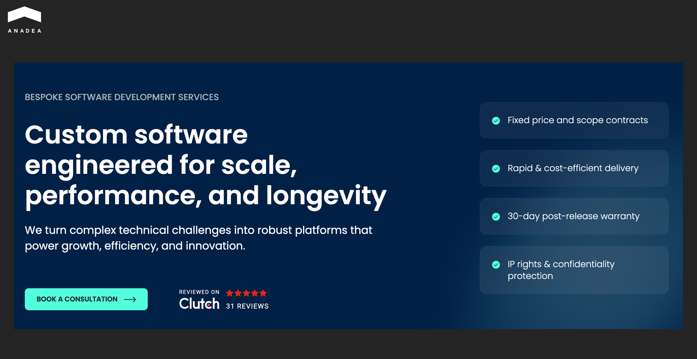

The time when companies tried to own every asset, hire every employee, and control every function under one roof is already in the past. The outsourcing model allows businesses to focus on their core activities and fill their tech talent gaps with external experts.

However, alongside the benefits of outsourcing, such as faster time to market and reduced development costs, businesses can also face a range of challenges. According to studies cited by[ Forbes](https://www.forbes.com/sites/steveandriole/2020/08/02/vanguard--infosys-are-now-billion-dollar-outsourcing-partners-good-bad--risky/?sh=23a4aa012672), poor communication, lack of transparency, and misaligned expectations regarding deliverables are named among the key reasons for these failures.

Major companies, like BairesDev, offer rich talent pools and stable quality of services. This makes them the outsourcing market leaders. Nevertheless, their standardized approaches are becoming less effective in a nuanced tech world. Businesses are looking for more flexibility that giants can rarely provide.

Our article explores the top BairesDev competitors that ensure great adaptability and transparent workflows. Our list of reliable options will help you move past the marketing hype and find a [development partner](https://anadea.info/services/custom-software-development) that truly fits your technical roadmap.

## Do You Need to Look for BairesDev Alternatives?

[BairesDev](https://www.bairesdev.com/) is a global nearshore software development and technology solutions company founded in 2009. It offers all the most highly demanded engagement models (staff augmentation, managed teams, and end-to-end project support). Cooperation with BairesDev makes it easy for companies in North America and Europe to access a large talent pool across multiple technology stacks.

BairesDev’s developers build custom software tailored to specific business needs, including: web and mobile applications, SaaS platforms, ERP solutions, etc. Apart from this, the team successfully works with digital transformation and software modernization projects.

The company’s tech stack includes a range of emerging technologies, such as:

* AI and machine learning;
* cryptocurrency and blockchain;
* big data;
* AR/VR;
* computer vision, etc.

Since its foundation, BairesDev has delivered 1,250+ projects across 130+ industry sectors. Among the industries that its team cooperates with are finance and banking, healthcare and insurance, transportation and logistics, telecommunications, and others.

BairesDev holds a 4.9/5 rating on Clutch, supported by client reviews and long-term partnerships. Apart from this, it has garnered significant industry recognition and received an impressive range of reputable industry awards. For example, in 2024, it won Gold Globee® for Company of the Year in Artificial Intelligence. In 2025, it was recognized among the fastest-growing private companies in the US and was included in the Inc. 5000 list for the sixth time.

Despite all the benefits that the partnership with this company can ensure, it makes sense not to concentrate only on it and consider BairesDev competitors as well. In some cases, BairesDev’s customers decide not to switch completely to another vendor but to supplement gaps with other providers.

BairesDev can still serve as a reliable backbone of your project. Meanwhile, cooperation with other strong teams will provide better adaptivity and help you address your ongoing development needs. 

## Top 7 BairesDev Alternatives for Software Development  

The following alternatives offer strong options across custom software development, global staffing, and enterprise digital transformation. Each provider brings a distinct approach to delivering their services, which makes them well-suited for different business needs.

The table below offers a quick overview of the best BairesDev alternatives based on our market research.

<table>

<tbody>

<tr>

<td>

Company

</td>

<td>

Description

</td>

<td>

Best For

</td>

</tr>

<tr>

<td>

Anadea

</td>

<td>

Custom software development company specializing in building web and mobile applications with a strong focus on AI integration and digital innovation

</td>

<td>

Startups and SMEs looking to build bespoke apps, particularly in real estate, finance, education, and healthcare sectors

</td>

</tr>

<tr>

<td>

NeoWork

</td>

<td>

BPO and staffing firm that builds integrated nearshore remote teams

</td>

<td>

Companies that need to scale software development, CX, sales, and back-office teams quickly

</td>

</tr>

<tr>

<td>

Tensorway

</td>

<td>

Specialized AI and software development company that works with advanced AI models, generative AI, deep learning, computer vision, and other emerging technologies

</td>

<td>

Building AI-centric products and integrating AI into existing platforms or workflows

</td>

</tr>

<tr>

<td>

SoftServe

</td>

<td>

Large global digital consulting and&nbsp; software engineering firm with 30+ years in digital projects&nbsp;

</td>

<td>

Complex digital transformation, big data, AI, and deep-tech engineering projects

</td>

</tr>

<tr>

<td>

ValueCoders

</td>

<td>

Outsourcing and development partner serving global clients with custom software, offshore development centers, and staff augmentation

</td>

<td>

Staff augmentation or fixed-cost projects for startups and SMBs

</td>

</tr>

<tr>

<td>

Zibtek

</td>

<td>

US-led software development &amp; IT outsourcing firm blending onshore project management with global engineering teams

</td>

<td>

Combination of US-based leadership and communication with the cost savings of offshore coding

</td>

</tr>

<tr>

<td>

GoodCore Software

</td>

<td>

Software development company that delivering tailored web/mobile/SaaS/AI solutions

</td>

<td>

Custom software engineering with a hybrid onshore-offshore partnership

</td>

</tr>

</tbody>

</table>

Let’s take a closer look at the BairesDev alternatives for software development and consider their core strengths.

### Anadea

Anadea is a custom software development company with 25+ years of experience. Its team builds tailored web, mobile, AI, and enterprise applications for businesses worldwide. The company works with clients across domains, including real estate, fintech, healthcare, education, travel, insurance, e-commerce, and others.

Anadea’s primary technical and service competencies cover:

* Custom web and mobile development (backend, frontend, native, and cross-platform apps);
* AI and ML integration (advanced algorithms, data‑driven features, agentic AI);
* UI/UX design and product strategy;
* QA and software testing;
* IT consulting, code audit, and DevOps;
* SaaS development.

Their tech stack spans Ruby on Rails, Java, Scala, Kotlin, iOS/Android platforms, AI/ML frameworks, and more, aligning with modern market requirements.

Since its foundation in 2000, the company has successfully delivered more than 800 projects and earned a 4.9/5 Clutch rating with 97% client recommendation rate.

The company is known for its outstanding technical skills and well-established approaches to building long‑running client relationships. Many clients stay for 10+ years. For example, in 2013, Anadea became a tech partner for Zillow-owned marketplace [StreetEasy](https://anadea.info/projects/streeteasy) and it still helps modernize and update the platform. 

Another example of long-term cooperation is the [Visdeal](https://anadea.info/projects/visdeal). It’s a large-scale e-commerce platform for fishing gear and outdoor products, developed and continuously supported by Anadea since 2011. It serves millions of users annually across 8 European markets and has a unified catalog of 80,000+ products.

The Anadea team offers flexible engagement models, such as IT outsourcing, dedicated teams, and [staff augmentation](https://anadea.info/services/staff-augmentation), that can address a wide range of business needs.

### NeoWork

NeoWork is a global staffing and operations partner that started its business journey in 2017. The key idea behind its foundation was to transform how companies leverage international talent for IT, software development, and operational support. 

It has built its identity around redefining traditional outsourcing and recruiting top talent from global hubs like Colombia and the Philippines. NeoWork serves a broad range of sectors, including tech, healthcare, logistics, media, gaming, and e-commerce, through offering flexible staffing and development support.

NeoWork specializes in:

* Software development staffing (engineers, developers, and data talent);
* AI engineering (data labeling, supervised fine-tuning, human-in-the-loop AI workflows);
* tech support engineering (system maintenance and tiered technical help);
* customer experience and support operations (24/7 support staff and help desk professionals);
* virtual assistants (bookkeeping, content moderation, and other administrative roles);
* creative services (custom animation, design, and virtual production solutions).

NeoWork can become a good choice for startups and scaling businesses that need to augment internal capacity quickly without compromising on talent quality.

### Tensorway

Established in 2019, Tensorway is a specialized AI and software development company. Its expertise primarily lies in addressing data-driven problems with practical solutions. The team delivers custom tools to automate processes, enhance decision-making, and unlock efficiencies across sectors such as FinTech, education, e-commerce, and others.

Its solutions are designed to fit within existing architectures. As a result, businesses do not need to invest in full rewrites when they are integrating new AI-driven systems.

Tensorway’s services are powered by advanced technology stacks and AI-first engineering. Here are the key areas of the company works in:

* Custom AI and ML development;
* generative AI solutions;
* deep learning;
* computer vision;
* Natural Language Processing;
* custom AI-integrated Software;
* AI consulting.

Tensorway is trusted by more than 20 businesses. In addition, the company’s expertise is validated by multiple industry recognitions and technology awards, For instance, Clutch and Tech Begemoths ranked it among the Top 20+ Artificial Intelligence Companies in Spain.

### SoftServe

SoftServe is a global digital consulting and software engineering firm. The company was founded in 1993, which makes it a well-established player in the IT services sector. It operates worldwide with 10,000+ employees and offices across Europe, the Americas, and Asia.

SoftServe focuses on broad industry solutions such as financial services, healthcare, retail, manufacturing, and supply chain. Its positioning emphasizes digital strategy and enterprise-level transformation.

What does SoftServe offer?

* Custom software development and engineering services (full lifecycle application development, architecture, testing, and product management);
* cloud and DevOps (cloud migration, automation, and operation optimization);
* analytics and AI/ML solutions;
* cybersecurity and compliance;
* UI and UX design;
* IoT, robotics, and connected systems.
* advisory services.

The company has a strong partner ecosystem and collaborates with globally known tech giants, including AWS, Google Cloud, Microsoft, NVIDIA, and Salesforce.

### ValueCoders

This software development outsourcing company was founded in 2004. It has delivered 4,500+ projects and served 2,500+ clients globally across 40+ countries. Among them are scale-ups, enterprises, digital agencies, and government organizations. ValueCoders works with a broad range of industries, including healthcare, retail & e-commerce, fintech, education, media, and more. Its core positioning focuses on cost-effective engineering delivery and flexible outsourcing engagements.

ValueCoders provides a comprehensive suite of technology services:

* Custom software development (web, mobile, cloud, backend, and frontend systems);
* software outsourcing (end-to-end delivery and staff augmentation);
* consulting;
* MVP and product engineering;
* QA and testing services;
* cloud application development and DevOps;
* legacy modernization.

The company’s professionalism has been acknowledged by a great number of professional awards and certificates, including a “Great Place to Work®” award in India. It reflects a strong internal culture and employee engagement.

### Zibtek

This custom software development agency was established in 2009. Today, it focuses on helping organizations build web, mobile, SaaS, and enterprise software. In its work, Zibtek follows agile methodologies and the blended delivery model with US-based project leadership and global engineering teams. It is positioned as a mid-market partner for startups, SMBs, and mid-sized enterprises that need scalable engineering support.

The team’s engineering capabilities span:

* custom web development;
* mobile app development;
* SaaS development and cloud solutions;
* DevOps and QA automation;
* UI/UX design;
* consulting (product design and strategy);
* ERP/CRM and integrations.

To match specific business needs, Zibtek supports both staff augmentation and project-based delivery.

### GoodCore 

It is a UK-based software development company founded in 2005. With nearly 20 years of experience, it delivers end-to-end custom applications, SaaS products, mobile and desktop apps, and AI-powered systems for clients worldwide. The GoodCore team has delivered more than 100 projects across sectors, including government, utilities, healthcare, and finance.

GoodCore helps organizations with:

* Bespoke software development;
* SaaS development;
* MVP development;
* digital transformation and consulting;
* custom AI tools and autonomous agents;
* legacy modernization and support;
* quality assurance.

GoodCore holds ISO/IEC-grade security practices and adheres to GDPR and other regulations that are in force in different jurisdictions.



## Final Word

BairesDev helped establish the nearshore model. But companies like Anadea and others mentioned on our list are refining it. They offer more flexibility, better cost-efficiencies, and specialized expertise. 

In many cases, moving to BairesDev alternatives is a good way to save money and diversify your opportunities in software development projects.

Don’t hire a vendor based on brand recognition. Assess your budget, define your preferred management style, and choose the alternative that aligns with your goals.

Want to learn more about Anadea’s approaches or offers? [Contact us](https://anadea.info/contacts)! Our experts are ready to answer all your questions.
