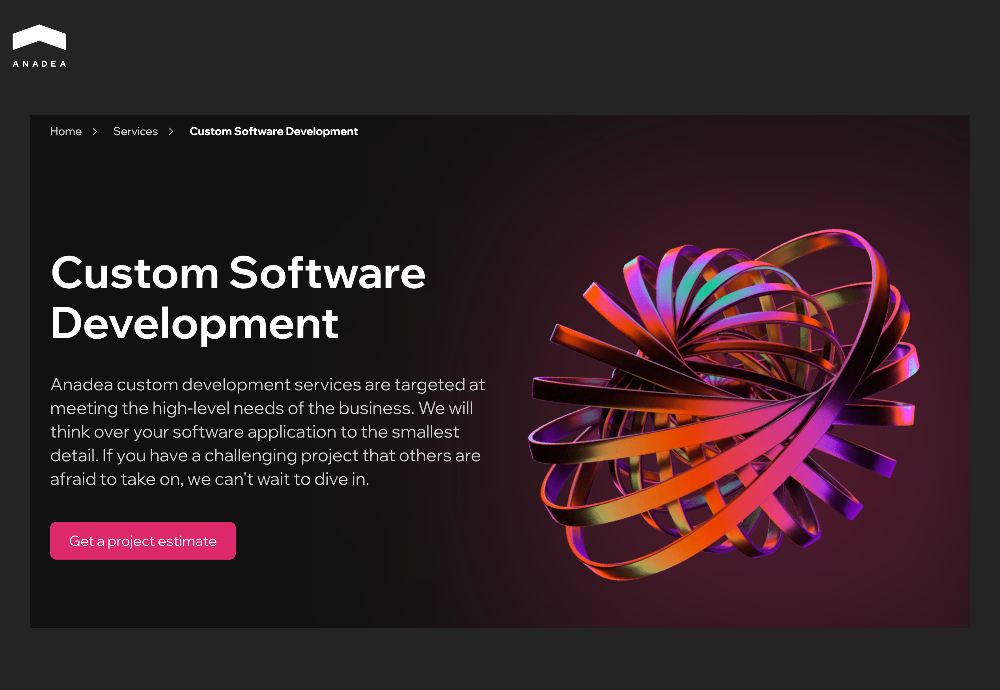
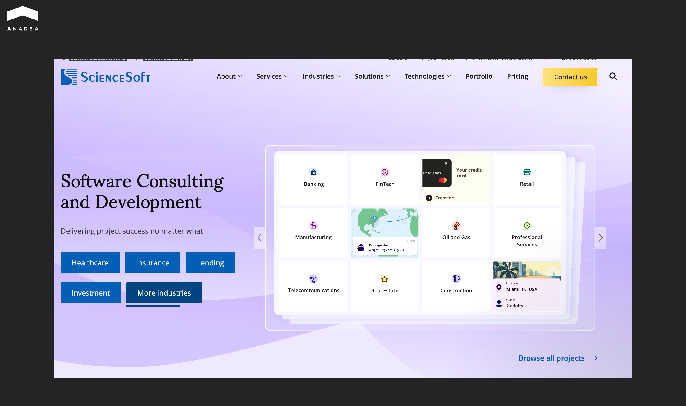
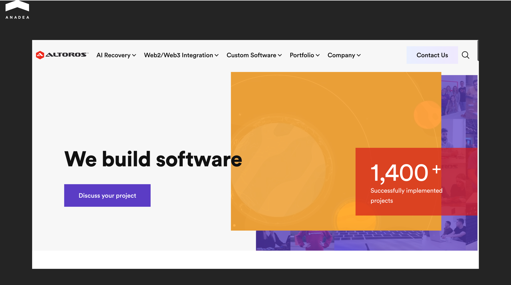
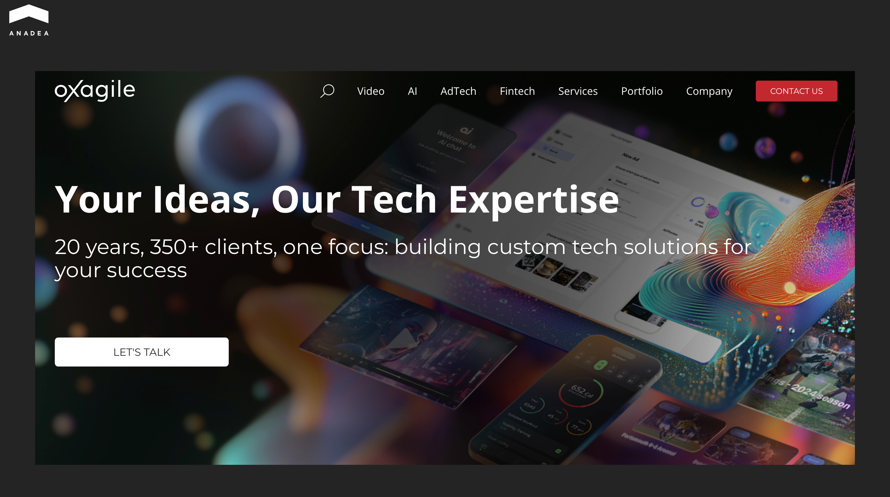
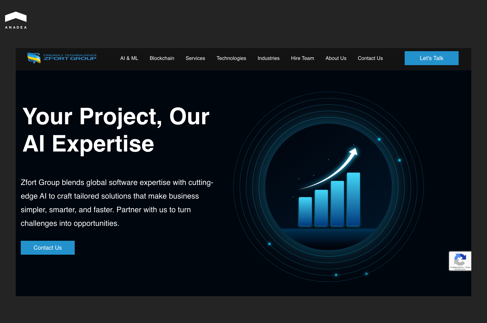
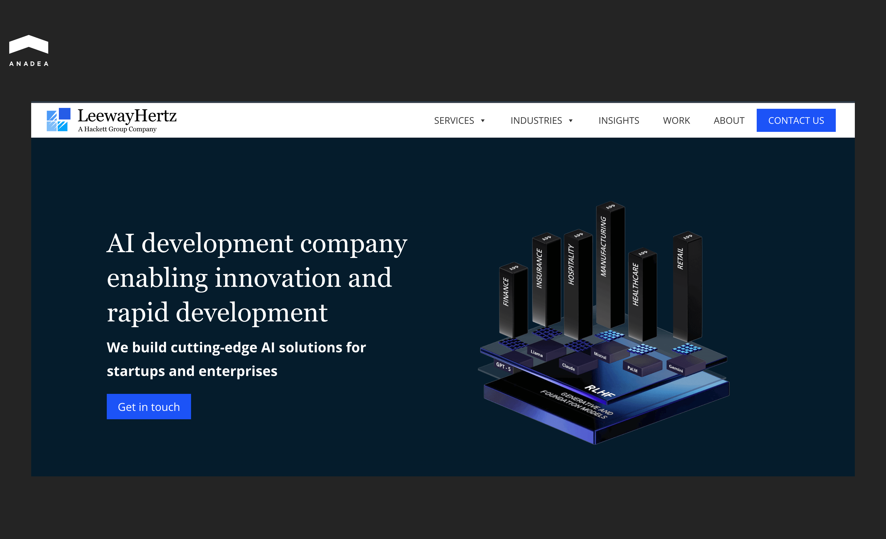
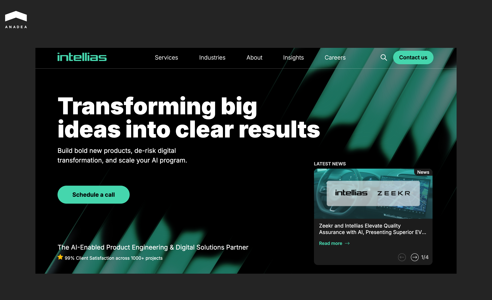

Failed digital transformation initiatives cost organizations an estimated [$2.3 trillion](https://newsroom.taylorandfrancisgroup.com/costly-business-overhauls-are-not-needed-to-embrace-new-digital-technologies-according-to-specialist/) annually. There are many reasons for this, but the role of the vendor responsible for delivery cannot be overstated. In software development outsourcing, success greatly depends on the vendor. 

Many companies believe that the best service providers are industry giants like DataArt. Such companies have rich experience across different domains and technologies. However, such big-name companies are not always the best choice for every project. You should look for a team that can precisely address your needs.

In this article, we will share a list of reliable DataArt alternatives and provide tips that will help you minimize risks while switching vendors.

## Why Companies Look for DataArt Alternatives

With over 25 years of experience, DataArt has earned its reputation as a global technology consultancy powerhouse. Today, it has a workforce of more than 5,700 professionals and offices in 20+ locations across the US, Europe, and Latin America. The company is known for its deep domain expertise in sectors like finance, healthcare, travel, and others.

DataArt’s professionalism and reliability have been recognized by a range of prominent awards. For example, it was included in the list of the Best Engineering Teams and the Best Product & Design Teams by Comparably in 2024.

Despite all its strengths, this software development company cannot be the right partner for every business. Your vendor choice should be based on your specific requirements and project type. Even when a vendor is as highly regarded as DataArt, certain shifts in project needs lead stakeholders to explore alternatives.

Here are the primary factors indicating that you need to consider DataArt alternatives. 

* **High cost for smaller budgets**. For early-stage startups or mid-sized firms with leaner budgets, a partnership with DataArt may be too costly. Smaller specialized offshore agencies can often provide high-quality engineering at more competitive rates. 
* **Need for niche specialization*.*** If a business is working on a highly niche emerging technology (like a specific blockchain protocol or a proprietary hardware-software integration), it is necessary to seek a team with specific skills. 
* **Agility**. Smaller vendors can often bypass the rigorous corporate processes required by larger firms like DataArt. This allows for faster onboarding and more rapid pivots.
* **Scaling up and down*.*** DataArt is good at supporting massive enterprise projects that require hundreds of engineers. But if a company has a small, experimental project, you don’t need this scale. In these scenarios, businesses look for smaller partners who offer flexibility without the bureaucracy typical of big firms.

## Top 8 DataArt Alternatives

When you are looking for an alternative to your vendor, the main goal should be to find a team that aligns with your project needs and business goals. We’ve prepared a list of teams that have earned a reputation as reliable software development companies. We recommend starting your search for a new tech partner by considering these vendors.

The table below contains the most important information about each of them.

<table>

<tbody>

<tr>

<td>

<strong>Company</strong>

</td>

<td>

<strong>Core Specialization</strong>

</td>

<td>

<strong> Best For</strong>

</td>

</tr>

<tr>

<td>

Anadea

</td>

<td>

Custom software, ML/AI apps, flexible team augmentation

</td>

<td>

Startups and mid-market companies that need to build new platforms or modernize legacy systems

</td>

</tr>

<tr>

<td>

ScienceSoft

</td>

<td>

Data management, analytics, business intelligence, big data processing

</td>

<td>

Enterprises and mid-market clients looking to turn raw data into scalable digital products

</td>

</tr>

<tr>

<td>

Altoros

</td>

<td>

Cloud-native engineering, microservices, serverless architecture, and data-intensive systems

</td>

<td>

Startups, ISVs, and Global 2000 organizations requiring niche cloud-native specialization&nbsp;

</td>

</tr>

<tr>

<td>

Oxagile

</td>

<td>

AI, data, and content-driven platforms&nbsp;

</td>

<td>

Media and eLearning projects

</td>

</tr>

<tr>

<td>

Zfort Group

</td>

<td>

Applied AI, intelligent automation, NLP, predictive analytics, and conversational AI

</td>

<td>

AI MVP development, AI-powered SaaS products, and custom applications

</td>

</tr>

<tr>

<td>

LeewayHertz

</td>

<td>

AI, advanced analytics, blockchain, Web3, and Industrial IoT

</td>

<td>

Supply chain, fintech, healthcare, and industrial IoT sectors

</td>

</tr>

<tr>

<td>

ELEKS

</td>

<td>

Full-cycle product engineering, data engineering, cloud, and big data solutions&nbsp;

</td>

<td>

Enterprises and SMEs with data-heavy systems that require strict technical governance and predictable execution

</td>

</tr>

<tr>

<td>

Intellias

</td>

<td>

Complex digital transformation and large-scale engineering initiatives

</td>

<td>

Fortune 500 enterprises and large companies across diverse industries (retail, telecom, finance, etc.)

</td>

</tr>

</tbody>

</table>

### Anadea

Anadea is a strong alternative to DataArt for companies seeking a flexible partner focused on custom software and data-driven solutions. Founded in 2000, Anadea is headquartered in Spain and operates internationally.

The company has engineering experience across domains including fintech, real estate, and eLearning. In total, it has delivered more than 800 custom projects. Among the built software products are tailored web, mobile, SaaS, and enterprise systems, as well as machine learning and AI solutions.

Anadea offers a flexible [outsourcing model](https://anadea.info/blog/software-development-do-it-inhouse-or-outsource/) that can adapt to different project scopes. This makes it especially suitable for startups and mid-market companies.

A strong example of Anadea’s capabilities is its 14-year partnership with [Visdeal](https://anadea.info/projects/visdeal). It is a Dutch e-commerce leader in the outdoor and fishing equipment segment. 

In 2011, Anadea took on the task of modernizing Visdeal's legacy website. The updated platform supported faster feature releases and improved system performance. This enables the required scaling and allows the client to reduce manual operations. The optimized architecture helped reduce errors and maintenance overhead, as well as improve overall system stability. Today, the platform supports integrations with 5+ marketplaces and more than 3 million user visits annually.

Key reasons to consider Anadea as a DataArt alternative:

* Strong focus on custom software development and [AI solutions](https://anadea.info/services/ai-software-development);
* flexible engagement models (dedicated teams, augmentation, full-cycle delivery);
* fast team assembly (2-3 weeks);
* competitive pricing;
* product-oriented mindset;
* long-term partnerships with clients across multiple industries (some collaborations last for 10+ years).



### ScienceSoft 

ScienceSoft is a global IT consulting and software development company with 36 years of experience in data management, analytics, and custom software engineering. It supports enterprises and mid-market clients across 30+ industries and helps them turn raw data into scalable digital products.

Today, the company’s workforce includes over 750 IT specialists, while its portfolio is composed of more than 4.2K success stories.

The domains that ScienceSoft works with:

* Healthcare;
* banking;
* real estate;
* retail;
* investment;
* oil and gas;
* manufacturing;
* logistics, and others.

The company combines traditional custom software development with advanced AI/ML and business intelligence services. Its analytics practice includes data warehousing, big data processing, and visualization solutions.

### Altoros

Altoros is a cloud-native software engineering and IT consulting company founded in 2001. It is known for its expertise in data-intensive systems and enterprise-grade digital transformation. With headquarters in Silicon Valley and global delivery centers, the company cooperates with startups, ISVs, and Global 2000 organizations. 

Key offerings by Altoros:

* platforms powered by microservices and serverless architecture for high-concurrency workloads;
* data-intensive solutions (data lakes and AI-driven platforms that are designed for processing vast amounts of information with low latency);
* modern engineering labs (AI, blockchain, and cloud-native transformation);
* strategic consulting.

Altoros is often chosen for projects that require deep, niche specialization in cloud-native technologies.

### Oxagile

This custom software development company specializes in AI and content-driven platform engineering, with a strong focus on media, AdTech, eLearning, and analytics-intensive solutions. Oxagile was founded in 2005. Today, it has 500+ employees and global delivery capabilities across multiple locations. 

Benefits of custom solutions by Oxagile:

* **Advanced personalization.** The company builds recommendation engines and AI-driven UX that adapt to user behavior in real time.
* **Intelligent video and media.** Oxagile’s engineers have deep expertise in computer vision, OTT platforms, and complex multi-screen video delivery systems.
* **Data and analytics.** Delivered solutions help transform raw data into structured insights using automated tagging and predictive modeling.
* **Modern engineering.** A focus is placed on stability and microservices-based architectures that support millions of concurrent users.

### Zfort Group

Zfort Group is a full-cycle custom software development company founded in 2000. The company focuses on applied AI and intelligent automation. Its expertise covers predictive analytics, NLP, computer vision, recommendation systems, and conversational AI.

Over 25 years of work, Zfort Group has completed over 1,500 projects that demonstrate the company’s expertise in 34 core technologies and domain knowledge across 16 different industries.

Currently, the company manages 54 active projects and maintains 18 dedicated development teams. 

Best-fit project types:

* MVP development for AI startups;
* AI-powered SaaS products and data-driven platforms;
* intelligent automation solutions
* predictive analytics tools;
* recommendation systems
* complex custom applications that require ML model integration.

### LeewayHertz

Founded in 2007, LeewayHertz is a technology consultancy and custom software development firm with a strong focus on AI and advanced analytics. The company has built more than 50 AI solutions, while the total number of delivered software products has exceeded 160.

The list of companies that partnered with LeewayHertz includes P&G, Siemens, Kinesis, 3M, and others.

Typical use cases and industries:

* **Supply chain and logistics.** LeewayHertz helps businesses implement blockchain for end-to-end transparency and AI for route optimization.
* **Fintech and Web3.** The company builds decentralized exchanges, digital wallets, automated compliance systems, and other solutions for this domain.
* **Healthcare**. LeewayHertz has solid experience in creating AI-powered diagnostic tools and interoperable data sharing platforms.
* **Industrial IoT.** The vendor’s engineers can connect complex hardware ecosystems with intelligent software layers for predictive maintenance.

### ELEKS

With 2,000+ specialists and delivery centers across Europe and North America, the ELEKS company supports enterprises and SMEs with full-cycle product engineering. It was founded over 30 years ago, and since that time, it has delivered 1000+ end-to-end software projects.

Core benefits of ELEKS:

* Deep expertise in data engineering;
* well-established delivery processes and QA practices;
* high technical standards;
* experience with enterprise platforms, cloud, and big data solutions;
* mature teams;
* quality-focused project execution.

If your project involves data-heavy systems or requires strict technical governance and quality assurance, ELEKS can become a reliable tech partner with its structured approach that provides high predictability.

### Intellias

Intellias is a technology company with 3,000+ professionals across 17+ locations worldwide. It was established in 2002, and currently, it serves 145+ active clients. Intellias cooperates with Fortune 500 enterprises on digital transformation and engineering initiatives.

This vendor has expertise in building tailored solutions for a wide range of industries:

* retail;
* healthcare;
* agriculture;
* travel and hospitality;
* insurance;
* financial services;
* telecom, etc.

Intellias has a lot of professional awards. For example, the vendor has been featured multiple times in the IAOP Global Outsourcing 100 list, including recognition in the Leaders category. In 2024, Intellias ranked among the Top 100 Best Workplaces in Europe based on feedback from over 1.3 million surveyed employees.

## Common Risks When Switching to a New Partner

Partnering with a new vendor can open new opportunities. But it may also come with some risks (especially when you need to switch from one tech partner to another). Let’s consider the most common of them.

### Overemphasis on Cost Savings

It’s quite natural that businesses are looking for lower rates. But vendors that underbid may struggle to deliver the same quality or expertise as your previous partner. Focusing solely on price can lead to delays and missed business objectives.

### Choosing Vendors without Sufficient Scale or Stability

Small or newly established companies may offer attractive pricing or niche expertise. Nevertheless, in many cases,  they don’t have enough resources to handle larger or more complex projects. That’s why you should carefully verify whether your new tech partner will be able to cope with the scale of your project.

### Lack of Clear Governance

Ambiguity about roles and responsibilities can slow the project transfer. To avoid friction, you should have a clearly defined governance structure. Otherwise, you may face confusion over accountability and delays in approvals.

### Knowledge Transfer and Legacy System Challenges

When you are moving from one vendor to another, you will need to ensure the transfer of knowledge and code to a new team. Without structured documentation and proper handovers, knowledge can be lost. This can lead to critical mistakes or delays in ongoing development.

### Communication Misalignment

Even with the most technically skilled vendor, you can face issues and misunderstandings related to communication style and time zone coordination. Compatibility in collaboration practices is key to project success.

### How to Mitigate Risks

One of the smartest ways to reduce risk in [software development outsourcing](https://anadea.info/services/custom-software-development) is to start small. Phased engagement or pilot projects will let you evaluate the vendor’s capabilities and quality standards before starting a full-scale partnership.

## Final Word

The choice of a software partner is one of those decisions that will impact your business long after the initial code is deployed. The wrong decision can threaten the future of your product.

You cannot rely solely on developers’ rates or the popularity of the company’s brand. The key recommendation is to find a team with skills and experience that align with your needs. Quite often, smaller vendors can become a more appropriate choice for your project. Such teams may have niche expertise and operational flexibility that giants lack.

Want to know what Anadea can offer you? [Contact us](https://anadea.info/contacts), and we will tell you more about our approaches to software development.
