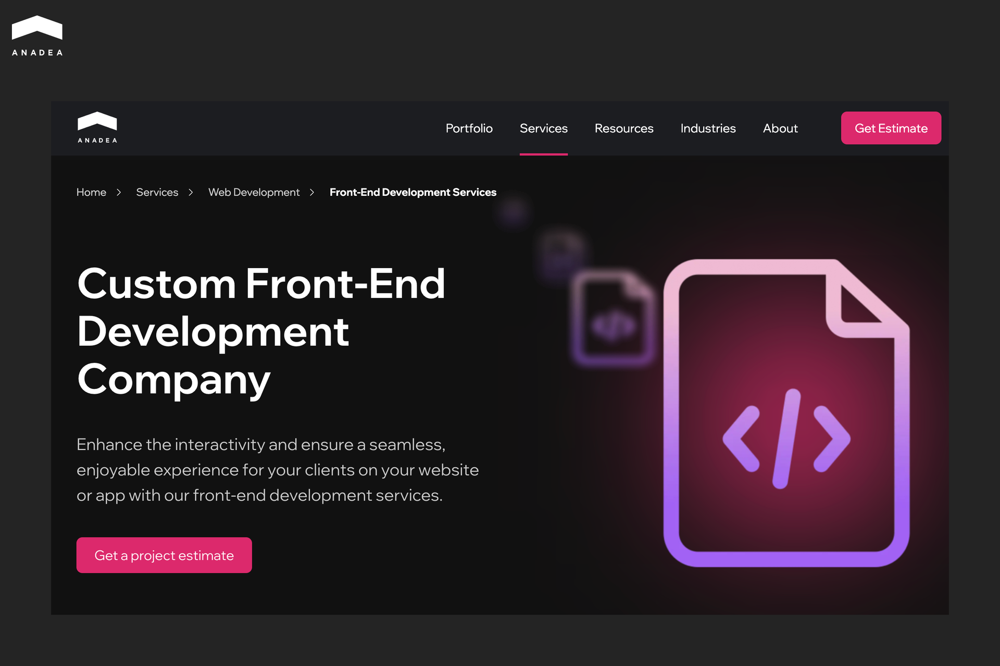
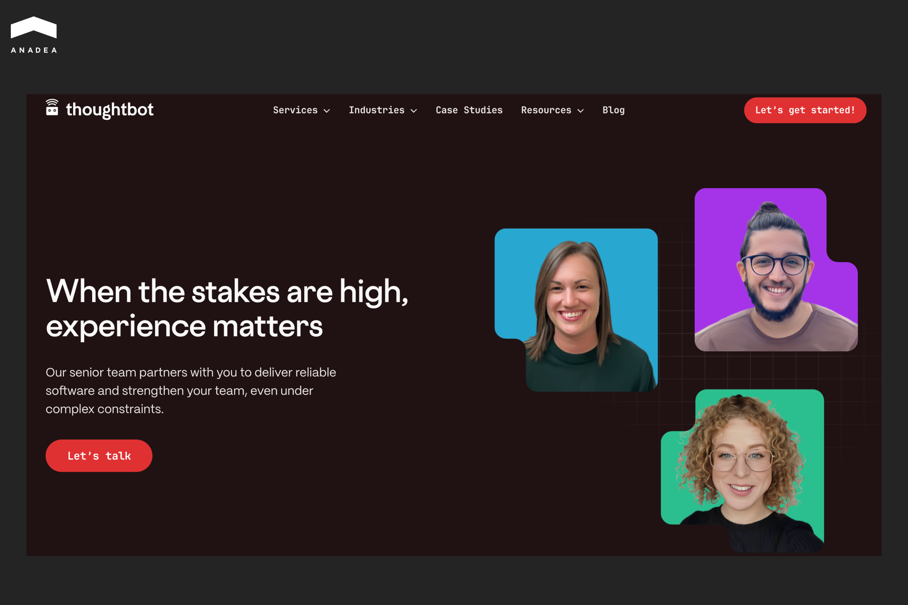
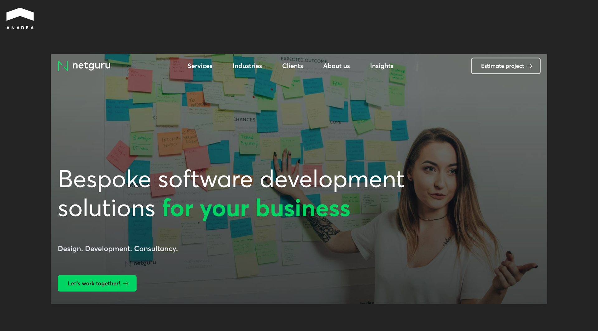
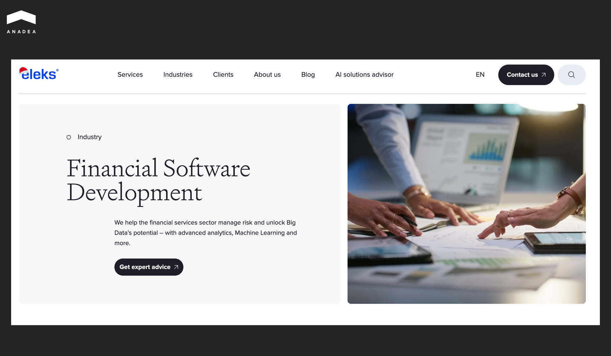
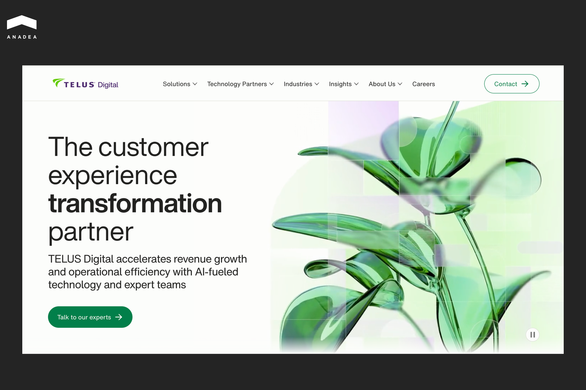
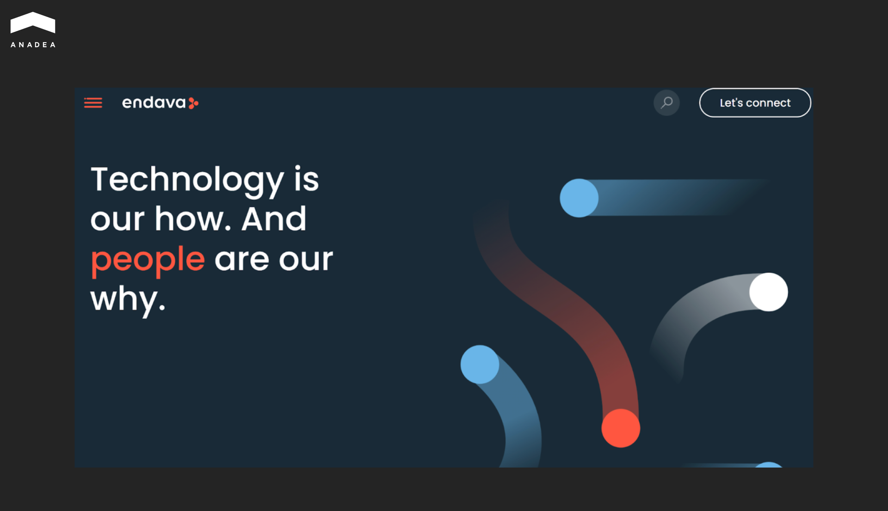
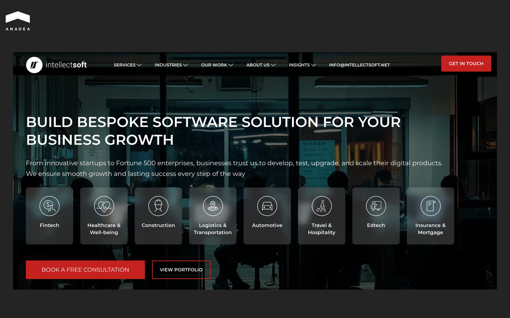

AI breakthroughs have a significant impact on software solutions available today. But apart from this, they greatly change the development process itself. AI coding agents can transform month-long development cycles into single-day sprints. For example, according to [Anthropic](https://www.anthropic.com/research/estimating-productivity-gains), its Claude model can reduce the time needed for complex task completion by 80%.

As productivity is growing, the expectations for service providers have reached new levels. But a lot of companies are still running yesterday’s playbook. Finding a vendor who skillfully leverages modern technologies to accelerate development and enhance quality can be a true challenge. 

In this article, we will share a list of the top frontend development companies that have mastered the agentic workflow to deliver results at the pace the market demands today.

## Top Frontend Development Services to Consider

According to Clutch data from February 2026, there are [30,174](https://clutch.co/developers?related_services=field_pp_sl_web_programming) teams providing web development. In addition, [21,267 ](https://clutch.co/developers?related_services=field_pp_sl_mobile_app_dev)companies have mobile app development expertise. That’s why one of your first tasks before starting your project is to find a team that fits your specific needs. 

To create our list of the best [frontend development outsourcing](https://anadea.info/services/web-development/front-end) companies, we analyzed a wide range of companies based on client reviews, project complexity, and engineering depth. Additional criteria included scalability of UI systems, expertise in modern frameworks, and the ability to support user-facing apps across industries.

The table below provides a quick overview of the company’s key strengths.

<table>

<tbody>

<tr>

<td>

<strong>Company</strong>

</td>

<td>

<strong>Core Frontend Strength</strong>

</td>

</tr>

<tr>

<td>

Anadea

</td>

<td>

Specializes in high-speed architectures and builds sophisticated user interfaces for AI-powered products

</td>

</tr>

<tr>

<td>

Thoughtbot

</td>

<td>

Expert in product-driven frontend strategies that prioritize accessibility and scalable design systems

</td>

</tr>

<tr>

<td>

Netguru

</td>

<td>

Focuses on UX consistency and seamless collaboration

</td>

</tr>

<tr>

<td>

EPAM Systems

</td>

<td>

Renowned for managing large-scale UI systems and ensuring consistency across global products

</td>

</tr>

<tr>

<td>

ELEKS

</td>

<td>

Delivers heavy-duty frontend architectures for Fortune 500 companies

</td>

</tr>

<tr>

<td>

TELUS Digital (former WillowTree)

</td>

<td>

Leverages a vast partner network to build mobile-first interfaces designed to handle massive consumer traffic

</td>

</tr>

<tr>

<td>

Endava

</td>

<td>

Specializes in long-term support and distributed agile delivery

</td>

</tr>

<tr>

<td>

Intellectsoft

</td>

<td>

Focuses on full-cycle development to modernize legacy systems and create responsive UIs for organizations across various sectors

</td>

</tr>

</tbody>

</table>

## Anadea

Founded in 2000, Anadea is a custom software development company that provides frontend development services as part of its broader engineering offerings. Today, the company’s portfolio covers over 800 completed projects. 

Anadea’s developers prioritize fast load times and optimized rendering across devices. This keeps applications efficient as they scale. In its projects, this top frontend development agency uses the most highly-demanded and reliable tech stack, including JavaScript, TypeScript, Angular, React, Next.js, Vue.js, and others.

Clear timelines for all the steps of this process, from discovery and [UI/UX design](https://anadea.info/services/ui-ux-design) to post-launch optimization, help teams align on milestones and effectively manage risk.

Another notable capability is Anadea’s integration of AI into frontend experiences. The company builds interfaces for AI-powered products such as predictive analytics dashboards, personalization engines, and NLP-based tools. Meanwhile, AI-accelerated development allows the team to provide clients with a time-to-market advantage without sacrificing software quality.

In 2026, Anadea is named among the top AI development companies in Spain by DesignRush.



### Thoughtbot

Thoughtbot is a product-focused design and development company. It is known for delivering frontend systems that prioritize usability and long-term scalability. The company was founded in 2003 and has built a strong reputation for delivering user-centered digital products.

Its teams work collaboratively with clients in dedicated groups that cover product strategy, design sprints, UX/UI, and frontend development. Their methodology is documented in an internal Playbook that shapes how they build products and run projects.

Thoughbot’s core frontend strengths include:

* product-driven frontend strategy aligned with business goals;
* strong focus on accessibility and human-centered design;
* scalable design systems;
* reusable component libraries;
* clean, maintainable architecture;
* close integration between design, engineering, and product discovery.

The company serves a wide range of use cases, such as responsive web apps, internal dashboards, MVPs, AI-driven solutions, and mission-critical frontend systems.

### Netguru 

Netguru is a digital product development company that delivers frontend development as an integrated part of cross-functional product teams. Netguru focuses on building responsive interfaces that align closely with product strategy and business goals. This approach is especially valuable for organizations developing complex digital products that require continuous iteration and seamless collaboration between designers and developers.

Founded in 2008 and headquartered in Poznan, Poland, Netguru works with global brands and startups, including IKEA and Volkswagen. Their frontend services typically support web applications, SaaS platforms, marketplaces, and customer-facing digital products.

Key strengths and approaches:

* frontend development delivered within full digital product teams;
* strong focus on UX consistency;
* close collaboration between design, product, and engineering functions;
* emphasis on scalable architectures and long-term maintainability;
* support for startups, scale-ups, and enterprises.

### EPAM Systems

EPAM Systems is a global technology company renowned for enterprise‑grade software engineering and consulting services. For more than 30 years, EPAM has served clients worldwide and has deep expertise in digital transformation, cloud, AI, and complex software delivery across industries.

EPAM provides frontend web development services designed to address the challenges of large‑scale UI systems and ensure cross‑team frontend consistency. Development teams closely collaborate with UX/UI designers, product owners, and backend specialists. This approach allows the company to ensure that interfaces are visually appealing and technically sound.

What the vendor offers:

* Enterprise‑grade frontend architecture and UI frameworks;
* consistency across teams and products;
* user‑centric design implementation;
* deep expertise with modern JS frameworks and tooling;
* smooth integration with backend systems.

### ELEKS

ELEKS is a software engineering and technology consulting company established in 1991. For over 35 years, it has delivered full‑cycle custom application and enterprise software development services. ELEKS works with Fortune 500 companies, large enterprises, and innovators around the world.

The vendor provides custom frontend development services that are embedded in its end‑to‑end custom application development approach. The range of the offered services also includes requirements analysis, UX/UI design, backend engineering, testing, deployment, and ongoing support.

Typical frontend use cases and client profiles:

* enterprise‑grade web apps that require robust frontend architecture;
* responsive customer‑facing platforms with complex interactions;
* internal business tools with high maintainability needs;
* digital products with integrated design and usability requirements.

### TELUS Digital (former WillowTree)

TELUS Digital is a global digital product and engineering company that combines award‑winning design and full‑stack development. Formerly known as WillowTree, the company became TELUS Digital after acquisition with TELUS Corporation.

The vendor has a well-developed network of partners. Apple, Google, Adobe, Amazon, and Microsoft are among its technology collaborators. This enables TELUS Digital to leverage the latest tools and cloud solutions for building secure and high-performance digital experiences.

Frontend development offers include, but are not limited to:

* consumer‑facing web and mobile apps with rich interaction requirements;
* performance‑optimized interfaces for high‑traffic digital products;
* mobile‑first experiences;
* integrated UI systems aligned with backend services and APIs.

### Endava

Endava is a UK‑based publicly listed technology services and software engineering company with more than 25 years of experience. Its multidisciplinary teams support clients at all stages of software development, from ideation to production.

Within its digital transformation programmes, Endava offers custom frontend development services that contribute to maintainable and user‑centric UI systems. 

Endava’s key focus is on long‑term frontend support and scalability. Its approach emphasises agile processes and distributed delivery models. The introduced frontend practices support rapid iteration and quality throughout the lifecycle of digital products.

When Endava is chosen for frontend development:

* projects requiring scalable UI architectures within enterprise platforms;
* digital transformation initiatives with complex delivery;
* long‑term product support;
* integrations between frontend layers, backend services, and design systems.

### Intellectsoft 

Since 2007, Intellectsoft has helped organizations modernize their businesses with tailored digital products, from web portals to mobile‑first platforms designed for scalable growth.

The company delivers full‑cycle custom software development solutions for enterprises, SMBs, and startups across sectors.

Its web development offerings include custom client‑side development using modern technologies such as HTML, CSS, JavaScript, React, Angular, and Vue.js.

The range of best‑fit frontend projects includes:

* enterprise web applications with responsive UIs;
* business‑critical digital platforms with rich interaction needs;
* integrated frontend-backend solutions for SaaS or internal tools;
* projects that need ongoing UI support and iterative enhancements.

## How to Choose the Right Frontend Development Company

To choose the best offshore frontend development agency in 2026, it won't be enough just to look through the portfolio of screenshots. Your decision should be based on engineering depth and long-term scalability.

Here is how to evaluate and define a frontend development service that will keep your product competitive.

1. **Align product goals with engineering expertise**. Not all teams deliver frontend web development services of equal quality. A company that has solid expertise in building high-conversion e-commerce platforms might not be the right fit for a data-heavy SaaS dashboard.
2. **Evaluate engineering depth.** You need a partner who works with a reliable frontend tech stack. Ask for specific case studies where the team worked on tasks similar to yours. 
3. **Demand AI literacy.** Most agencies now use AI, but the way they use it matters. You need a vendor that uses AI to accelerate delivery without sacrificing code quality or security. A top-tier firm will have a clear policy on human-in-the-loop validation to ensure that AI isn’t introducing security vulnerabilities or technical debt.
4. **Prioritize compliance-first accessibility**. With the enforcement of the European Accessibility Act (EAA) and updated global standards, accessibility has become a legal and business necessity. Verify whether your potential partner has relevant knowledge in this field.
5. **Look for long-term support**. Modern frontends require ongoing care. Choose a service that offers more than just a launch-and-leave contract. Ask whether they set up tools to monitor real-user sessions and error tracking.

## Wrapping Up

The choice of the right frontend development team is your first step to success. Your frontend is the most visible part of your business. Given this, it is vital to entrust it to a team that understands the intersection of business logic and modern engineering. A skilled partner ensures scalability, performance, maintainability, and smooth integration with backend systems.

Want to learn more about Anadea’s 25-year experience in frontend development? [Contact us](https://anadea.info/contacts) to discuss your project’s needs with our experts.
