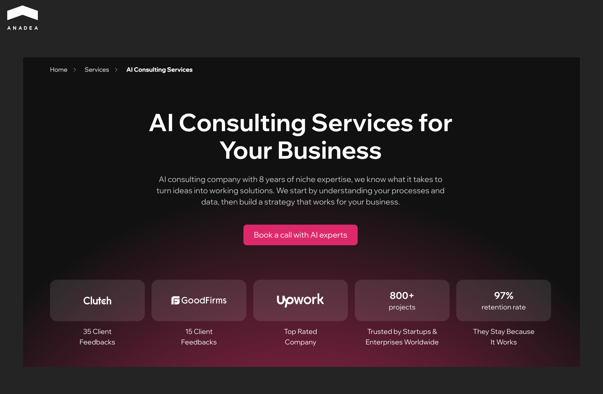
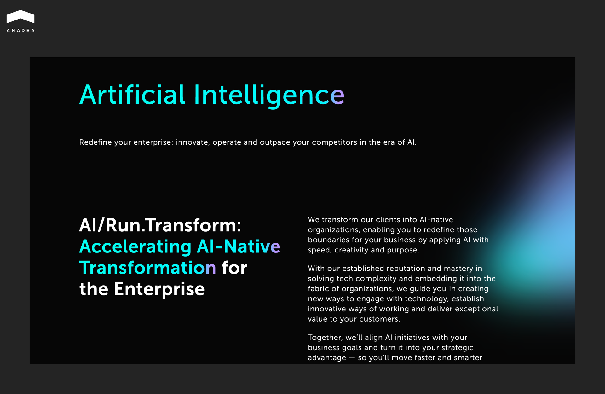
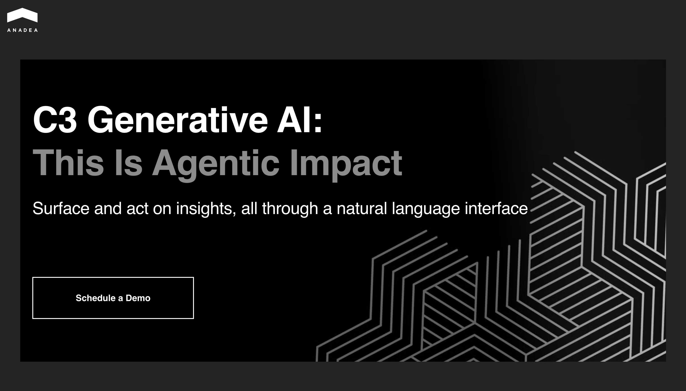
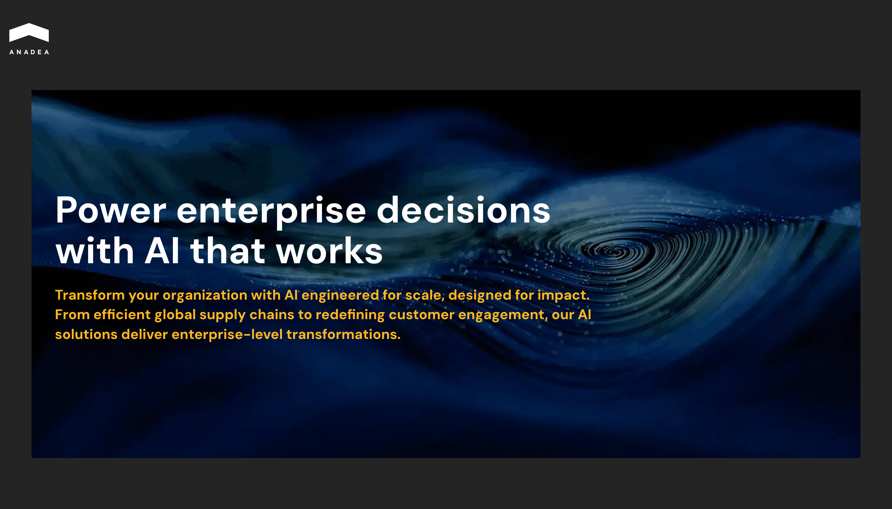
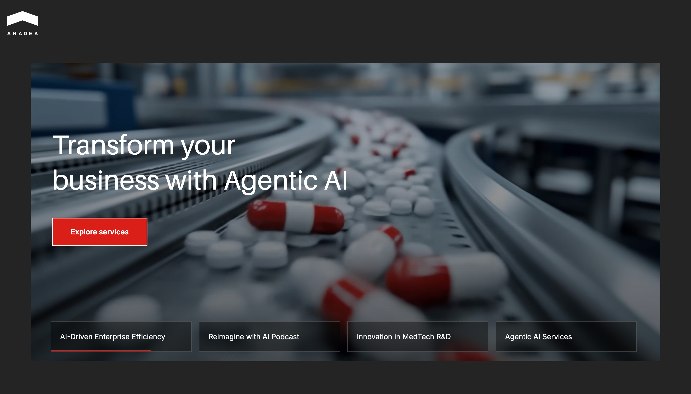
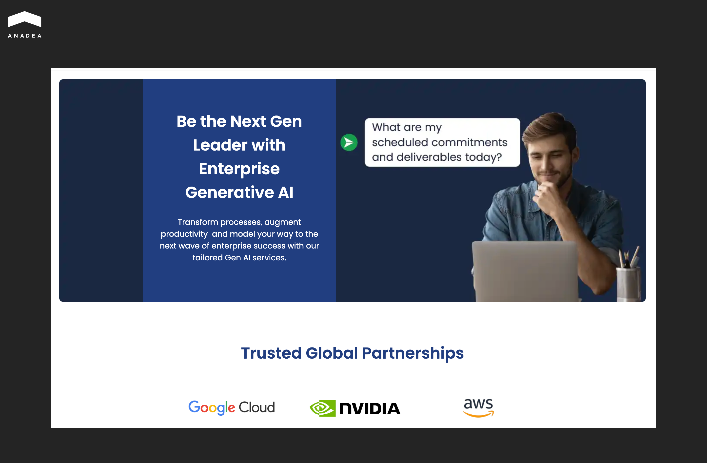
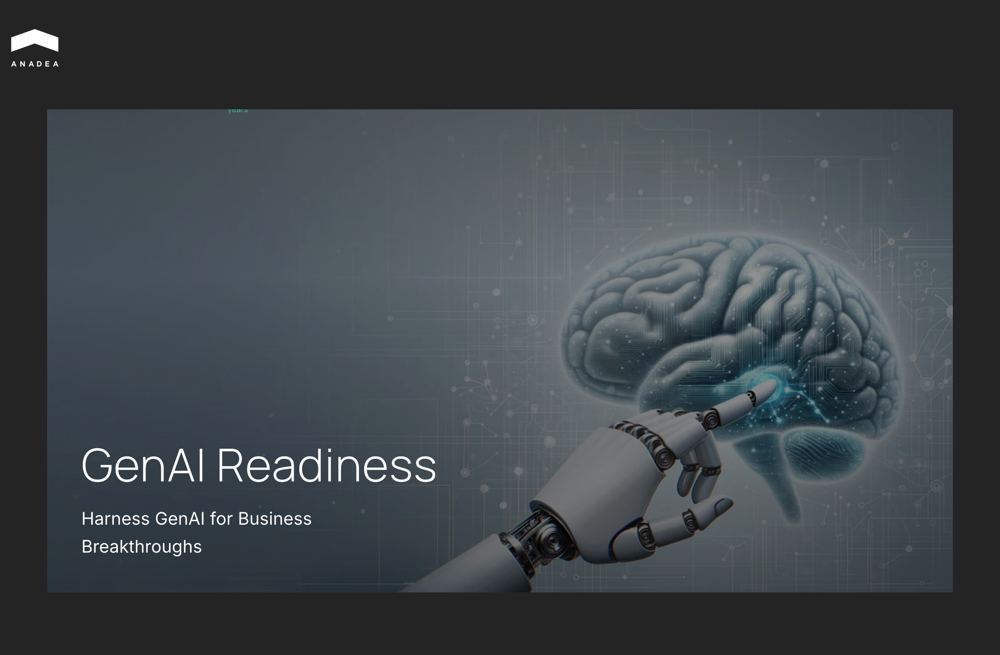
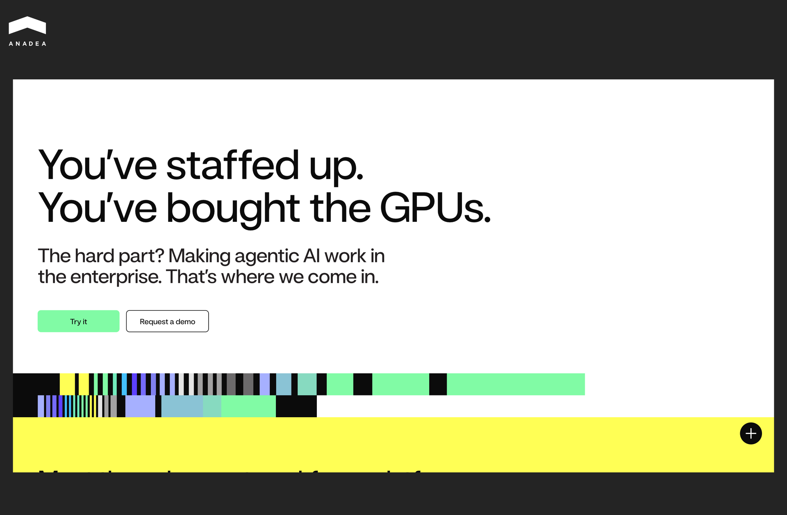
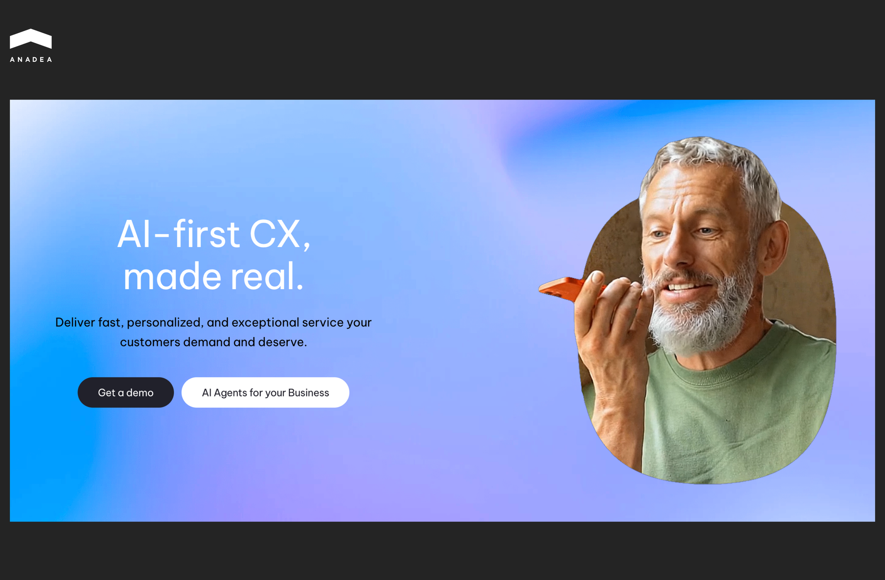
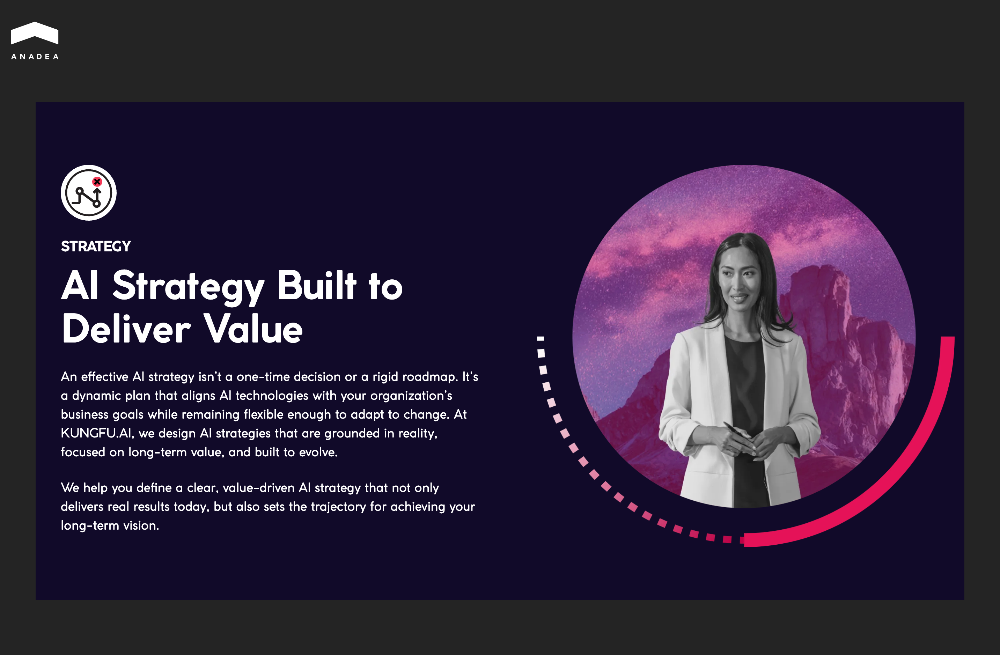

Over the past few years, the application of generative AI has significantly expanded. According to [Grand View Research](https://www.grandviewresearch.com/industry-analysis/generative-ai-market-report), the global generative AI market reached $22.21 billion in 2025. Now, it is expected to exceed $324.68 billion by 2033. It means that the market will be growing at a CAGR of over 40% during the forecast period from 2026 to 2033.

The use of GenAI brings a range of benefits, such as automation, increased productivity, and the reduction of human errors. These capabilities are increasingly attractive to businesses. But its efficient implementation requires deep technical knowledge and strategic planning. That’s where specialized generative AI consulting firms step in.

In our article, we will talk about the benefits of cooperation with such firms and share a list of top tech partners that can support you in your AI initiatives.

## Why Businesses Turn to Generative AI Consulting Companies

The potential [value of generative AI for businesses](https://anadea.info/blog/gen-ai-applications-for-business/) is undeniable. However, for many organizations, the steep learning curve and high costs of [building GenAI solutions](https://anadea.info/services/ai-software-development) entirely in-house outweigh the perceived benefits. That’s why many companies are partnering with specialized AI strategy consulting firms today.

Experienced tech specialists help you focus on the ROI of your AI initiatives. Here are the key benefits of working with reliable artificial intelligence consulting firms.

* **Accelerated adoption**. Consultants work with proven frameworks and pre-built code libraries that help reduce deployment timelines from years to months and even weeks.
* **Lower operational risks**. Expert partners understand the nuances of regulatory compliance and data security. As a result, they can help companies safeguard sensitive information and avoid costly missteps.
* **Business alignment*.*** Professional consultants wouldn’t recommend implementing AI where it brings no value. They concentrate on outcome-driven applications that help achieve important business goals, such as streamlining supply chains or automating customer service.

## What Services Do Generative AI Consulting Companies Provide?

Today, many businesses across industries lack the internal expertise required to design effective strategies and integrate AI into existing systems. Generative AI consulting firms help organizations move from experimentation to real business impact.

Here are the primary ​​generative AI consulting services offered by leading companies today:

* **Generative AI strategy consulting**. Consultants perform[ AI maturity assessments](https://anadea.info/questionnaire) to evaluate a company's data readiness, technical debt, and talent gaps. Such specialists can provide multi-year roadmaps, use case prioritization, and ethical governance frameworks to ensure compliance with global regulations like the [EU AI Act](https://anadea.info/blog/eu-ai-act-compliance-requirements/).
* **LLM development and fine-tuning**. Consulting firms specialize in taking foundational models (like GPT-5, Claude 3.5, or Llama 4) and customizing them for specific industries. They can train models on domain-specific terminology to improve accuracy, as well as embed these models directly into existing ERP, CRM, and other systems. 
* **Agentic AI automation.** AI consulting companies can also [develop autonomous agents](https://anadea.info/blog/top-ai-agent-development-companies/) for supply chain logistics, automated financial reconciliation, and many other use cases. Instead of just assisting humans, such solutions execute processes. For example, an AI agent can detect a micro-deviation in a factory motor, order the replacement part, and schedule the repair before a failure occurs.
* **Development of generative AI solutions**. Specialized agencies can join your project at any stage of the software development cycle, from planning and MVP creation to full-scale product launch and its maintenance.
* **AI model optimization and MLOps**. As companies scale, the cost of running large models becomes higher. Consultants provide model optimization services to ensure that performance stays cost-efficient and the model doesn’t become biased over time.

## Leading Generative AI Consulting Companies to Consider

If you are planning a new GenAI project or need expert support with your existing AI initiative, you can consider the following consulting firms that have a well-established reputation in the AI domain.

### Anadea

[Anadea](https://anadea.info/services/ai-consulting) is a custom software development company founded in 2000. With strong expertise in engineering custom artificial intelligence, machine learning systems, and complex generative AI applications, Anadea is known as one of the top companies for generative AI consulting.

Anadea’s core offerings in this domain include:

* Generative AI solution development and integration;
* AI consulting and strategy planning;
* LLM-powered applications;
* conversational AI agents;
* AI model training, fine-tuning, and deployment;
* intelligent automation tools;
* MVP development for AI products;
* MLOps and AI system monitoring and optimization.

Anadea develops AI solutions for a variety of sectors, such as fintech, healthcare, e-commerce, real estate, education, and energy. The team builds tools for fraud detection, predictive analytics, automated customer support, recommendation engines, and medical image analysis.

For example, Anadea developed a [machine learning model](https://anadea.info/solutions/fintech-software-development/p2p-lending) for a leading European P2P lending platform. The main goal of this project was to improve loan default prediction. The solution analyzes diverse data sources (loan applications, registries, and geo-data), and continuously improves through an AutoML pipeline. As a result, the model increased prediction accuracy by more than 50%.



### EPAM Systems

EPAM Systems is a global digital engineering and consulting company. Established in 1993, it helps enterprises modernize their technology systems through advanced cloud and artificial intelligence solutions. The company integrates generative AI and machine learning into enterprise platforms and applications to accelerate innovation and improve operational efficiency.

Key generative AI development and consulting services:

* Enterprise AI transformation consulting;
* LLM development and integration;
* AI-ready data platform development;
* AI automation and workflow optimization;
* custom AI platforms and orchestration tools such as EPAM DIAL and AI/RUN™.

EPAM works with companies from many domains, including, but not limited to, financial services, healthcare, media and entertainment, retail, telecommunications, energy, and high-tech.

### C3 AI

C3 AI is an enterprise artificial intelligence software and consulting company that helps large organizations build and deploy AI-driven applications. The company was founded in 2009, and now it focuses on delivering enterprise-grade AI platforms and generative AI solutions. 

What does C3 AI offer?

* Generative AI app development;
* custom enterprise copilots;
* AI platform implementation and integration;
* LLM-powered enterprise search and analytics;
* AI agents and workflow orchestration;
* data integration;
* enterprise AI architecture consulting;
* deployment and scaling of AI applications.

The company’s C3 Agentic AI Platform helps enterprises build and operate AI applications, as well as integrate large volumes of data. This combination of platform technology and industry-specific AI solutions enables organizations to apply AI across complex business use cases.

### Fractal Analytics

Fractal Analytics is a global artificial intelligence and advanced analytics company with more than 26 years of experience. It helps large enterprises transform decision-making through AI and machine learning solutions. Today, the company works with many Fortune 500 organizations.

How can Fractal Analytics help you?

* Generative AI strategy consulting;
* development of generative AI applications;
* prompt engineering;
* AI model customization;
* AI-driven analytics and decision intelligence platforms;
* data science and advanced analytics services.

Apart from this, Fractal Analytics also invests in proprietary AI products and research initiatives, as well as maintains strong partnerships with major cloud providers. Its recognition through programs such as the AWS Generative AI Consulting Services Competency highlights its ability to guide enterprises through the entire generative AI lifecycle.

### Sigmoid

Sigmoid is a data engineering and AI consulting company that helps enterprises modernize their data infrastructure and implement advanced analytics and artificial intelligence solutions. The company primarily works with data-intensive industries such as retail, consumer packaged goods, pharmaceuticals, insurance, and manufacturing.

What services does Sigmoid provide?

* Generative AI consulting;
* AI strategy development;
* development of domain-specific AI models and GenAI applications;
* data platform modernization;
* ML model development, deployment, and MLOps;
* enterprise AI automation solutions;
* implementation of GenAI accelerators;
* AI-driven analytics tools.

This generative AI consulting company is known for its engineering-first approach to enterprise AI. Sigmoid emphasizes building scalable AI-ready data platforms and end-to-end AI solutions that integrate seamlessly into enterprise workflows. Its use of prebuilt accelerators and domain-specific models also helps organizations adopt generative AI faster and deliver measurable business value.

### Quantiphi

Quantiphi is an AI‑first digital engineering and consulting company established in 2013. It partners with enterprises worldwide to accelerate their AI journeys and embed advanced analytics throughout their operations.

Key services provided by Quantiphi:

* Generative AI roadmap and implementation;
* development of AI copilots;
* AI‑powered automation;
* end‑to‑end machine learning model training and deployment;
* knowledge mining, and contextual search solutions;
* AI product support.

The company’s AI tools are applied to solve various tasks. For example, the wide range of use cases includes automated customer service, enterprise knowledge assistants, predictive analytics, personalized marketing, fraud detection, and operational efficiency improvements.

Quantiphi demonstrates high speed and prototyping efficiency. The team uses proprietary accelerators to reduce the time needed to move from a pilot project to a production environment. This allows clients to realize ROI much faster than traditional timelines.

### LatentView Analytics

LatentView Analytics is a digital transformation and AI consulting firm. With solid experience in analytics, data science, and machine learning, LatentView enables companies to become more agile and competitive. Its generative AI services are designed to help businesses assess readiness and integrate generative models into existing processes for enhanced decision‑making and operational efficiency.

What can this company do for you?

* Generative AI strategy;
* custom model development and integration of LLMs;
* predictive analytics combined with generative output;
* comprehensive data-driven transformation strategies.

LatentView Analytics has a strong foundation in analytics combined with generative AI expertise. Its portfolio covers customer analytics and segmentation, demand forecasting, personalized recommendations, marketing optimization, and AI‑assisted decision support systems.

### DataRobot

This enterprise AI platform provider empowers organizations to build, deploy, monitor, and govern AI solutions. Since its foundation in 2012, the company has worked with more than 1,000 organizations from different corners of the world. For instance, its team has cooperated with FordDirect, Boston Children’s Hospital, Razorpay, the U.S. Army, IKEA, Mercedes, Morgan Stanley, and others.

​​Generative AI consulting offerings by DataRobot:

* Workflow orchestration;
* pre‑built generative AI components and customizable production templates;
* generative AI experiment, test, and benchmark tools;
* integration with data sources;
* deployment, monitoring, and governance for generative AI models.

DataRobot unites automated machine learning (AutoML), predictive intelligence, and generative AI capabilities in a single platform to accelerate business outcomes. Its solutions help companies streamline AI development and manage AI workflows, from prototyping to production deployment and ongoing governance.

### Cognigy

Cognigy is a conversational AI company that helps businesses deliver scalable customer and employee experiences through AI‑driven dialogue systems. Cognigy has expertise in generative AI, natural language understanding, and workflow automation. It applies these technologies to build enterprise‑grade agents and self‑service solutions.

It serves a wide range of industries, including telecommunications, financial services, healthcare, retail, travel and hospitality, and utilities. The company’s solutions are used to: 

* automate customer support;
* streamline contact center operations;
* power self‑service chatbots;
* enhance voice‑based interactions;
* deliver personalized customer engagement at scale.

Cognigy is not a generalist AI firm. It stands out for its focus on customer service automation. Its AI agents are optimized for empathy, complex problem solving, and seamless integration with contact center platforms and core CRM systems.

### KUNGFU.AI

KUNGFU.AI is an AI consulting and engineering firm that enables enterprises to design impactful AI strategies and implement AI‑driven products and workflows. It has a strong team of experienced AI researchers, engineers, and product builders who deliver scalable solutions with measurable business value.

The company’s AI strategy services focus on:

* Strategic vision;
* readiness assessment;
* roadmap design.

The portfolio of KUNGFU.AI includes 120+ AI projects, while the company works with clients across 30+ industries. Among the key domains where KUNGFU.AI has experience are healthcare, government, finance and insurance, and retail. The use cases range from early medical diagnostic and operational automation to AI systems for public sector and retail innovation. 

## Final Word

Your choice of the right generative AI consulting company directly influences the success of your AI initiatives. You should cooperate with professionals who will clearly see your pain points and business goals. This helps detect the right approaches to addressing them with AI technologies. AI-driven solutions require significant investments, and experts can ensure that you maximize your ROI.

At Anadea, we have been working on AI projects for more than 7 years. Today, our firm is recognized as one of the top AI companies in Spain, according to Clutch and TechBehemoths. Thanks to our rich experience, we know how to turn even the most complex AI concepts into practical solutions that bring real business value.

To learn more about our services and experience, [contact us](https://anadea.info/contacts).
