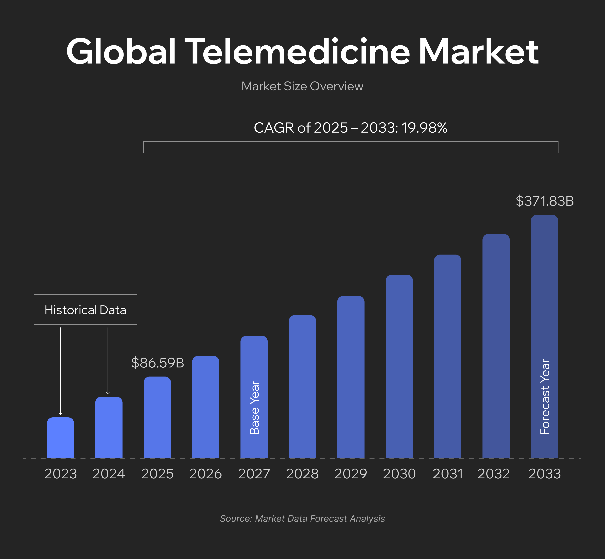
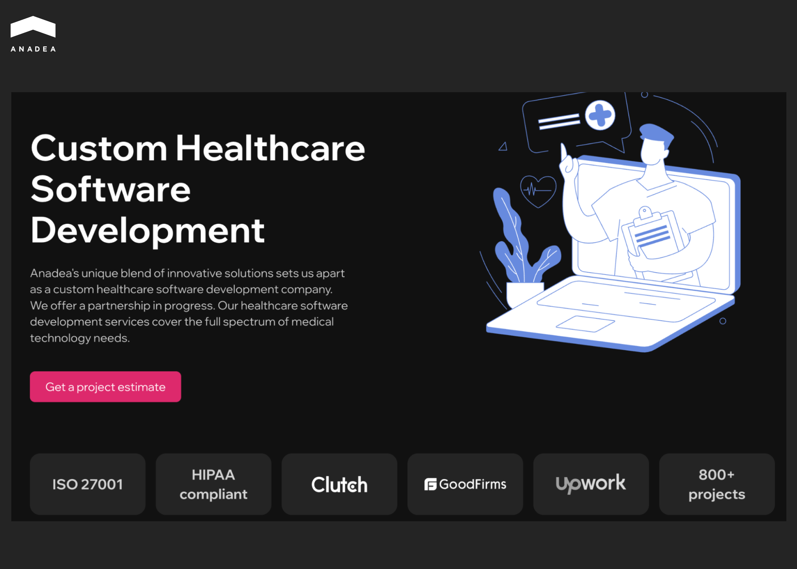
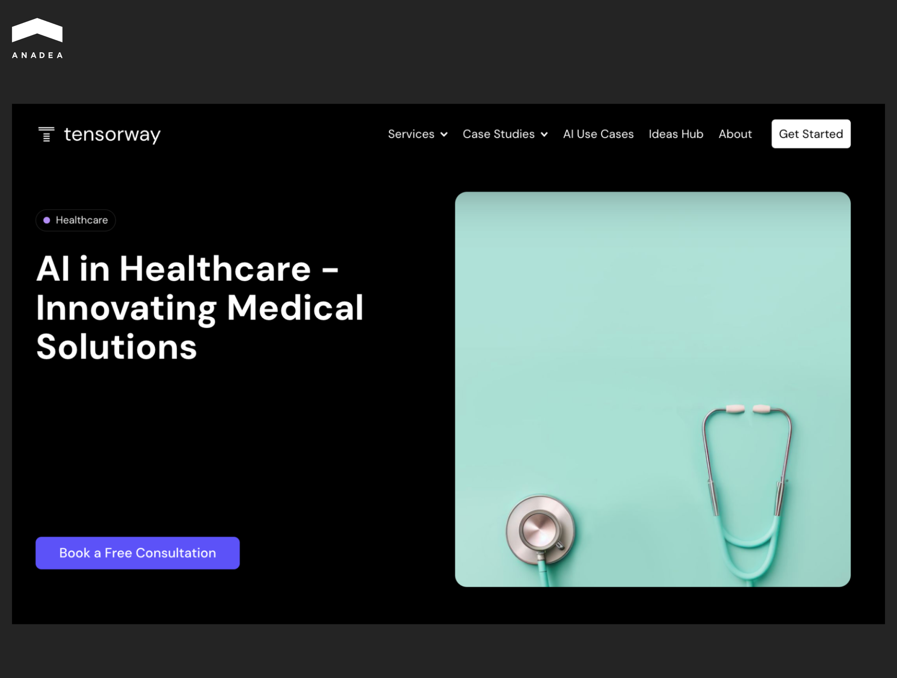
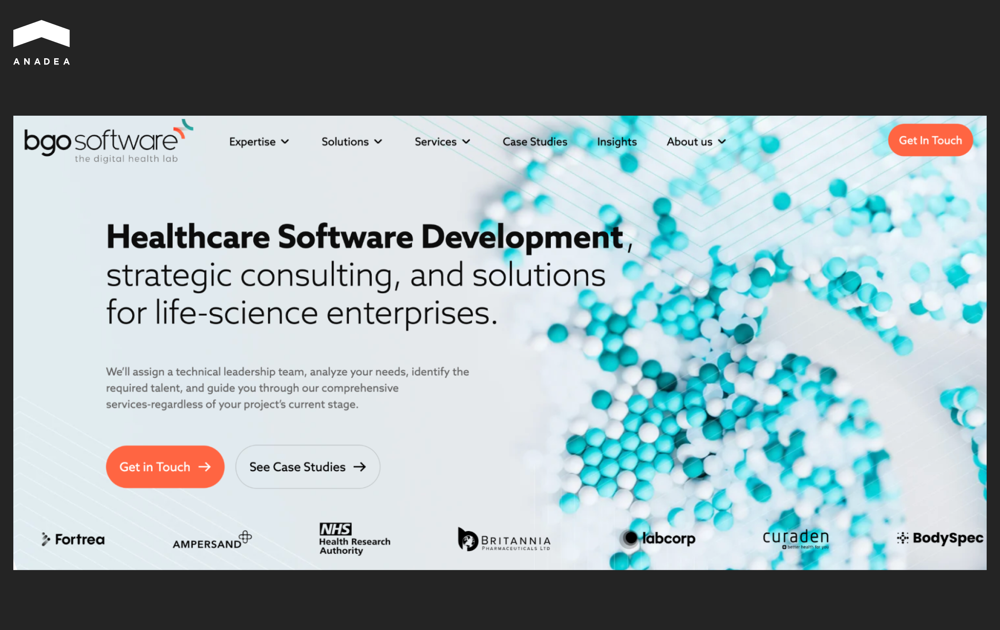
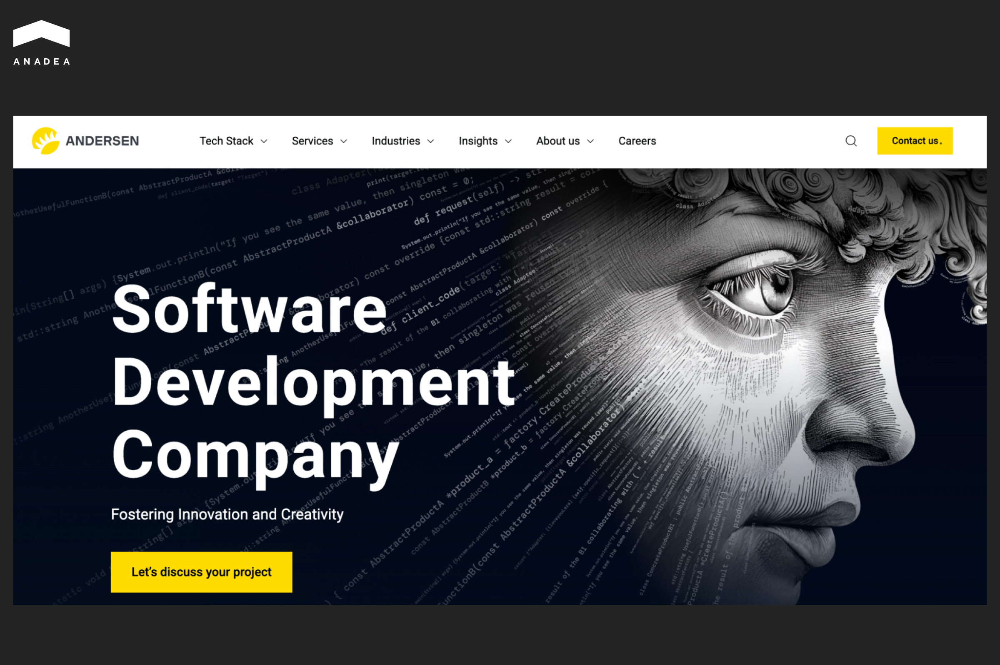
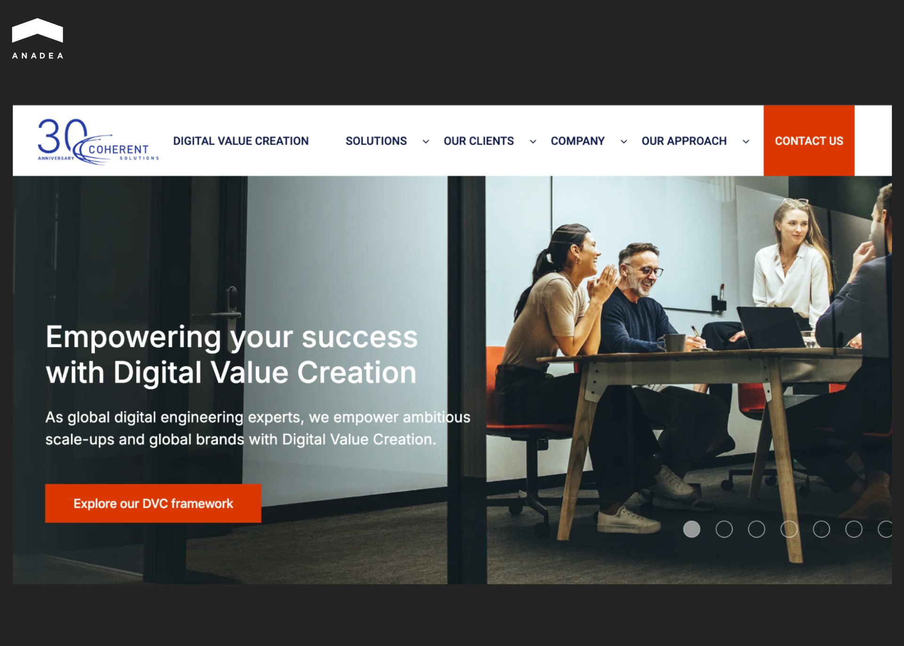
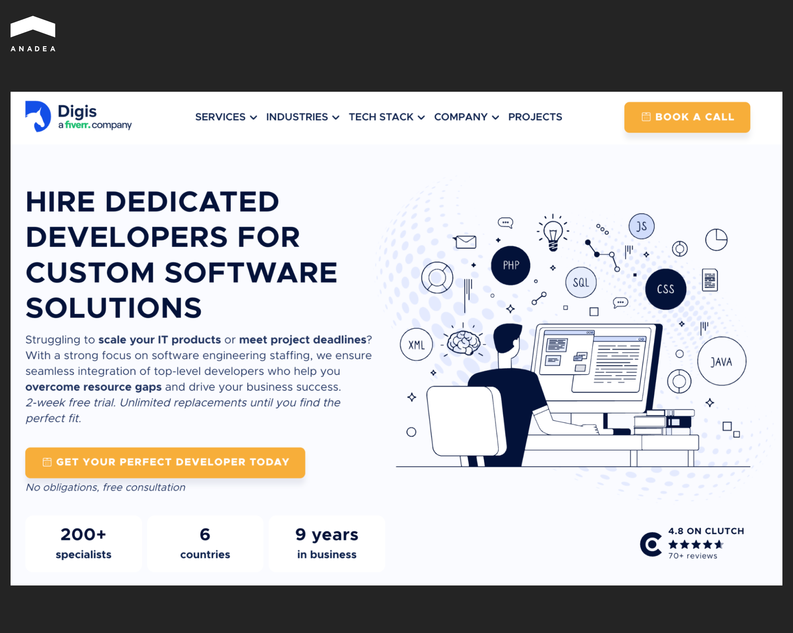
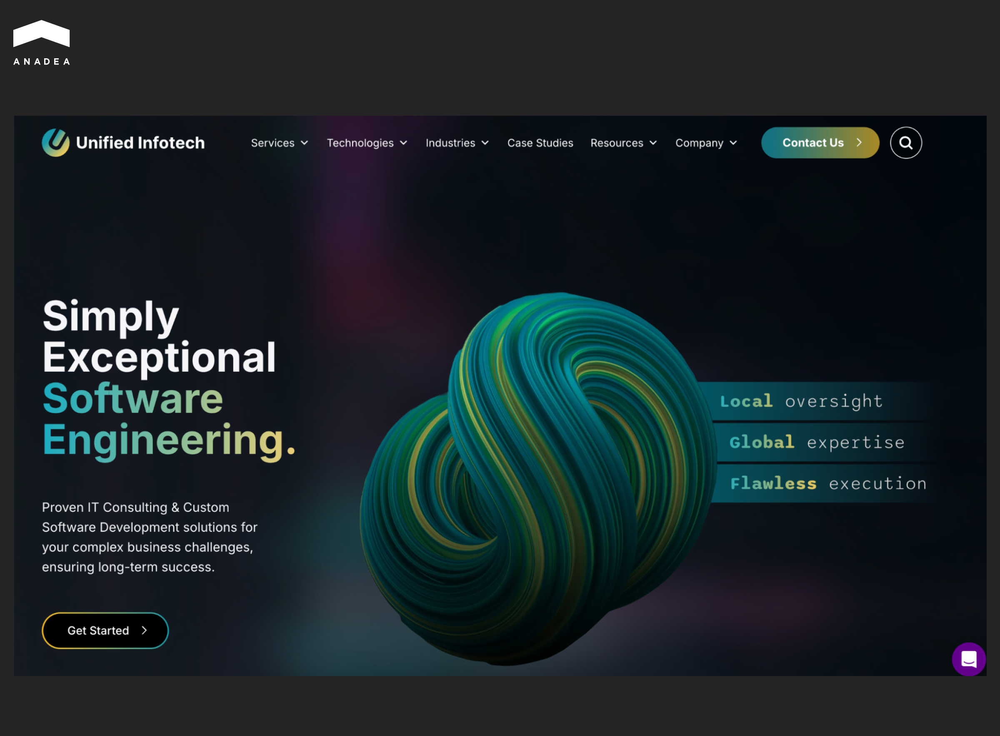
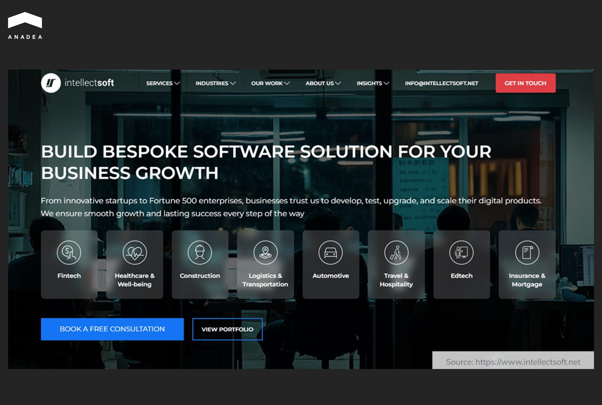
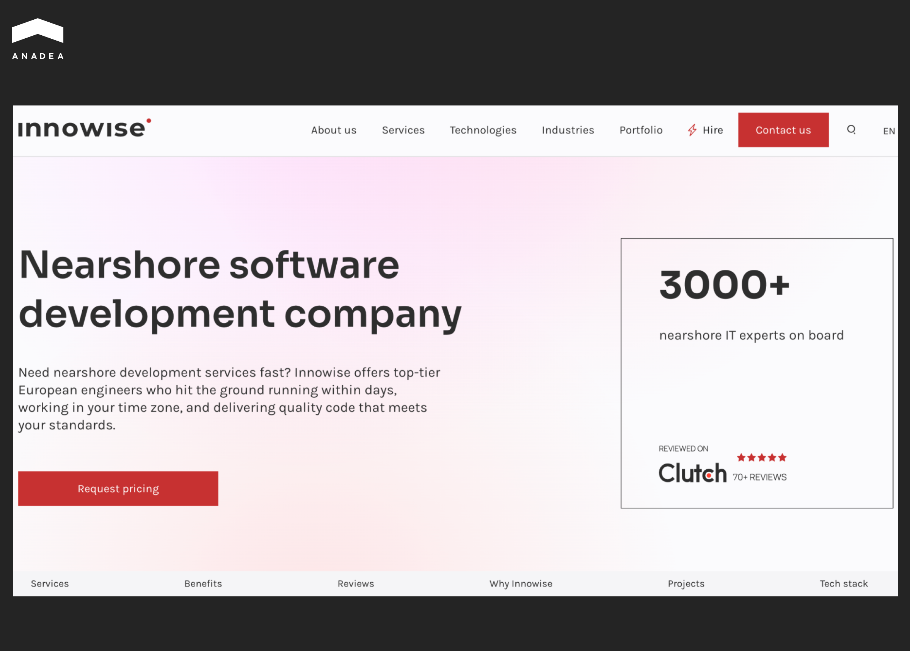

The COVID-19 pandemic catalyzed mass adoption of digital solutions in the healthcare industry. The Centers for Disease Control and Prevention recorded a [154% increase in telehealth visits ](https://www.marketdataforecast.com/market-reports/telemedicine-market)during the last week of March 2020 compared to the same period in 2019. Today, the global telemedicine market is forecast to grow from $72.17 billion in 2024 to $371.83 billion by 2033 at a CAGR of 19.98%. 

Investment in this sector remains substantial even after the post-pandemic boom correction. In 2024, [digital health startups raised $10.1 billion](https://www.fiercehealthcare.com/digital-health/digital-health-venture-funding-hit-101b-2024-investors-focused-earlier-stage-deals) in venture funding across 497 deals, while in the first half of 2025, [funding reached $6.4 billion](https://www.fiercehealthcare.com/health-tech/healthcare-ai-rakes-nearly-4b-vc-funding-buoying-digital-health-market-2025), with 62% of those funds going to AI-powered startups. These figures demonstrate market maturity and sustained investor interest in healthcare innovation.

According to [Clutch](https://clutch.co/developers/healthcare-industry), as of November 19, 2025, there are 8,431 companies registered on the platform specializing in healthcare software development. This number simultaneously reflects both enormous choice and selection complexity. How do you find genuine experts among hundreds of healthcare software development companies positioning themselves as medical technology specialists?

In this article, we've analyzed the market and selected top healthcare software development companies based on strict criteria. Every company on our list has a proven track record in creating solutions that meet the highest standards of security and effectiveness in healthcare. This review will help you find the ideal technology partner for your needs.

## Top Healthcare Software Development Companies

<table>

<tbody>

<tr>

<td>

<strong>Company</strong>

</td>

<td>

<strong>Hourly Rate</strong>

</td>

<td>

<strong>Location</strong>

</td>

<td>

<strong>Core Specialization</strong>

</td>

</tr>

<tr>

<td>

<strong>Anadea</strong>

</td>

<td>

$25-49/hr

</td>

<td>

Spain, USA

</td>

<td>

EHR/EMR, Telemedicine, Custom Healthcare Apps

</td>

</tr>

<tr>

<td>

<strong>Tensorway</strong>

</td>

<td>

$50-99/hr

</td>

<td>

Spain, Cyprus

</td>

<td>

AI/ML Healthcare, Medical Imaging, Predictive Analytics

</td>

</tr>

<tr>

<td>

<strong>BGO Software</strong>

</td>

<td>

$50-99/hr

</td>

<td>

Bulgaria

</td>

<td>

Clinical Research, eHealth, GMP Systems

</td>

</tr>

<tr>

<td>

<strong>Andersen</strong>

</td>

<td>

$50-99/hr

</td>

<td>

Europe, USA

</td>

<td>

EHR/EMR, Telemedicine, Healthcare IT

</td>

</tr>

<tr>

<td>

<strong>Coherent Solutions</strong>

</td>

<td>

$25-49/hr

</td>

<td>

USA

</td>

<td>

Enterprise Healthcare IT, Cloud Solutions

</td>

</tr>

<tr>

<td>

<strong>Digis</strong>

</td>

<td>

$100-149/hr

</td>

<td>

USA

</td>

<td>

Digital Health Apps, HIPAA Compliance

</td>

</tr>

<tr>

<td>

<strong>Unified Infotech</strong>

</td>

<td>

$25-49/hr

</td>

<td>

USA, India

</td>

<td>

Healthcare Mobile/Web Apps, UI/UX

</td>

</tr>

<tr>

<td>

<strong>BairesDev</strong>

</td>

<td>

$50-99/hr

</td>

<td>

Latin America

</td>

<td>

Healthcare Development, Staff Augmentation

</td>

</tr>

<tr>

<td>

<strong>Intellectsoft</strong>

</td>

<td>

$50-99/hr

</td>

<td>

USA, Ukraine

</td>

<td>

IoT Healthcare, AI Solutions, Digital Transformation

</td>

</tr>

<tr>

<td>

<strong>Innowise</strong>

</td>

<td>

$25-49/hr

</td>

<td>

Poland

</td>

<td>

Custom Healthcare Software, Enterprise Solutions

</td>

</tr>

</tbody>

</table>

### 1. Anadea

Anadea is an international software company founded in 2000, headquartered in Spain with a US office. Over two decades, they've built a substantial healthcare practice that represents a significant portion of their business. The company handles the full development cycle for medical software – from discovery and MVP to enterprise-level systems.

They hold ISO 9001 and ISO 27001 certifications, demonstrating their commitment to quality processes and information security. Since 2019, Anadea has run its own AI department, enabling them to integrate artificial intelligence into healthcare projects.

The team brings deep know-how in EHR/EMR systems with HL7, FHIR, and SMART on FHIR integration, telemedicine platform development, practice management software, and medical IoT solutions. Every project follows HIPAA compliance requirements and FDA regulatory guidelines for Software as a Medical Device. With extensive experience in[ medical app development](https://anadea.info/solutions/medical-app-development), they deliver solutions tailored to diverse healthcare needs.

Their portfolio includes [GoGoof](https://anadea.info/projects/gogoof) (practice management for the German medical market), [Vivum Health](https://anadea.info/projects/vivum-health) (clinician application), and [OnTrac](https://anadea.info/projects/on-trac) (EHR system for skilled nursing facilities). Clients range from biotech companies and private clinics to SaaS providers in healthcare and medtech startups. 

### 2. Tensorway

Tensorway is an AI company that emerged as a spin-off from Anadea. They focus exclusively on AI/ML solutions for healthcare, concentrating on deep learning technologies. The team consists of award-winning AI engineers.

The company builds solutions for medical imaging (X-ray, MRI, CT), predictive analytics for healthcare providers, NLP for medical documentation, and AI-powered telemedicine. Tensorway has hands-on experience with DICOM standards and EHR system integrations.

Thanks to their Anadea origins, the team combines AI expertise with a genuine understanding of healthcare workflows and the regulatory landscape of the medical field.

### 3. BGO Software – The Digital Health Lab

BGO Software is one of the few IT companies globally with an exclusive healthcare focus. Founded in 2008 in Bulgaria, they've spent over 15 years building digital health solutions and GxP-compliant systems.

Their client roster includes NHS UK (Department of Health), Roche, LabCorp, IQVIA, and AbbVie. The company works on clinical research systems, GMP validated systems for pharmaceutical companies, eHealth solutions, and medical device software.

BGO Software is a member of HL7 International and an official supplier to the Health Research Authority (UK). 

### 4. Andersen

Andersen is a large international IT company operating since 2007 with a robust healthcare practice. The team includes 3500+ developers and QA engineers, with over 300 specializing in healthcare.

They maintain a medical advisory board with 30+ clinicians, researchers, and healthcare professionals from Europe and North America. Andersen works on EHR/EMR systems, telemedicine platforms, SaMD (Software as a Medical Device), AI solutions for diagnostics, remote patient monitoring, and mental health digital solutions.

Clients include Siemens, Johnson & Johnson, and medical institutions across the US, Europe, and the Middle East. The company holds ISO 9001, ISO 27001, and ISO 13485 certifications and has completed over 150 healthcare projects. 

### 5. Coherent Solutions

Coherent Solutions is a large IT company with 20+ years of experience that includes a healthcare practice among other verticals. The team numbers over 1000+ professionals with offices in the USA and Eastern Europe.

They work on enterprise-level healthcare IT solutions, cloud migration for medical systems, healthcare data analytics and BI, and integration with existing HIS (Hospital Information Systems). They also handle modernization of legacy healthcare systems.

The company serves Fortune 500 healthcare companies and applies Agile methodologies and DevOps practices to their projects.



### 6. Digis

Digis (a Fiverr Company) is a software development firm based in the USA that focuses on premium digital health solutions. The team consists of 50-249 professionals.

They work on mobile health applications, patient engagement platforms, digital therapeutics, and HIPAA-compliant infrastructure. The company brings expertise in FDA regulatory consulting and takes a security-first approach to development.

The US-based team provides strong healthcare domain knowledge and white-glove service for projects with strict compliance requirements and high-visibility healthcare applications.

### 7. Unified Infotech

Unified Infotech is an international company with offices in the USA and India that focuses on web and mobile healthcare applications. The team of 250-999 professionals has 10+ years of experience.

They concentrate on healthcare mobile app development, patient portals, telemedicine apps, and UI/UX design for healthcare. The company delivers HIPAA compliance and secure coding practices.

Their nearshore/offshore model provides competitive pricing, making them an attractive option for healthcare startups, MVP development, and patient-facing applications where UI/UX plays a critical role.

### 8. BairesDev

BairesDev is Latin America's largest software development company with a healthcare practice. They employ 1000+ developers selected through a rigorous vetting process (1% acceptance rate).

They focus on staff augmentation for healthcare projects, custom healthcare software development, cloud solutions, and QA/testing for medical software. The company brings HIPAA compliance expertise and ISO certifications.

Time zone compatibility with US clients and scalable teams make them a solid choice for US companies needing nearshore talent and quality professionals for mid-to-large scale healthcare projects.

### 9. Intellectsoft

Intellectsoft is a global software development company with 15+ years of experience and a healthcare vertical. The team of 250-999 professionals operates from offices in the USA and Ukraine.

They work on digital transformation in healthcare, IoT healthcare solutions, blockchain in healthcare, AI-powered applications, and wearable technology integration. The company has HIPAA/GDPR compliance and FDA regulatory experience.

Strong R&D capabilities and an innovative approach make them appealing for healthcare organizations pursuing innovation, IoT healthcare projects, blockchain implementations, and digital transformation initiatives.

### 10. Innowise

Innowise is a large Eastern European IT company with 17+ years of experience and a healthcare practice. The team of 1000+ developers operates from offices in Poland and Belarus.

They focus on enterprise healthcare software, EHR/EMR systems, healthcare analytics and BI, cloud healthcare solutions, and healthcare system integration. They maintain HIPAA/GDPR compliance and ISO certifications.

Their Eastern Europe location provides competitive pricing, making them a solid choice for enterprise healthcare organizations, large-scale healthcare systems, and long-term partnerships.

## How to Choose the Right Healthcare Software Development Partner

Selecting one of the best healthcare software development companies is one of the most critical decisions your organization will make. Unlike general software development, healthcare projects carry unique complexities. The wrong partner can lead to failed FDA submissions, HIPAA violations costing millions, or products that clinicians simply refuse to use. Here's a comprehensive framework to guide your selection process.

### 1. Healthcare Domain Expertise

Healthcare software isn't traditional enterprise software with medical data added on top. It requires a deep understanding of the unique needs of healthcare stakeholders.

What to look for:

* **Portfolio specificity**. Look for companies with 20%+ of their portfolio dedicated to healthcare projects.
* **Regulatory experience**. Proven track record with FDA submissions, CE marking processes, or other relevant regulatory pathways.
* **Healthcare sub-sector expertise**. Experience in your specific vertical (telemedicine, diagnostics, hospital management, payer platforms, etc.) matters significantly.

### 2. Compliance and Security Posture

When software is used by HIPAA covered entities to create, receive, store, or transmit Protected Health Information, it must comply with HIPAA regulations. Fines for HIPAA violations range from $100 to $50,000 per record, with some penalties reaching millions of dollars annually.

Essential certifications and frameworks:

* **HIPAA compliance infrastructure**. The vendor must be willing to sign a Business Associate Agreement (BAA) and implement technical security measures including encryption, transmission security, and access controls.
* **ISO 27001**. Information security management certification demonstrating systematic approach to data protection
* **ISO 13485**. For medical device software, ISO 13485 certification provides a quality management system framework and is often a prerequisite for market access in many countries.

Red flags:

* Reluctance to sign BAA.
* No documented security policies or incident response procedures.
* Claims of "HIPAA compliance" without specific technical controls to back it up.
* No experience with FDA or notified body interactions for regulated products.

### 3. Technical Capabilities 

Healthcare operates on data exchange. FHIR (Fast Healthcare Interoperability Resources) is a standard for exchanging healthcare information electronically, and it has become a commonly used standard, with federal agencies positioning it to strengthen health data interoperability.

* **HL7 and FHIR implementation**. FHIR allows healthcare information, including clinical and administrative data, to be securely available to those who need it, with support from major vendors including Epic, Cerner, and most EHR systems
* **EHR integration experience**. Proven ability to integrate with major EHR platforms (Epic, Cerner/Oracle Health, Allscripts, athenahealth)
* **Cloud architecture expertise**. Experience with HIPAA-compliant cloud platforms (AWS, Azure, Google Cloud healthcare-specific services)
* **Mobile health capabilities**. iOS and Android development with healthcare-specific requirements.
* **AI/ML for healthcare**. If relevant, experience with FDA's guidance on AI/ML-based SaMD and clinical validation requirements.

### 4. Proven Track Record

What constitutes genuine proof:

* Deployed, production systems. Not just prototypes or MVPs, but software actively used by real patients and providers
* Verifiable references. Direct conversations with past clients in similar situations
* Case studies with metrics. Patient outcomes improved, clinician time saved, regulatory submissions successful
* Public validations. App store presence, FDA clearance documentation, peer-reviewed publications featuring their work

Questions to ask references:

* "Did the project launch on time and within budget?"
* "How did they handle regulatory challenges that arose mid-project?"
* "Would you hire them again for your next critical project?"
* "How was their communication during stressful phases?"

### 5. Engagement Model and Budget Alignment

**Common engagement models:**

**Fixed-price projects**: Best for well-defined, smaller scope projects with clear requirements (e.g., standalone mobile app with specified features). 

**Time and materials**: Flexible for complex projects where requirements evolve. Better for R&D-heavy work or when regulatory pathway isn't fully clear. This model is particularly effective for[ healthcare SaaS](https://anadea.info/blog/healthcare-saas/) development where iterative improvements are essential. 

**Dedicated team**: Ongoing partnership model where you essentially have an offshore/nearshore extension of your team. Best for long-term products requiring continuous evolution.

**Cost considerations:** Healthcare software development typically ranges from:

* Simple MVP/prototype: $50,000-$150,000 (3-6 months)
* Production-ready application (single platform, moderate complexity): $150,000-$500,000 (6-12 months)
* Enterprise platform or FDA-regulated SaMD: $500,000-$2M+ (12-24+ months)

Factors affecting cost: regulatory requirements, number of integrations, AI/ML components, multi-platform deployment, cybersecurity sophistication, and clinical validation needs.

### 6. Red Flags to Avoid

Signs of trouble ahead:

* **Generic claims**. "We do healthcare software" without specifics on regulatory experience or healthcare standards.
* **Overpromising on timelines**. Claims of building an EHR integration in 2 weeks or FDA submission in 3 months.
* **Lack of questions during discovery**. Good partners challenge assumptions and ask tough questions about your regulatory strategy.
* **No mention of risk management**. Healthcare development requires systematic risk assessment; if they don't discuss it, they don't understand the domain.
* **Poor documentation practices**. In regulated environments, if it isn't documented, it didn't happen.
* **Unwillingness to show past work**. NDAs are common, but inability to provide any portfolio examples is concerning.
* **No quality assurance process**. Healthcare software requires rigorous testing, including validation for regulated components.

### Final Recommendation

Before signing any contract:

1. Review at least 3-5 relevant case studies and speak with references.
2. Have them sign an NDA and walk through their compliance documentation.
3. Request a technical architecture review session with their lead engineers.
4. Validate certifications directly with issuing bodies where possible.
5. Conduct a small paid proof-of-concept before committing to a full project.
6. Review their standard BAA, MSA, and SOW templates with your legal team.
7. Understand their incident response and breach notification procedures.
8. Discuss staff augmentation vs. fixed team models and associated risks

The healthcare software landscape is complex, and the stakes are high. Take the time to conduct thorough due diligence. The cost of making the wrong choice far exceeds the investment in finding the right one.

## Conclusion

The healthcare software development landscape in 2025 demands more than technical proficiency – it requires partners who understand the intricacies of medical workflows, regulatory frameworks, and patient safety imperatives. The custom healthcare software development companies featured in this review have demonstrated their ability to navigate these complexities while delivering solutions that genuinely improve healthcare delivery.

Whether you're building a telemedicine platform, developing AI-powered diagnostics, or modernizing legacy hospital systems, your choice of development partner will significantly impact your project's success. When evaluating custom healthcare software development companies, take time to assess not just technical capabilities, but domain expertise, regulatory experience, and cultural fit.

Ready to start your healthcare software project?[ Contact Anadea](https://anadea.info/contacts) for a free consultation. Our team has over 20 years of healthcare development experience and can help you navigate from initial concept to FDA-compliant, market-ready solution.
