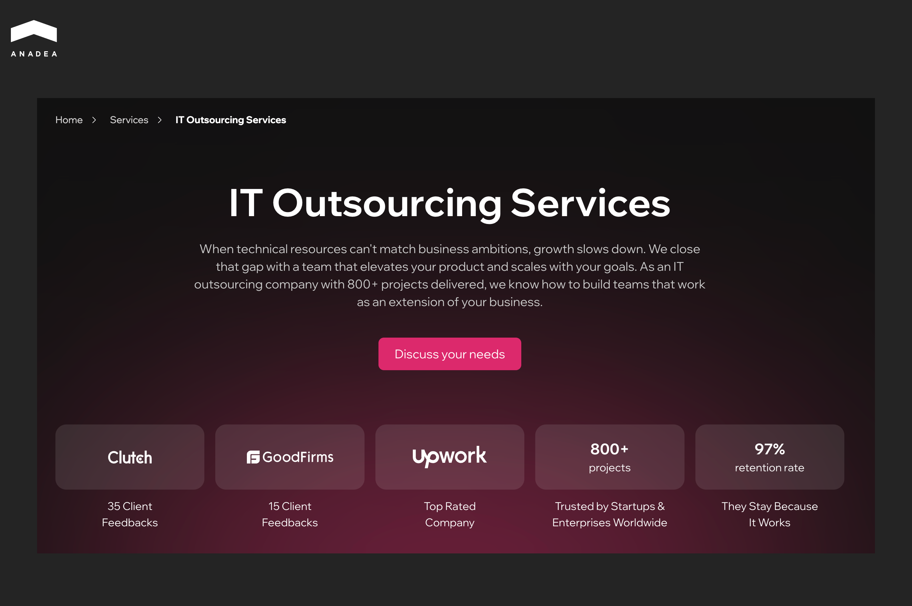
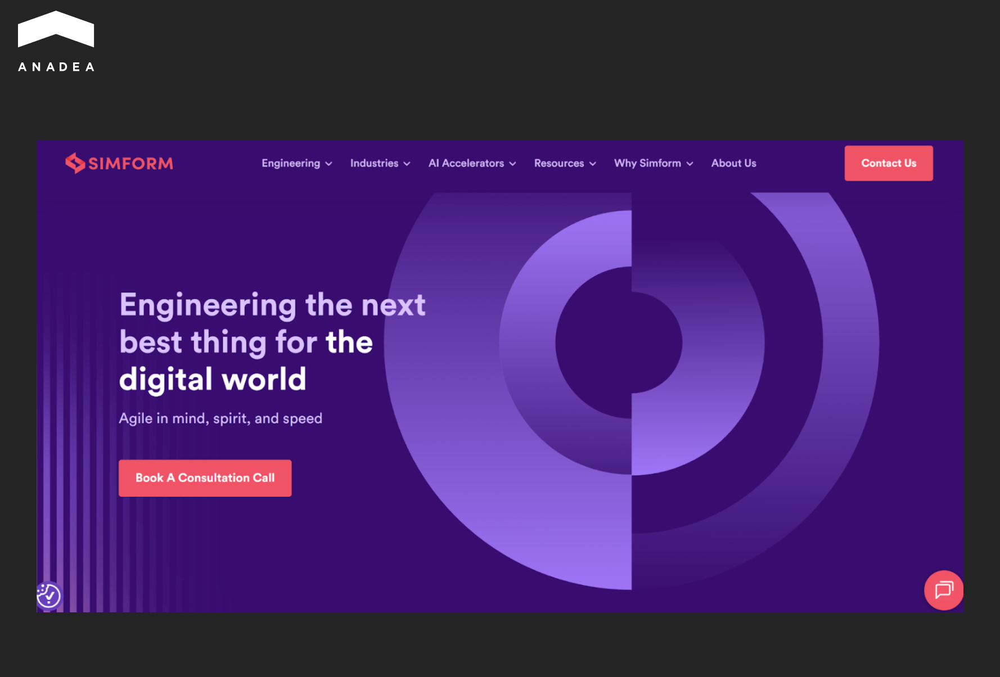
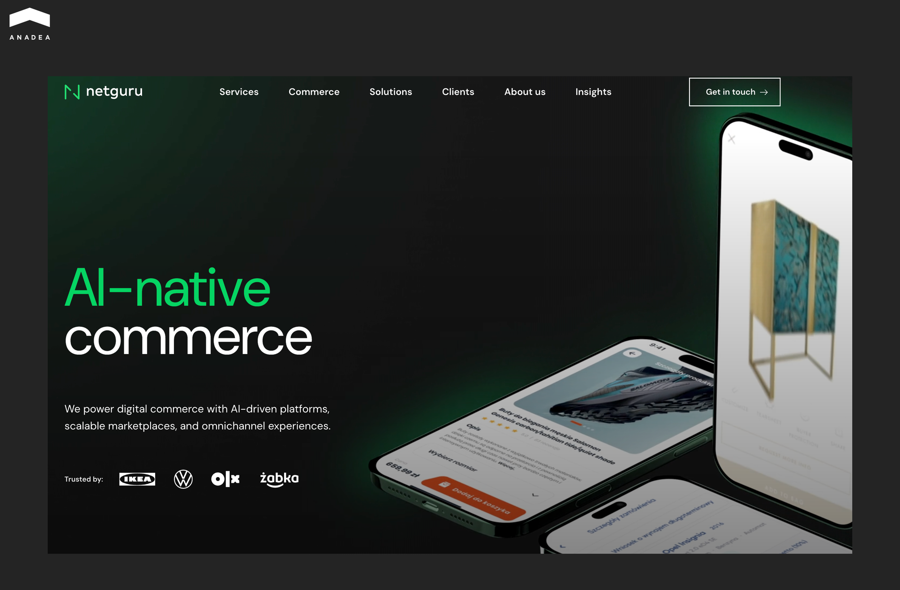
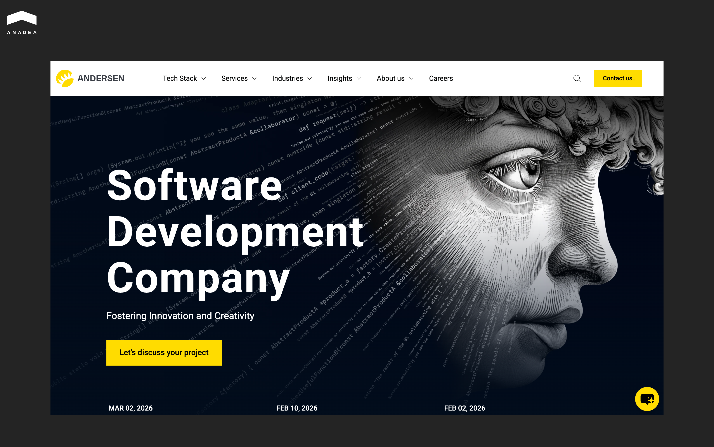
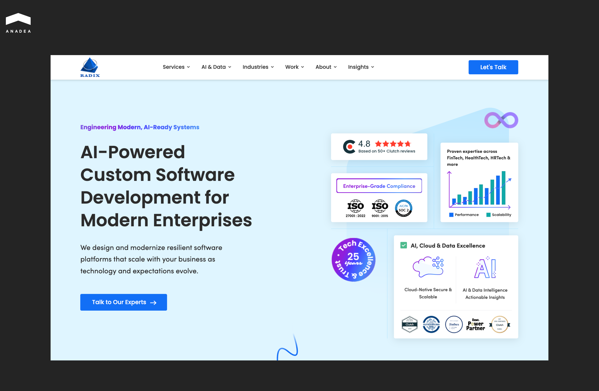
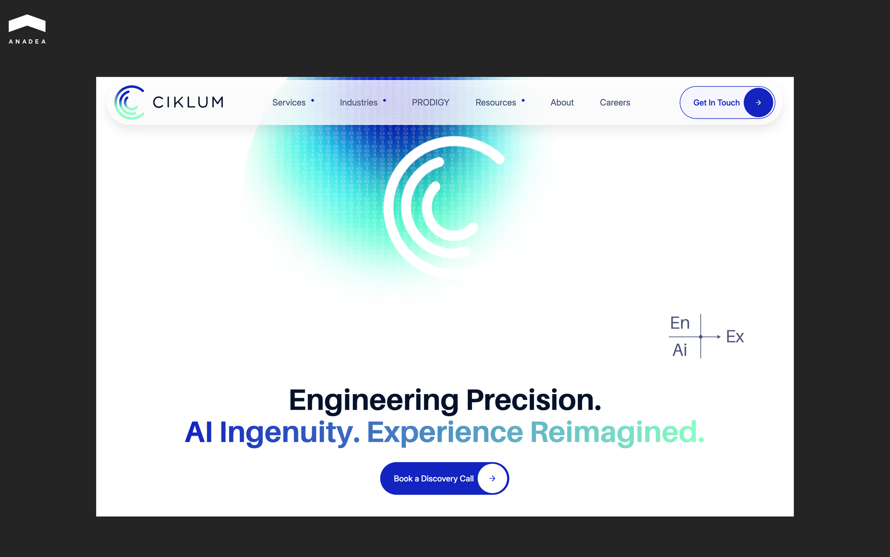
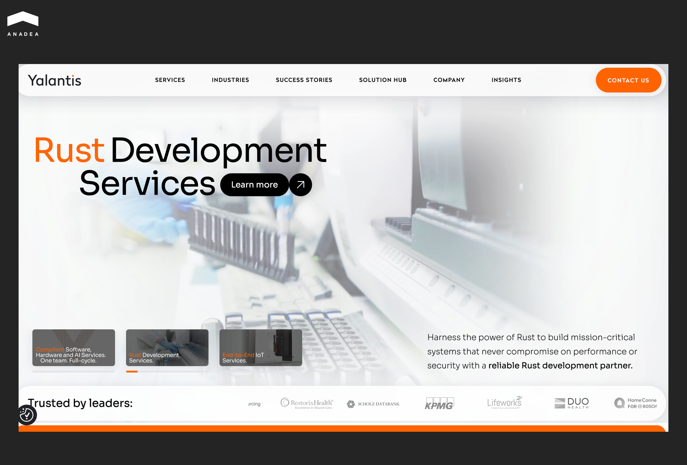
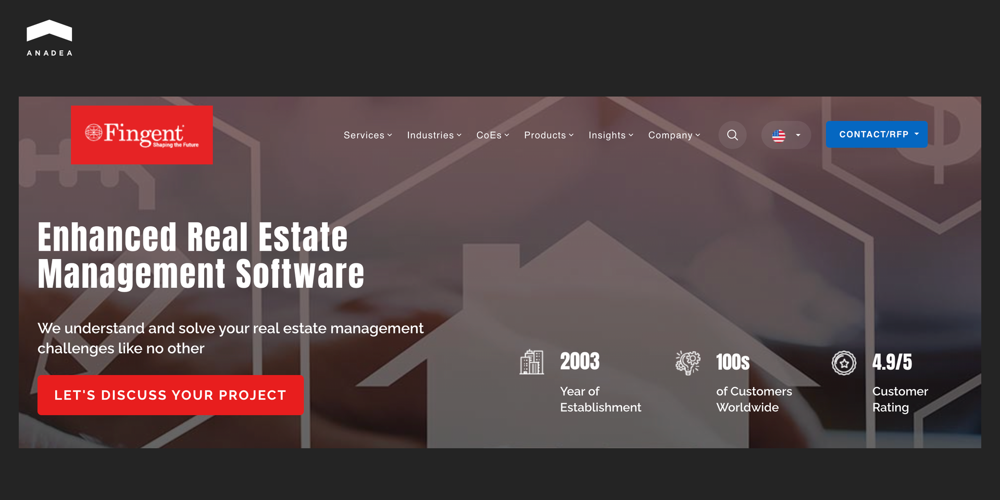
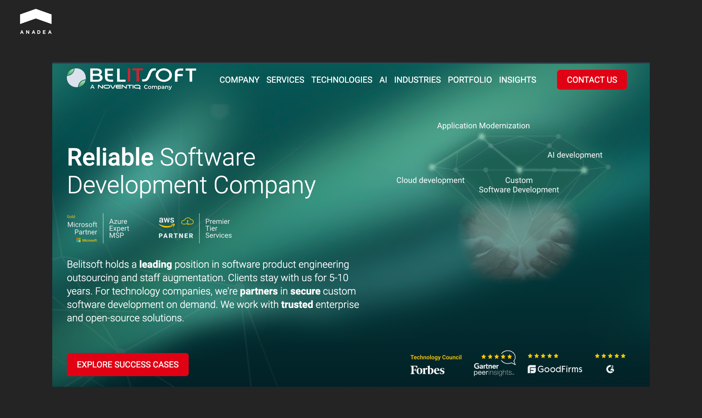

When businesses look for a software development outsourcing company, they often start their search by considering the biggest market players with well-known names.  N-iX is one such example. 

This Tier-1 enterprise software development agency was founded in 2002. Today, it has over 2,400 engineers. The company specializes in AI and IoT, and helps Fortune 500 companies scale their digital infrastructure.

Though N-iX has a strong reputation in the [software development](https://anadea.info/services/custom-software-development) market, businesses often explore alternative tech partners. It happens not because N-iX lacks capability, but because specific project nuances require a different skillset or approach. 

This article presents a list of reliable N-iX alternatives. These companies can become suitable tech partners to address your business needs.

## Why Businesses Look for N-iX Alternatives

Here are the primary drivers behind exploring different engineering partners:

* **Industry specialization**. While large firms cover many sectors, a business might seek a boutique partner that works with a particular vertical.
* **Engagement flexibility.** Not every project requires a large dedicated team that includes 50+ specialists. Smaller tech partners often offer more flexibility in how they structure engagements.
* **Pricing and budget models.** Depending on the budget, a company might look for a partner with a different cost structure. Another way to optimize costs can be to hire developers in regions with more competitive rates.
* **Niche technology expertise**. Sometimes a project requires a specialized stack. If a firm’s core specialization is more focused on widely adopted Java or .NET, a client might look for a partner with a niche center of excellence.

## Top N-iX Alternatives to Explore

When planning to establish cooperation with a new [IT outsourcing](https://anadea.info/services/it-outsourcing) partner, you should compare various options. Software development companies may have different focus areas and expertise. Therefore, you should find one whose strengths align with your specific needs.

The table below summarizes each alternative's core strengths.

<table>

<tbody>

<tr>

<td>

<strong>Company</strong>

</td>

<td>

<strong>Core Strengths</strong>

</td>

<td>

<strong>Best For</strong>

</td>

</tr>

<tr>

<td>

Anadea

</td>

<td>

AI/ML expertise, rapid 2-week onboarding, and a massive 97% client retention rate

</td>

<td>

Long-term technical evolution and high-risk builds that require a Proof of Concept before full investment

</td>

</tr>

<tr>

<td>

Simform

</td>

<td>

Co-engineering model and cloud/AI specialization

</td>

<td>

Collaborative iteration where you need a partner that works as a native part of your in-house engineering department

</td>

</tr>

<tr>

<td>

Netguru

</td>

<td>

High-end UX/UI design and consumer-facing enterprise apps

</td>

<td>

Design-driven development and rapid team scaling

</td>

</tr>

<tr>

<td>

Andersen

</td>

<td>

Enterprise compliance and high-security builds

</td>

<td>

Highly regulated industries that need audit-ready engineering pods

</td>

</tr>

<tr>

<td>

Radixweb

</td>

<td>

Legacy system refactoring and long-term architectural stability

</td>

<td>

Projects with strict security standards

</td>

</tr>

<tr>

<td>

Ciklum

</td>

<td>

Global follow-the-sun delivery and intelligent automation hubs

</td>

<td>

Large-scale global products that require 24/7 development and high-level automation

</td>

</tr>

<tr>

<td>

Yalantis

</td>

<td>

IoT/hardware integration, mission-critical systems (healthcare/fintech)

</td>

<td>

Connected hardware products and high-performance backend systems

</td>

</tr>

<tr>

<td>

Oxagile

</td>

<td>

Video engineering, adtech, and computer vision video analytics

</td>

<td>

Streaming platforms, real-time media processing, and complex big data pipelines

</td>

</tr>

<tr>

<td>

Fingent

</td>

<td>

Business-logic-first approach and low-code acceleration

</td>

<td>

High-velocity business tools and companies that look to cut cloud costs through optimized architecture

</td>

</tr>

<tr>

<td>

Belitsoft

</td>

<td>

Edtech specialization, senior-heavy talent bench, and high developer retention

</td>

<td>

Specialized long-term partnerships that require deep domain knowledge

</td>

</tr>

</tbody>

</table>

### Anadea

[Anadea](https://anadea.info/) has a 25-year history in the software development industry. With more than 800 successful launches behind the company, it can become a long-term technical partner for businesses working in different domains. Anadea stays with a product through its entire evolution and handles everything from the first discovery session to the day-to-day maintenance long after the initial release.

Here’s how Anadea helps eliminate your operational overhead:

* **Streamlined onboarding**. Anadea has a pre-vetted pool of developers, QA, DevOps, and other specialists. Thanks to this, it can assemble dedicated development teams in 2-3 weeks, as the company. Such teams will integrate into your Slack, Jira, and stand-ups as a native extension of your company.
* **Flexible engagement vectors**. You don't pay for an entire team when you only need a specific fix. When you are looking just for one or two specialists to solve a critical system slowdown, you can opt for staff augmentation. These experts will adapt their workflow to match your existing schedule.
* **Risk mitigation.** Before investing six figures into an unproven technology, you can cooperate with Anadea’s R&D team, which will build a Proof of Concept (PoC) for you. The company’s experts will evaluate the technology, create a functional prototype, and hand you the data you need to decide if the investment is actually viable.
* **Cross-functional output.**  Anadea’s technical expertise covers backend architecture, frontend state management, CI/CD orchestration (DevOps), legacy software modernization, cloud migration, and AI transformation.
* **97% retention metric.** This number proves that Anadea can maintain the architecture its team deploys over multi-year cycles. The company has dozens of clients who have relied on its services for more than 12 years.

Anadea works with clients from different industries, including but not limited to healthcare, fintech, real estate, and education. 

One of the projects that highlights Anadea’s ability to manage complex, long-term digital transformations is its 14-year partnership with [Visdeal](https://anadea.info/projects/visdeal), a leading Dutch e-commerce platform. By replacing a failing legacy system with a high-performance architecture, Anadea reduced page load time by 10x and scaled the platform to handle 3 million annual users and over 80,000 products. In addition, the team integrated AI-powered translations and custom warehouse automation to support Visdeal’s expansion across eight European markets. 



### Simform

Since its foundation in 2010, Simform has operated as a specialized product engineering firm. It functions more like a technical partner than a traditional service provider. The company focuses on a co-engineering philosophy. It means that its developers embed directly into a client’s internal team. This integration ensures that every line of code remains synchronized with the client’s broader business goals. Moreover, it leads to more predictable releases and faster iteration cycles.

What does Simform offer as an outsourcing partner?

* **Co-engineering approach.** Simform works as an extension of in-house teams to provide better alignment with business goals and smoother collaboration.
* **End-to-end development capabilities.** The company supports the full product lifecycle, from discovery to testing and long-term maintenance.
* **Strong expertise in modern technologies.** Simform specializes in cloud engineering, AI/ML, data platforms, and application modernization. It helps companies build scalable and future-ready solutions.
* **Agile and scalable teams**. Its teams follow agile methodologies and DevOps best practices to enable continuous delivery and rapid scaling as project needs evolve.
* **Industry versatility.** Simform has experience across multiple industries, including fintech, healthcare, SaaS, and e-commerce.

### Netguru

Netguru was established in 2008. As of today, this custom software development company has delivered over 2,500 projects for startups and global brands like IKEA, Volkswagen, and OLX. Netguru has solid expertise in tech product design and bridges the gap between heavy backend architecture and front-end user retention.

Why choose Netguru as an outsourcing partner?

* **Flexible outsourcing and scaling**. Businesses can access specialized talent and reduce operational costs without investing in in-house capabilities. Netguru guarantees high flexibility as its clients’ needs evolve.
* **Focus on user experience.** The company emphasizes design-driven development to ensure that products are intuitive and engaging for end users.
* **Expertise in modern technologies.** The company delivers solutions in web and mobile development, AI/ML, data science, and cloud technologies.
* **Collaborative approach.** Netguru works closely with clients using agile methodologies. So that its customers can leverage faster delivery cycles.

### Andersen

This outsourcing software development firm brings together 3,500+ IT specialists and has delivered over 2,000 successful projects. Andersen was founded more than 19 years ago and today, it operates 19 offices worldwide. It can support businesses at every stage of digital growth.

What is special about Andersen’s delivery model?

* **Deployment velocity (14-28 days).** Andersen can introduce pre-vetted engineers into your staging environment in under a month, which allows its clients to bypass the standard 6-month recruitment lag.
* **Zero-trust and compliance.** The company’s engineers build with field-level encryption and strict data governance protocols from day one, passing enterprise-level compliance audits by default.
* **Consolidated infrastructure delivery**. Andersen handles the entire technical pipeline, from CI/CD orchestration to AI infrastructure and automated security testing.

### Radix

With over 25 years of experience, Radix is a technology outsourcing partner that delivers scalable software solutions to businesses worldwide. The company has flexible engagement models. It offers dedicated teams, project-based delivery, and long-term collaborations to meet diverse needs.

What does Radixweb offer?

* **Specialized technical proficiency**. Radixweb has deep expertise in high-stakes areas, including legacy modernization of critical systems, cloud-native development, embedded and IoT solutions.
* **Engineering-first mindset**. The company focuses on building scalable systems powered by AI, cloud, and data engineering. It delivers solutions that evolve alongside business needs.
* **ISO-certified quality and security.** For industries like fintech, healthcare, or edtech, basic encryption is a compliance failure. Radixweb operates under ISO 9001:2015 quality standards and rigorous data governance protocols.
* **Strong outsourcing performance metrics**. Radixweb maintains a 97% client satisfaction rate, 87% retention rate, and over 93% on-time delivery.

### Ciklum

Ciklum positions itself as an AI-powered experience engineering company. It was founded more than 25 years ago. Its staff includes over 4,000 engineers who are across EMEA, the US, and APAC. The company’s expertise covers foundational AI, agentic automation, and accelerated software engineering. Now, delivers high-quality solutions for fintech, retail, healthcare, hi-tech, and other sectors.

What can Ciklum provide to its customers?

* **Global follow-the-sun delivery**. With delivery centers across Europe, Asia, and Latin America, Ciklum solves the time-zone latency issue.
* **Specialized centers of excellence**. Unlike generalist firms that claim to do everything, Ciklum operates dedicated hubs for specific high-stakes technologies: intelligent automation, AI, analytics, cloud, and DevOps.
* **Accelerated software engineering**. Scalable engineering capabilities to deliver high-quality, future-ready software faster, without the overhead of building internal teams.

### Yalantis

Yalantis is a certified software, hardware, and AI development partner that has been on the market for more than 17 years. Yalantis positions itself as a product-first engineering house. It takes full technical ownership of complex ecosystems, especially in IoT, healthcare, and fintech.

Key strengths of Yalantis:

* **Hardware-to-cloud integration.** Yalantis has a dedicated bench for embedded development and IoT.  The company designs the firmware and the cloud pipelines that allow physical devices to communicate securely.
* **Strategic discovery phase**. Every project starts with a rigorous discovery process to validate clients’ technical assumptions and build a realistic roadmap.
* **Focus on quality and innovation.** The company emphasizes thoughtful architecture, automated testing, and continuous improvement to deliver reliable software that drives measurable business value.

### Oxagile

With over two decades of experience, Oxagile helps businesses innovate and build future‑ready products through flexible engagement models and deep technical expertise. The company has the richest experience in online video (OTT), computer vision, and adtech development. Its client list includes Google, Disney, Discovery, and other prominent names.

Why Oxagile can become an appropriate outsourcing tech partner: 

* **Hybrid delivery models**. They offer a managed team approach that functions as a self-healing engineering unit. Clients need to provide the high-level roadmap. All operational tasks can be handled by Oxagile.
* **Enterprise-grade security**. Oxagile builds with SOC2 and GDPR compliance by default, ensuring that sensitive user data and proprietary media assets are protected at the database layer.
* **Big data and business intelligence orchestration**. For projects managing massive datasets, Oxagile builds the underlying ETL pipelines. They ensure that data can be queried in real-time for executive decision-making.

### Fingent

Fingent is a strategic technology outsourcing partner with more than 20 years of experience. Over this time, it has completed over 800 projects for clients across 14+ countries. Fingent supports clients through full‑cycle development, flexible staff augmentation, and strategically aligned global capability centers that can be located in different regions of the world. Developers at such centers fully follow the client’s security standards, corporate culture, and long-term product roadmap. But at the same time, all administrative tasks (like local labor laws, office real estate, payroll, and regional taxes) remain the responsibility of Fingent.

What Fingent offers:

* **Proprietary low-code and no-code acceleration.** Fingent uses a hybrid development approach. It leverages modern low-code platforms where appropriate to deliver functional MVPs or internal tools up to 50% faster than it is possible with traditional development methods only.
* **Multi-cloud architecture.** Fingent focuses on cloud-native builds. Your application will be auto-scaling and cost-optimized. This will protect you from the massive server bills that come from unoptimized, monolithic architectures.
* **Industry-focused expertise.** The company has delivered solutions across industries such as healthcare, fintech, logistics, e‑commerce, manufacturing, and education. This cross‑industry experience enables Fingent to understand unique domain challenges and tailor solutions accordingly.

### Belitsoft

Belitsoft is a custom software development company that was founded in 2004. The company focuses on long-term engineering partnerships. 50% of its current clients have relied on its services for more than 5 years. Today, its staff includes 250+ employees, 51% of whom are senior-level experts.

Belitsoft’s strengths:

* **Proven software engineering expertise**. Belitsoft has built a solid track record delivering custom enterprise software, web and mobile applications, and complex integrations. Their experience includes various industries such as healthcare, finance, education, logistics, and e‑commerce.
* **Broad technology stack**. Belitsoft’s engineers are proficient in modern technologies, including .NET, Java, PHP, Python, JavaScript frameworks, mobile platforms, cloud services, and data solutions.
* **ISO 9001 and 27001 certification.** Belitsoft’s internal processes are audited for quality and information security, ensuring your IP and user data are protected by enterprise-grade protocols.

## Technical Selection Metrics

To identify a partner that will work as an engineering peer, not just an order-taker, you need to evaluate a range of core signals.

* **Technical depth vs. surface knowledge**. Look for partners who understand the underlying principles of technology and design. Depth ensures that they can troubleshoot complex issues and adapt to evolving requirements.
* **Domain-specific expertise**. Experience in your industry is critical. A partner familiar with regulatory requirements and typical workflows can accelerate development and reduce risk.
* **Communication latency.** Evaluate responsiveness, clarity of technical discussions, and their ability to convey complex ideas to both technical and non-technical stakeholders.
* **Onboarding efficiency.** Fast onboarding reduces ramp-up time and streamlines project delivery.
* **Ownership vs. vendor lock-in.** Your tech partner must provide clean, documented code, automated test suites, and transparent deployment logs. 

## Wrapping Up

Finding the best N-iX alternative is usually not about a "better" company. Instead, it is about a better match for your specific stage of growth. The main task for you is to clearly define your goals and needs. This will help you understand what skills and expertise you expect your tech partner to have.

Of course, it is very important to pay attention to the company’s reputation, case studies, and clients’ reviews. However, it’s vital to keep in mind that something that suits other organizations may not be the best choice for your business. That’s why you also should consider your potential partner’s niche expertise, tech stack, and approaches to development. All this should align with your requirements.

Anadea can be the engineering partner that you are looking for. With our company, you can get a dedicated team running in under 3 weeks and turn your technical roadmap into a reality. [Contact us](https://anadea.info/contacts) to learn more!
