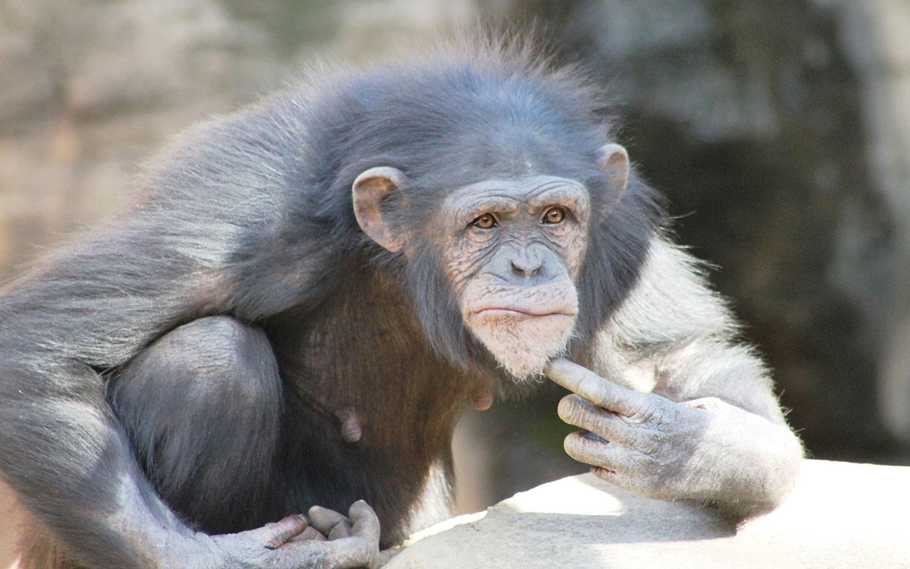

<script type="application/ld+json">
{
 "@context": "https://schema.org",
 "@type": "Article",
 "author": "Anadea",
 "name": "Carrierwave: How to Avoid Issues with Version Inheritance"
}
</script>

<a href="https://github.com/carrierwaveuploader/carrierwave" rel="nofollow" target="_blank">Сarrierwave</a> is a popular image upload gem used by the Rails community to upload files to the server.

Recently I had a task to upload two types of images into the application. Under the hood,the only difference between them was the target directory on the server. Sounds pretty simple, right?

To follow <a href="https://en.wikipedia.org/wiki/Don%27t_repeat_yourself" rel="nofollow" target="_blank">DRY</a> principle, I decided to not create different uploader classes and use inheritance structure.

I created simple ImageUploader class:

<script src="https://gist.github.com/DmytroVasin/47714aea7190a74f1bda4ea5074f66fe.js"></script>

Then I created PurchasedImageUploader that completely inherits from the previous one:

<script src="https://gist.github.com/DmytroVasin/2a05cdd02ae2abf254a3d35d63146f21.js"></script>

Then I uploaded several files and got unexpected result:

```
PurchasedImage.last.file.small.url
=> "/image/9/small_file_name.png"
PurchasedImage.last.file.url
=> "/purchased_image/9/file_name.png"
```

Hmm…

## What is going on?

After some research I found out that existing behaviour was correct by design. `storage_dir`, that was defined inside the inherited class, would not be applied to versions. We should define `storage_dir` inside each block. It sounds confusing to me.

> When you create inheritance structure with carriervave classes you should remember next: Versions of subclasses respects methods that defined only inside original class and previous version blocks.

**"original class"** means the first class in chain that inherits from the **"CarrierWave::Uploader::Base"**.

Let's review that behaviour.

To provide more deep ancestor chain let's add:

```
# app/uploaders/purchased_image_uploader.rb
version :small do
 process resize_to_fill: [120, 120]
end
```

If we pick direct version we can find out ancestors chain:

```
PurchasedImage.last.file.versions[:small].class
#=> PurchasedImageUploader::Uploader70329100898520
PurchasedImage.last.file.versions[:small].class.ancestors
#=>[
 PurchasedImageUploader::Uploader70329100898520,
 ImageUploader::Uploader70329129758160,
 ImageUploader,
 CarrierWave::MiniMagick,
 CarrierWave::Uploader::Base,
 ...
]
```

"`PurchasedImageUploader::Uploader70329100898520`" — This is a class that was created specially for version **:small** for PurchasedImageUploader.

"`ImageUploader::Uploader70329129758160`" —  A class for ImageUploader :small version (that has the same name).

Each version that was defined inside of the `PurchasedImageUploader` creates its own special class. That version class is inherited from the same special class that was created by the version with the same name in the parent class. And so on to `ImageUploader` — the original class that inherits from `CarrierWave::Uploader::Base`.

Simply, by design, each version block inherits from another version block with the same name that was defined in parent class.

About version creation you can find out <a href="https://github.com/carrierwaveuploader/carrierwave/blob/e9f3be59e6e6b5d41a9b379df92cad6be16e7f84/lib/carrierwave/uploader/versions.rb#L66" rel="nofollow" target="_blank">here</a>.

## Solution

<script src="https://gist.github.com/DmytroVasin/12d7c4a2a5016a6523f8ef07ef62d352.js"></script>

Or just do not use an inheritance for uploader files, you can achieve the same goal with "includes" :)

BTW: `fog_public` method will have the same issue if you would use a <a href="https://github.com/fog/fog-aws" rel="nofollow" target="_blank">fog storage</a>.

Solution is not perfect, but it works.

Also, if you find another solution — please let me know.

Link to dummy app: <a href="https://github.com/DmytroVasin/carrierwave-inheritance-test" rel="nofollow" target="_blank">Demo App</a>.
