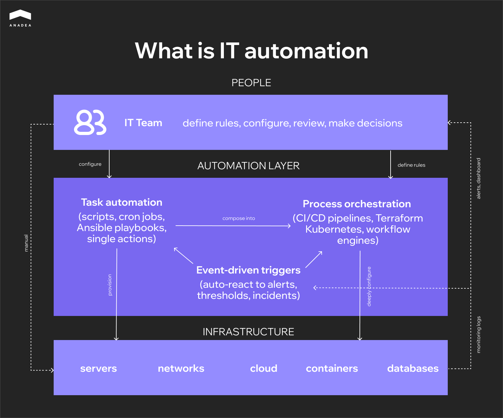

58% of companies planned to increase their IT automation budget in 2025 compared to 2024. Only 1% expected cuts. This data comes from a [Red Hat survey](https://www.redhat.com/en/blog/solving-tool-overload-one-automation-step-time), and it illustrates the general sentiment quite well: automation is no longer an initiative driven by individual DevOps engineers but has become a dedicated budget line item. At the same time, [IBM IBV reports](https://www.ibm.com/thought-leadership/institute-business-value/en-us/report/intelligent-it-automation) that companies with mature automation spend half as much on infrastructure maintenance as they did just two years ago, allocating 33% of their IT budget instead of 67%. The rest goes toward product development.

In its [global IT trends report](https://www.redhat.com/en/global-tech-trends-2024), Red Hat ranks manual processes as the number one barrier to digital transformation, ahead of budget constraints and even technical debt. The direction is clear. The question is how exactly to approach implementation, and that's what this guide is all about.

## What Is IT Automation? 

It is the use of software to perform repetitive IT tasks with minimal human involvement. Server provisioning, network configuration, deployment, patch management, backups, load balancing across cloud environments. Anything that can be described as a set of instructions can be handed off to software. 

A standalone script that runs on a schedule is also automation. And so is a fully autonomous pipeline that responds to infrastructure events and executes a chain of operations without an administrator. Most teams fall somewhere between these two points: some processes are already automated, some still rely on manual work, and that boundary keeps shifting.

Distributed data centers, hybrid clouds, microservices, containerization. Infrastructure is growing more complex faster than teams can scale. Coordinating configurations, monitoring service health, and maintaining a stable release cycle across dozens of environments simultaneously simply doesn't fit into manual workflows anymore. In this context, automation becomes less a matter of efficiency and more a prerequisite for manageability.

There's another point that often gets confused: automation versus orchestration. Automation executes a task. Orchestration links multiple automated tasks into a single process. A CI/CD pipeline is a good example of orchestration: build, test, deploy, and monitor run in sequence, with each step depending on the one before it. At the architectural level, these are different things, even though the terms are often used interchangeably.

## Task Automation vs Process Automation

In practice, this distinction turns out to be more important than automation vs orchestration. For teams trying to understand what is IT process automation and how it differs from simply scripting individual tasks, this is the section that matters most. And this is exactly where most teams get stuck, often without even realizing it. 

An *automated task* is a single action that runs in isolation. A script that cleans up logs every night. An Ansible playbook that updates configuration across a group of servers. A cron job that kicks off a backup at three in the morning. Each of these tasks is self-contained: it either ran or it didn't. It doesn't preserve state between runs and knows nothing about neighboring tasks.

An *automated process* works differently. It coordinates multiple tasks into a sequence where each step depends on the outcome of the previous one. A CI/CD pipeline is the classic example: build, test, deploy to staging, verify, deploy to production. A failure at the testing stage should halt the entire chain. A failure at the deployment stage should trigger a rollback. The process maintains state, handles errors, and makes decisions based on conditions: retry, fallback, alternative path. In essence, this is no longer a script but a system with its own logic.

The difference becomes obvious the moment something breaks. If a single task fails, you look at the log of one script and fix it. If a process breaks, you need to figure out which step failed, what state the data was in at that moment, whether side effects had already occurred, and whether a rollback is needed. This is a fundamentally different level of complexity, and it requires different tooling and a different approach to testing. 

<table>

<tbody>

<tr>

<td>&nbsp;</td>

<td>

<strong>Task automation</strong>

</td>

<td>

<strong>Process automation</strong>

</td>

</tr>

<tr>

<td>

Scope

</td>

<td>

A single specific action

</td>

<td>

A chain of related actions

</td>

</tr>

<tr>

<td>

State

</td>

<td>

Stateless, no context preserved between runs

</td>

<td>

Stateful, tracks which stage it's at

</td>

</tr>

<tr>

<td>

Trigger

</td>

<td>

Schedule or manual execution

</td>

<td>

Event, condition, or result of the previous step

</td>

</tr>

<tr>

<td>

Failure handling

</td>

<td>

The task either succeeded or it didn't

</td>

<td>

Rollback, retry, alternative path

</td>

</tr>

<tr>

<td>

Testing

</td>

<td>

Isolated testing of a single script

</td>

<td>

Integration testing of the entire chain

</td>

</tr>

<tr>

<td>

Ownership

</td>

<td>

One engineer writes and maintains it

</td>

<td>

The team owns the process as a product

</td>

</tr>

<tr>

<td>

Tooling

</td>

<td>

Bash, cron, Ansible playbooks

</td>

<td>

CI/CD pipelines, Terraform, Kubernetes, workflow engines

</td>

</tr>

<tr>

<td>

Maintenance

</td>

<td>

Updating an individual script

</td>

<td>

Versioning the process as code

</td>

</tr>

</tbody>

</table>

Most teams start with tasks. The transition to process automation usually happens organically, when so many individual scripts have accumulated that no one can hold the full picture in their head anymore. Dependencies between tasks emerge that aren't documented anywhere. Someone changes one script, and two days later another one breaks because it had an implicit dependency. That's the signal it's time to move from a collection of separate automations to a unified process with explicit relationships, versioning, and state control.



## Where IT Automation Is Applied

The difference between task and process automation becomes more concrete when you look at where teams actually apply them. Some areas have run on scripts for years and that's enough. Others can't hold together without full process automation because there are too many dependencies and the cost of manual error is too high. Below are the main areas where automation is present in most mature IT organizations.

### Configuration Management

Drift occurs when the actual configuration of an environment diverges from the expected state. It's one of the most common causes of production incidents. With ten servers, you can still track this manually. With a hundred, you can't. Ansible, Puppet, and Chef let you describe the desired state of infrastructure declaratively and automatically bring environments into alignment. Changes become reproducible, documented, and reversible, which is critical for both stability and auditing.

### Infrastructure Provisioning and IaC

Terraform, CloudFormation, and Pulumi moved infrastructure into the repository. It's described as code, goes through review, and gets deployed via a pipeline. A new environment spins up in minutes. Restoring state after a failure is an operation, not a week-long investigation. For teams working with multiple environments simultaneously (dev, staging, production), IaC is effectively the only way to keep them in sync.

### Network Automation

Network device configuration, load balancing, DNS, firewall rules. This is an area where the cost of error is particularly high because a single incorrect change can isolate an entire segment. Automation here works on two levels: it removes the risk of human error during routine operations and ensures that identical rules are applied consistently across all devices. For organizations with distributed network infrastructure, this isn't optimization. It's a necessity.

### Cloud and Hybrid Environment Management

Most enterprise companies today work with hybrid architectures spanning on-premise, public cloud, private cloud, and edge. According to IBM, [over 77% of organizations](https://www.ibm.com/think/topics/hybrid-cloud-use-cases) already use a hybrid approach. Managing workloads across these environments manually is unrealistic given the different APIs, different billing models, and different constraints. Cloud automation distributes load, scales resources to meet demand, and enables migration between environments without downtime.

### Application Deployment and CI/CD

This is often the first area where teams see tangible results from automation. CI/CD pipelines take over building, testing, and delivering code to production. The value here isn't just release speed. Automated testing at each stage stops problematic code before it reaches users. Automated [code review](https://anadea.info/services/code-review-service) keeps the codebase quality consistent even as the team grows. For product companies releasing daily or more frequently, CI/CD isn't an advantage. It's an infrastructure baseline.

### Security and Compliance

Automated vulnerability scanning, access management through IAM, enforcement of compliance policies at the infrastructure level. Security automation reduces incident response time and lowers MTTR, but the main benefit is reducing the risk of error where mistakes are most expensive. Manually configuring security rules across dozens of environments at once isn't a question of speed. It's a question of how many times you can repeat the same action without making a mistake.



## What Can Go Wrong with IT Automation

The previous sections describe areas where automation works. This section is more honest: it's about how the same solutions create problems if you treat them as something you can set up once and forget.

A CI/CD pipeline that deploys a new release in minutes will deliver broken code to production just as quickly. [According to IBM IB](https://www.ibm.com/thought-leadership/institute-business-value/en-us/report/intelligent-it-automation)V, companies with mature automation cut IT costs by 31%. But maturity is the key word here: behind every step of their pipelines are tests, failure scenarios, and documented logic. Teams that skip this part get the opposite effect. An incident that spreads automatically is harder to stop and harder to investigate than a manual mistake by a single engineer.

Investigation is an interesting point in general. While automation runs smoothly, nobody looks inside. The README describes a state from two years ago, the script's author left the company long ago, the logic has accumulated hotfixes, and none of this bothers anyone until the first serious failure. Then begins the process of untangling code that had been quietly doing its job for months or years. Teams that allocate time for documentation and review of infrastructure code with the same rigor as product code run into this far less often.

There's a similar dynamic with over-engineering. Kubernetes for three microservices, four layers of abstraction in Terraform modules for two servers. The intentions are understandable, but the result is a system more complex than what it automates. And it has to be maintained by people who have enough work to do without it. The same goes for maintenance itself: a script built for an old API version quietly stops working, a scheduled job halts for weeks unnoticed. Automation requires the same maintenance cycle as any other code in the project. Otherwise, technical debt simply relocates to where it's harder to spot.

## How to Start Without Overcomplicating It

The previous section covers mistakes that mostly come down to the same thing: teams start in the wrong place or at the wrong scale. Here's how to avoid that.

### Find the Pain Point First

Start by figuring out what actually hurts. Not automation as a general initiative, but something specific. Which process eats the most time. Where do mistakes keep happening. What are engineers doing by hand several times a week that they shouldn't be. That process is your first candidate. Start there, even if it feels too small for a serious automation project.

### Set the Baseline Before You Automate

Before you automate anything, capture where things stand today. How long does a deploy take. How often do incidents trace back to manual configuration errors. How many days does a new engineer wait for access and a working environment. Without these numbers you won't be able to measure the outcome later, and automation stays in the realm of gut feeling. Things seem better, but nobody can say by how much.

### Build, Buy, or Outsource

This is a decision teams tend to postpone, even though it needs to happen early. For standard tasks like CI/CD or monitoring, off-the-shelf platforms almost always win. More complex scenarios involving legacy system integrations or non-standard business logic often call for custom development. If the team lacks DevOps expertise or is already stretched thin,[ outsourcing the automation work](https://anadea.info/services/it-outsourcing) lets you move faster without overloading the people you have. The important thing is to keep process ownership on your side, regardless of who writes the code.

### Factor in AI-Driven Tooling

It's also worth considering how[ AI-driven approaches to development](https://anadea.info/blog/ai-driven-software-development-guide/) are changing the tooling landscape. Tasks that required custom solutions two years ago are now handled by platforms with built-in AI, from generating configurations to intelligent incident analysis. That doesn't mean you should drag AI into every process, but it belongs on the radar when choosing your stack.

### Start Small, Measure, Then Scale

The best way is a narrow scope, a clear success metric, and one process automated end to end. Quick wins build confidence and set a precedent the team can point to when it's time to expand. Trying to automate everything at once almost always ends in the same over-engineering we covered earlier.

## Final Thoughts

IT automation is not a project with a finish line. The companies that get the most out of it aren't the ones with the most sophisticated tooling. They're the ones that started with a real problem, measured what changed, and kept investing in the automation they already had instead of chasing the next layer of complexity. A well-maintained Ansible playbook that everyone on the team understands will outperform a Kubernetes setup that only one person can debug.

Everything in this guide comes back to one idea: automation works when there's engineering discipline around it. Documentation, testing, monitoring, regular review. If you're looking for a team to help you figure out where automation fits your operations and build it so it actually holds up,[ reach out to us](https://anadea.info/services/it-outsourcing). We'd rather start with a conversation than a sales pitch.
