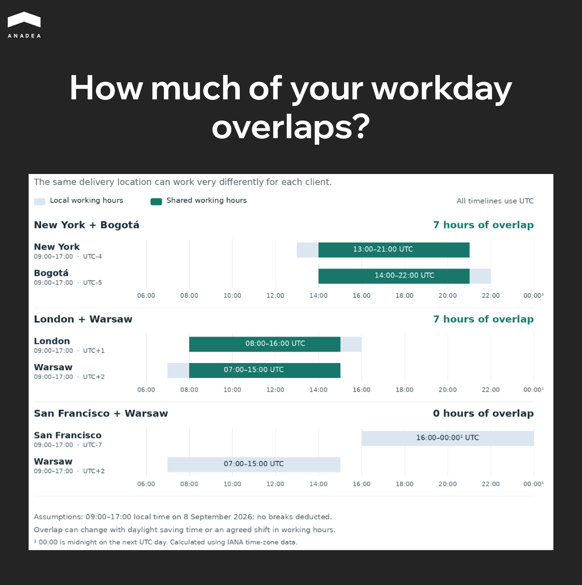

Comparing software development outsourcing companies gets complicated when their proposals cover different responsibilities. One provider offers engineers who will report to your tech lead. Another takes responsibility for delivering the project. Both may offer nearshore services, but each requires a different level of involvement from your team.

Nearshore software development means working with developers in a nearby country whose working hours largely overlap with yours. Your location matters: a team that works well with a London client may share only a few working hours with one in California.

This article compares eight providers by team location and engagement model, with practical guidance on what to check before committing to a partner.

## What Is Nearshore Software Development?

Nearshore software development means working with developers in a nearby country whose working hours substantially overlap with yours. This makes it easier to discuss a task, clarify requirements, and review the work within the same business day.

For US clients, this often means hiring a team in Latin America. For Western European clients, it commonly means Central or Eastern Europe. Check where the engineers assigned to your project actually work: a provider’s headquarters won’t tell you which time zones your team will operate in.

Nearshore is one of three ways to organize outsourced development by location. Here’s how they compare:

<table>

<tbody>

<tr>

<td>

<strong>Model</strong>

</td>

<td>

<strong>Where the team works</strong>

</td>

<td>

<strong>Working-hour overlap</strong>

</td>

<td>

<strong>Cost considerations</strong>

</td>

</tr>

<tr>

<td>

<strong>Onshore</strong>

</td>

<td>

In the client's country

</td>

<td>

Usually substantial, though time zones within the country can differ

</td>

<td>

Local rates and team composition

</td>

</tr>

<tr>

<td>

<strong>Nearshore</strong>

</td>

<td>

In a nearby country

</td>

<td>

Usually substantial; working hours still need to be agreed on

</td>

<td>

Rates in the chosen market, coordination, and onboarding

</td>

</tr>

<tr>

<td>

<strong>Offshore</strong>

</td>

<td>

In a geographically distant country

</td>

<td>

May be limited, depending on location and working hours

</td>

<td>

Rates, task handoffs, and support coverage

</td>

</tr>

</tbody>

</table>

Location alone doesn’t guarantee savings. When comparing nearshore software development services, check that each proposal covers the same scope, including project management and testing.

## How Do We Evaluate Companies for This Shortlist?

We compare each provider’s services and team locations with client feedback on Clutch, G2, and, where relevant reviews are available, GoodFirms and DesignRush. We look at what the client hired the company to do, how the engagement went, and what could have been better. We also consider review dates and volume, keeping candidates’ experiences with hiring platforms separate from client feedback.

Official websites help us confirm engagement models and stated expertise. Reddit discussions add practical examples, but they don’t determine whether a company makes the shortlist.

## Which Nearshore Software Development Companies Should You Shortlist in 2026?

AgileEngine, Anadea, Andela, BairesDev, DBB Software, Innowise, Revelo, and Toptal are worth shortlisting based on your location and preferred engagement model. Some arrangements put external engineers under your management; others give the provider responsibility for delivery. Even the term *dedicated team* can describe different divisions of responsibility.

Service information was checked in September 2026. The client reviews below show how specific engagements worked in practice, adding context to the capabilities each company advertises.

### AgileEngine

* **Best suited to:** product teams that need additional engineers and designers for ongoing development.
* **Team locations:** Latin America, Europe, and Asia.
* **Engagement models:** staff augmentation, dedicated teams, and product development.

AgileEngine is worth considering when your product is already live and your internal team needs more capacity to deliver planned improvements. In this situation, external engineers need to understand the existing codebase and work within an established development process.

Scott MacDonald, Director of Application Development at Fix.com, describes this experience in a May 2024 Clutch review. Two to five specialists joined the company’s custom e-commerce project, fixing bugs, developing backend systems, and improving the interface. MacDonald highlighted their ability to adapt to the company’s management practices and the low number of defects found by its QA team.[ Fix.com’s review on Clutch](https://clutch.co/profile/agileengine).

The engagement supports considering AgileEngine for an extension of an existing development team. It also shows that the client remained involved in managing the work and checking its quality. If you want the provider to take on those responsibilities, the proposal should explicitly cover technical leadership, project management, and QA. Agree on the locations of the assigned engineers as well: specialists in different regions will have different working-hour overlaps with your team.

### Anadea

* **Best suited to:** businesses looking for a technical partner to launch a product and continue developing it as the company grows.
* **Company base:** a European company with Ukrainian roots, headquartered in Alicante, Spain.
* **Engagement models:** staff augmentation, dedicated teams, and project delivery from planning through launch.[ ](https://anadea.info/about-us)

Anadea’s strength is its ability to support a product through different stages of development and adapt the engagement to the client’s team. Founded in 2000, the company offers[ IT outsourcing services](https://anadea.info/services/it-outsourcing) that cover requirements, development, and support after launch. Under its project-based model, Anadea takes responsibility for delivery and coordination through its own project manager. With a dedicated team, the client retains control over priorities and tasks.

Its work with the UK’s The Electric Car Scheme illustrates this flexibility. In a May 2022 Clutch review, co-founder Tom Eilon explained that the business initially had no other technical staff. Anadea helped develop its quoting system beyond the MVP stage and improve backend customer management. When the client hired its own CTO, the relationship continued: the internal leader took charge of the process, while Anadea supplied the engineering expertise the business needed.[ The Electric Car Scheme’s review on Clutch](https://clutch.co/profile/anadea).

For a business gradually building an internal technology team, that is a useful precedent. The engagement continued as the client’s management structure changed. A separate 2024 GoodFirms review from Kwizie.ai’s CTO describes the release of new product features and notes that the team stayed within budget.[ GoodFirms](https://www.goodfirms.co/company/anadea).

For businesses considering[ nearshore IT outsourcing](https://anadea.info/services/it-outsourcing), Anadea offers a choice between managed project delivery and[ adding specialists to an existing team](https://anadea.info/services/staff-augmentation). Establish how much technical leadership you need at the outset, since that will shape the team and the cost of the engagement.

### Andela

* **Best suited to:** companies seeking specialized engineers or a managed team for AI work.
* **Team locations:** a global network; specify your nearshore region during selection.
* **Engagement models:** staff augmentation and managed engineering teams.[ ](https://www.andela.com/)

As of September 2026, Andela places a strong emphasis on AI engineering. You can consider it for adding specialists to an established technical function or assembling a team around an agreed scope. In the latter case, establish exactly which responsibilities the provider will take on.

Andela’s published GitHub case study shows why it pays to read beyond a project headline. According to the account, Andela supplied a managed technical support team that worked within GitHub’s existing GitHub and Zendesk environment. The team lead specifically describes handling and resolving technical support requests. The case therefore demonstrates the organization of specialized support; it does not, by itself, establish experience building an AI product from scratch.[ GitHub case study published by Andela](https://www.andela.com/case-study-github).

For buyers, the reference project needs to match the service being purchased. If you need an AI application developed, ask to see a system the team built and handed over to a client, with a clear explanation of its contribution. Put location requirements in the proposal too: global recruitment does not guarantee that every team member will work the hours you need.

### BairesDev

* **Best suited to:** US clients seeking a Latin American team with a choice of management arrangements.
* **Team locations:** Latin America.
* **Engagement models:** staff augmentation, dedicated teams, and end-to-end development.

With BairesDev, compare staff augmentation and dedicated teams carefully. Its dedicated-team page states that the model includes a project manager and Scrum Master who coordinate day-to-day work, while the client sets product priorities. That distinction matters to a CTO who needs more engineers but has limited capacity to manage another team.[ ](https://www.bairesdev.com/software-development-services/software-dedicated-team/)

In a January 2024 Clutch review, Freeplay CTO Eric Ryan describes bringing in two to five specialists to help build an MVP. The detailed account covers a React frontend, a Python backend, SDKs, and integrations with language model providers. The client tracked progress through weekly demonstrations of completed work.[ Freeplay’s review on Clutch](https://clutch.co/profile/bairesdev).

This provides a reason to consider BairesDev for a product that requires several technical components to advance together. Before starting, establish which management roles are included in your proposal and who accepts the work at the end of each sprint. 



### DBB Software

* **Best suited to:** product teams that need to define the technical scope before moving into development.
* **Team locations:** Poland and Ukraine.
* **Engagement models:** staff augmentation, dedicated teams, and product development.

DBB Software offers its own Pre-Built Solutions, including configured cloud environments, interface components, and integrations. Assess this approach by looking at how much of your required functionality those components cover and how much adaptation they need. Using existing modules alone does not establish the timeline for the entire project.[ ](https://dbbsoftware.com/services/pre-built-solutions)

Its engagement with UK train ticket retailer CHOO CHOO began with a technical document defining the system’s scope and integrations. The team subsequently moved into web and mobile development. In an [updated November 2025 Clutch review](https://clutch.co/profile/dbb-software), the client highlighted the team’s accuracy in meeting commitments and its ability to understand the national rail system.

The case makes DBB Software worth considering for a project that still needs technical definition before development begins. If the proposal relies on pre-built components, ask for an estimate that separates their integration from custom development. Also agree on the rights to use those modules and whether another team can take over maintenance.

### Innowise

* **Best suited to:** companies that need additional capacity across several engineering disciplines.
* **Team locations:** an international network, with headquarters in Warsaw.
* **Engagement models:** staff augmentation, dedicated teams, and outsourced development.[ ](https://innowise.com/about-us/)

Innowise is worth considering for projects where mobile development depends on changes to backend systems and infrastructure. These engagements require coordination between specialists working on different parts of the same system.

[An August 2024 Clutch review from Sionic CTO Matthew Watson](https://clutch.co/profile/innowise) provides a concrete example. A team of six to ten people worked on a payment solution spanning a Flutter application, backend code, and microservices, while also contributing to DevOps. The client praised the quality of the candidates and their ability to meet sprint goals. Watson also explicitly stated that Sionic’s internal staff managed the sprints.[ ](https://clutch.co/profile/innowise)

That case supports considering Innowise when you already have technical leadership but need engineers with additional expertise. If you want to hand over coordination as well, request a proposal that includes the necessary management roles. When assessing the budget, distinguish between engineers needed throughout the engagement and specialists required only at certain stages. That will produce a more useful comparison than a single average hourly rate.

### Revelo

* **Best suited to:** US companies choosing between hiring Latin American engineers and commissioning managed development.
* **Team locations:** Latin America.
* **Engagement models:** individual specialists, teams, and end-to-end development.[ ](https://www.revelo.com/clients/software-development)

Evaluate Revelo against the specific service you need. Its hiring model helps clients find engineers and administer the engagement. For managed development, Revelo states that it provides a dedicated delivery lead and takes responsibility for work from architecture through deployment.

In a testimonial published on Revelo’s website, Member Splash’s founder describes how the provider adjusted its search based on his feedback, arranged interviews, and helped find a developer. This is a practical example of recruitment against a client’s requirements. It does not establish the quality of managed development, which requires its own project references.[ Client testimonials published by Revelo](https://www.revelo.com/reviews).

As of September 2026, Revelo’s managed development service uses hourly billing, time tracking in Jira, and a weekly cap on hours. The cap limits weekly spending, while the total budget still depends on the duration and scope of the work.[ ](https://www.revelo.com/clients/software-development)

This arrangement may suit a product with evolving requirements. For a project with a firm budget, also agree on estimates for each stage and a process for handling scope changes. Controlling weekly spending alone will not establish the full cost of launch.

### Toptal

* **Best suited to:** teams seeking specialized expertise or managed project delivery.
* **Team locations:** a global network; countries and working hours are specified during selection.
* **Engagement models:** individual specialists, teams, and Managed Delivery.[ ](https://www.toptal.com/managed-delivery)

Toptal allows clients to bring in expertise for a particular stage of work. That can be useful when you initially need an experienced designer for an MVP, followed by developers and infrastructure support once the concept has been validated.

The founder of a financial startup describes this staged approach in an October 2023 Clutch review. Toptal proposed candidates, while the client reviewed their previous work and conducted interviews. The engagement covered MVP design and development, along with other expertise the business needed. It shows the client taking an active role in assembling the team.[ Clutch](https://clutch.co/profile/toptal).

Managed Delivery is a separate offering: Toptal states that it handles planning, execution, and reporting. A proposal for an individual specialist and one for a managed project therefore need different evaluation criteria. For the former, focus on the person’s skills and availability. For the latter, assess team composition, delivery responsibility, and acceptance criteria. Both arrangements require an explicit agreement on location if you need a nearshore team.[ ](https://www.toptal.com/managed-delivery)

The table below summarizes the main differences for an initial shortlist. Confirm engagement models in the commercial proposal and working hours with the engineers assigned to your project.

<table>

<thead>

<tr>

<th>

<strong>Company</strong>

</th>

<th>

<strong>Team locations</strong>

</th>

<th>

<strong>Primary use case</strong>

</th>

<th>

<strong>Engagement models</strong>

</th>

</tr>

</thead>

<tbody>

<tr>

<td>

<strong>AgileEngine</strong>

</td>

<td>

Latin America, Europe, Asia

</td>

<td>

Expanding a team developing an existing product

</td>

<td>

Staff augmentation, dedicated teams, product development

</td>

</tr>

<tr>

<td>

<strong>Anadea</strong>

</td>

<td>

Europe; headquarters in Spain

</td>

<td>

Launching a product and continuing development as business needs change

</td>

<td>

Staff augmentation, client-managed dedicated teams, project delivery

</td>

</tr>

<tr>

<td>

<strong>Andela</strong>

</td>

<td>

Global network

</td>

<td>

Bringing in specialized engineers and managed teams

</td>

<td>

Staff augmentation, managed engineering and AI teams

</td>

</tr>

<tr>

<td>

<strong>BairesDev</strong>

</td>

<td>

Latin America

</td>

<td>

Adding developers with the option to delegate daily coordination

</td>

<td>

Staff augmentation, dedicated teams with a PM, end-to-end development

</td>

</tr>

<tr>

<td>

<strong>DBB Software</strong>

</td>

<td>

Poland, Ukraine

</td>

<td>

Defining a product&rsquo;s technical scope and developing it with reusable components

</td>

<td>

Staff augmentation, dedicated teams, product development

</td>

</tr>

<tr>

<td>

<strong>Innowise</strong>

</td>

<td>

International network; headquarters in Poland

</td>

<td>

Developing systems that require several engineering disciplines

</td>

<td>

Staff augmentation, dedicated teams, outsourcing

</td>

</tr>

<tr>

<td>

<strong>Revelo</strong>

</td>

<td>

Latin America

</td>

<td>

Hiring engineers or commissioning managed development with hourly billing

</td>

<td>

Individual specialists, teams, end-to-end development

</td>

</tr>

<tr>

<td>

<strong>Toptal</strong>

</td>

<td>

Global network

</td>

<td>

Adding expertise in stages or commissioning managed project delivery

</td>

<td>

Individual specialists, teams, Managed Delivery

</td>

</tr>

</tbody>

</table>



## How Do You Choose a Nearshore Development Company?

Before nearshoring software development, decide who will manage the work and which responsibilities you need the provider to take on. To make proposals comparable, send two or three providers the same brief: what you need to build, the constraints you already know, and who will be involved on your side.

Then work through the following checks.

1. **Decide who will manage development.** If your tech lead can assign tasks and review code, staff augmentation may fit. If you lack that capacity, the proposal should include technical leadership from the provider. Agree on who estimates tasks, makes architectural decisions, and accepts completed work. The label “dedicated team” does not answer those questions.
2. **Meet the people who will work on your product.** Ask the proposed technical lead to explain how they would approach a difficult part of your system. For example, how would the team migrate data from a legacy service and verify its integrity? The discussion will reveal the questions engineers ask, the dependencies they notice, and the assumptions behind their estimates.
3. **Agree on working hours and communication.** Set a daily window for collaboration, expected response times, and a contact for urgent issues. Shared hours can make a practical difference: in an[ r/ExperiencedDevs discussion about working with overseas teams](https://www.reddit.com/r/ExperiencedDevs/comments/1exmfew/comment/lj72qv2/), one participant describes time-zone alignment as a reason their experience with Latin American developers worked well. Confirm that your nearshore development team will be available during the agreed working hours. For guidance on bringing them into your daily workflow, see[ Anadea’s software development team extension guide](https://anadea.info/blog/software-development-team-extension-guide/).
4. **Compare the cost of equivalent work.** Ask providers to specify roles, allocated hours, and included services. A quote covering developers’ hours alone is not comparable to one that includes management and testing. Clarify how you will be charged for learning the codebase, handling changes in requirements, and transferring knowledge when an engineer is replaced.
5. **Discuss data requirements before development starts.** If the product handles sensitive information, ask what access engineers will need and how the test environment will be set up. For regulated industries, request a relevant project example and an explanation of the team’s contribution. A financial services or healthcare client’s logo does not establish that experience on its own.
6. **Start with a small, paid engagement.** For an existing product, this could be a limited integration; for a new one, it might be technical discovery. Define the deliverable and acceptance criteria in advance. Evaluate how the team communicates blockers and responds to feedback as well as the completed work. This gives you evidence for deciding whether to continue, though it cannot test every risk of a long-term project.

## What Can’t a Nearshore Company Ranking Tell You?

Rankings of nearshore outsourcing companies cannot tell you who will be assigned to your project or how the provider will respond when requirements change or a key engineer leaves. Even a detailed client review describes a particular team and scope of work that may differ from your engagement.

Directory placement also needs to be understood in the context of the platform’s rules.[ Clutch explains that sponsorship affects directory placement but not its Leaders Matrix](https://help.clutch.co/en/knowledge/difference-between-sponsor-and-non-sponsor). A company’s position in a list and its client feedback therefore need to be assessed separately.

Some costs only become visible after work begins. A new engineer needs time to understand the system, and your tech lead needs time to explain its constraints. If neither is accounted for, the initial estimate will look more attractive than the actual cost. Missing documentation can also make replacements harder and leave maintenance dependent on one person.

Before committing to a long-term nearshore outsourcing engagement, clarify the arrangements that rankings cannot show:

* **Access and documentation:** where the code will be stored, who can access it, and who keeps technical documentation current.
* **Staff changes and handover:** how work and knowledge will be transferred if an engineer leaves or the engagement ends.
* **Defects and scope changes:** who handles fixes after acceptance and how changes to the agreed scope affect the bill.

Assess your own readiness too. If nobody inside the business can set product priorities, adding developers will not resolve that problem. A comparison of[ in-house development and outsourcing](https://anadea.info/blog/software-development-do-it-inhouse-or-outsource/) can help you decide which responsibilities to keep within your company.

### Which Engagement Model Fits Your Team?

Start with the management capacity you already have. A provider can supply additional engineers, assemble a dedicated team, or take responsibility for delivery, but each arrangement requires a different level of involvement from you.

<table>

<thead>

<tr>

<th>

<strong>Your situation</strong>

</th>

<th>

<strong>Model to consider</strong>

</th>

<th>

<strong>What to agree before starting</strong>

</th>

</tr>

</thead>

<tbody>

<tr>

<td>

You have technical leadership and need specific skills or additional capacity

</td>

<td>

<strong>Staff augmentation</strong>

</td>

<td>

Your team assigns work and reviews the results. Confirm the engineers&rsquo; availability and the provider&rsquo;s responsibilities for onboarding and replacements.

</td>

</tr>

<tr>

<td>

You need a stable team for ongoing product development

</td>

<td>

<strong>Dedicated team</strong>

</td>

<td>

Specify who manages daily work, makes technical decisions, and provides QA. A dedicated team may be managed by you or by the provider.

</td>

</tr>

<tr>

<td>

You need a partner to organize and deliver an agreed project or workstream

</td>

<td>

<strong>Managed delivery or project-based development</strong>

</td>

<td>

Define deliverables, acceptance criteria, and responsibility for changes. Your business still needs someone to set priorities and approve key decisions.

</td>

</tr>

</tbody>

</table>

Ask each provider to describe these responsibilities in its proposal. The same engagement label can cover different services, so compare what is included before comparing the price.

## Conclusion

There is no single best nearshore software development company for every project. A provider that suits a US business extending its engineering team may be a poor fit for a European startup that needs someone to manage development from scratch. Your location, internal capacity, and project requirements determine which companies belong on your shortlist.

The comparison should ultimately come down to the proposed team and how the work will be managed. Client reviews help establish a track record; direct conversations and a paid initial engagement let you assess how that experience applies to your product. Before committing, you should understand what the provider will deliver, what it needs from you, and how changes will affect the budget.
