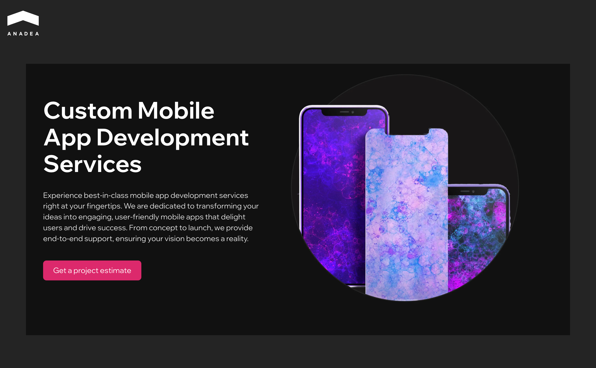
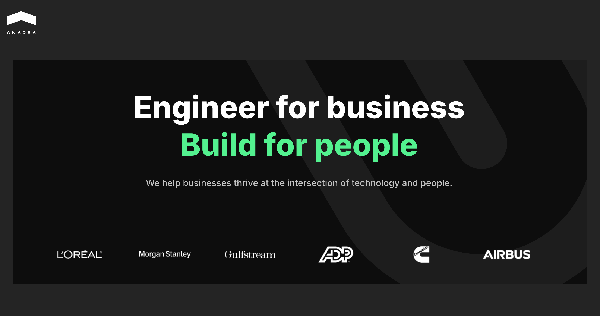
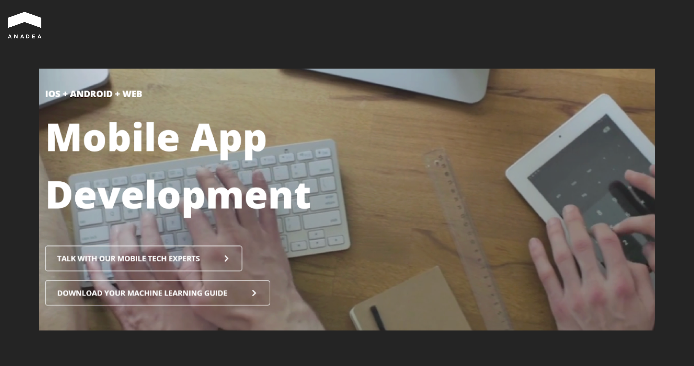
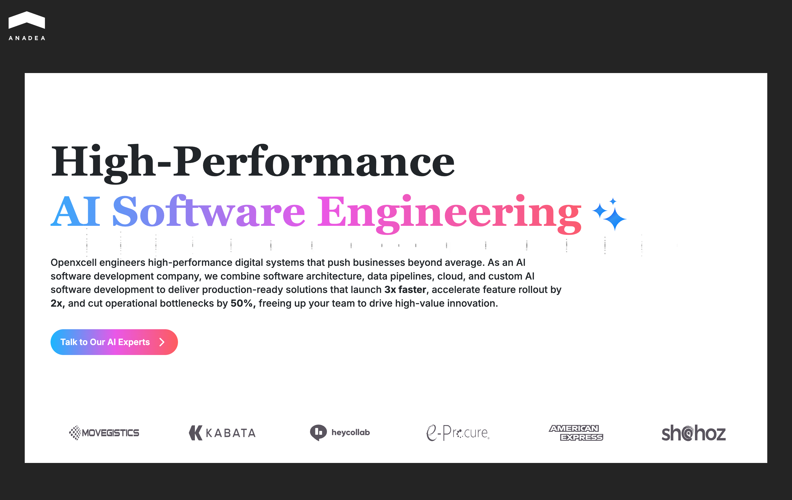
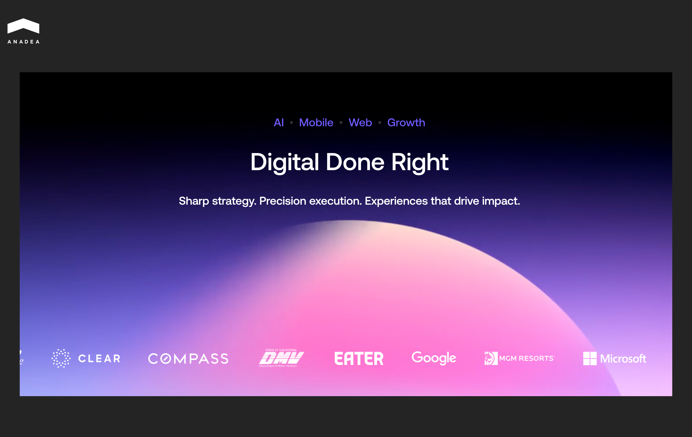
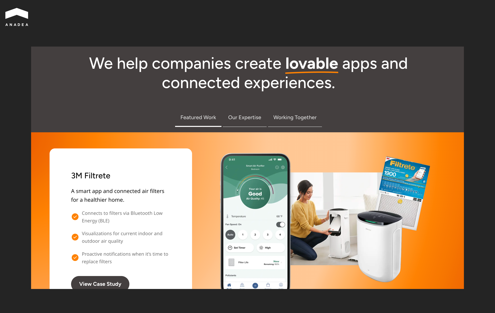
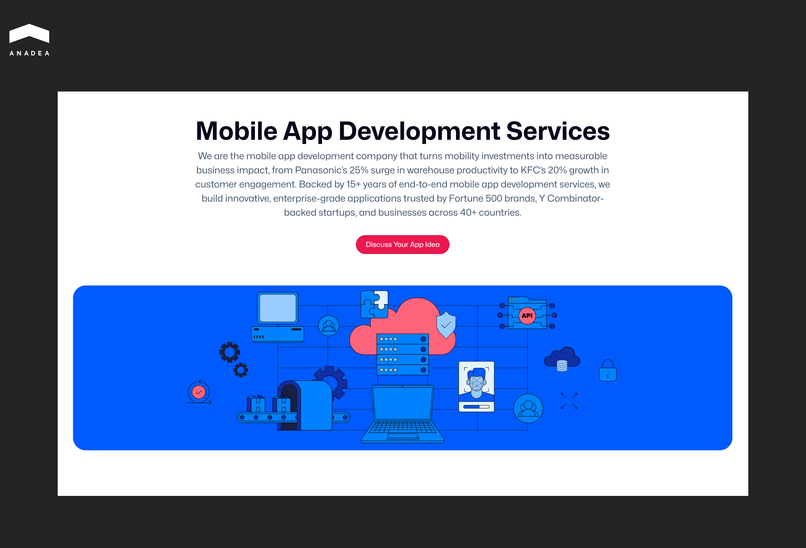
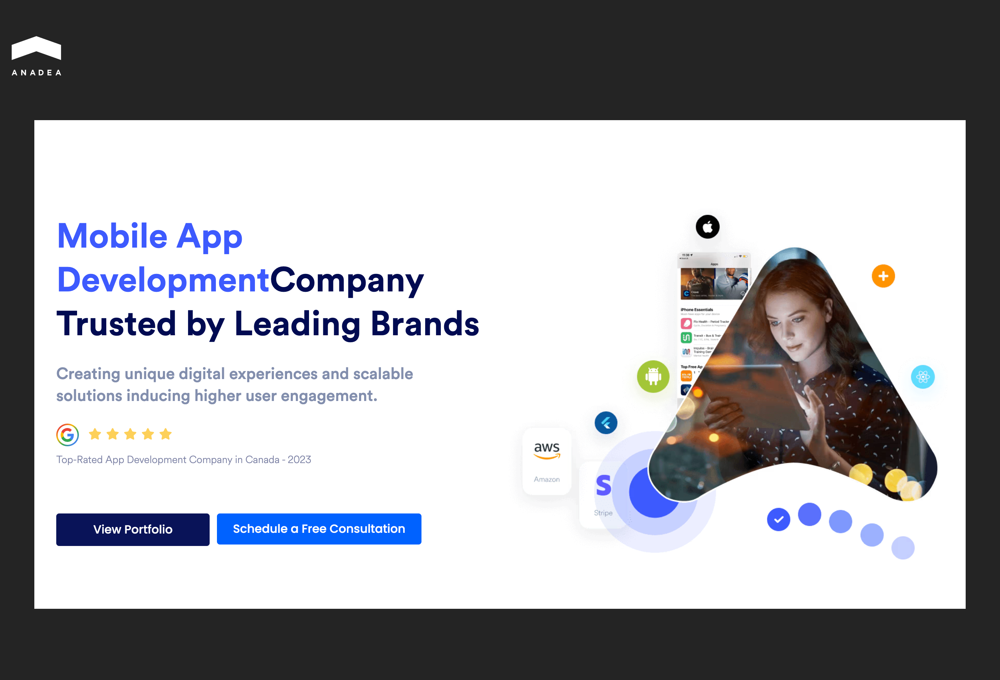
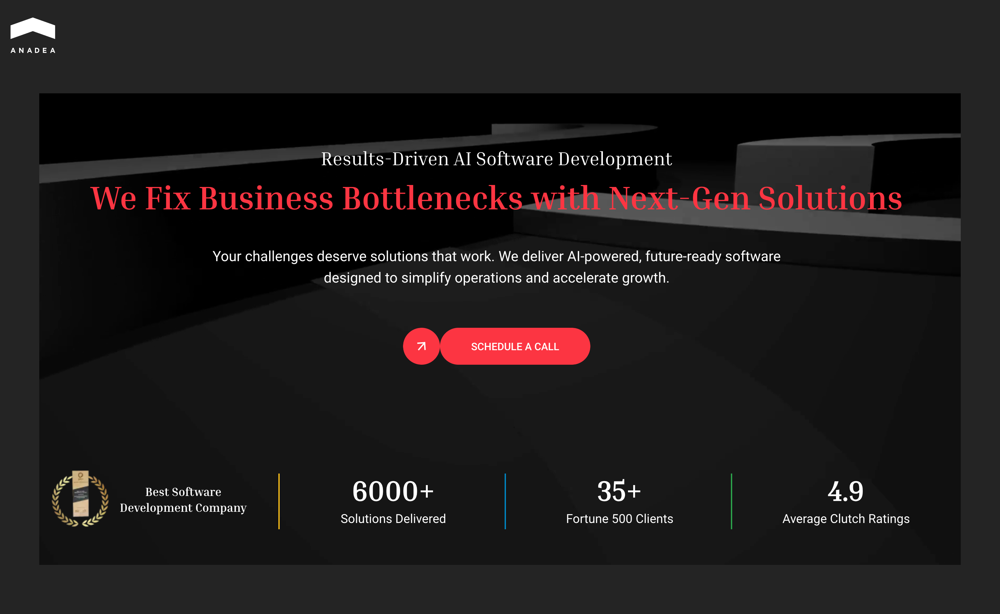
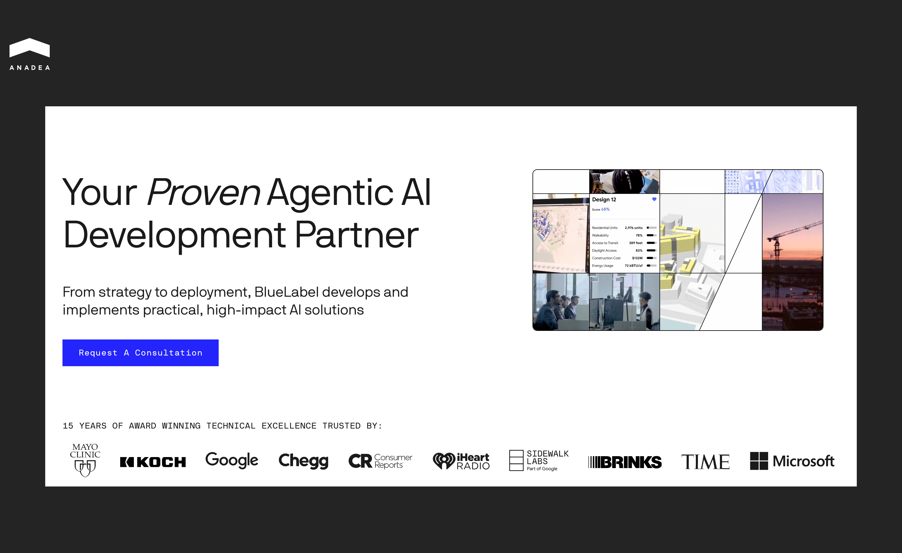

If you don’t have enough in-house resources for your digital initiatives, the choice of a tech partner directly impacts speed-to-market and long-term viability of your project.

Appinventiv is one of the leaders in custom mobile app development. The company was established in 2015. Since then, its staff has grown to over 1,600 experts, who have delivered 3000+ projects across more than 35 industries. In addition to mobile app creation, ​​Appinventiv offers a wide range of other custom software development services and builds complex solutions for startups and global enterprises.

However, the “perfect” tech partner is a relative term. There are no one-size-fits-all options.

Below, we compare ten Appinventiv alternatives by their core service offerings and unique value propositions so that you can make a well-informed decision.

## Why Consider Appinventiv Competitors?

Businesses that outsource [mobile app development](https://anadea.info/services/mobile-development) should explore various options to ensure the best fit for their needs.

These are the key factors that typically push companies to look for Appinventiv alternatives.

* **Pricing models and budget expectations.** Agencies may offer different cost structures. Look for engagement models that better align with your budget constraints.
* **Specific industry expertise.** Some projects require a partner with deep expertise in a regulated sector such as healthcare or fintech.
* **Specialized technologies and frameworks.** If a project relies on a legacy system or a brand-new niche framework, a company might seek a partner that has expertise in that exact technology.
* **Geographic location and time zones.** The physical location of a development team matters. Some businesses prefer nearshore or onshore partners to minimize time zone differences. This approach can simplify real-time collaboration. Meanwhile, for other projects, round-the-clock development is a must. As a result, businesses need to look for offshore teams that can maintain continuous development cycles.

## Top Appinventiv Alternatives

To find an appropriate tech partner for your project, you need to conduct thorough research. You can start by considering the companies from our list. They are recognized for delivering high-quality software and deep cross-domain expertise.

The table below provides a quick overview of the companies’ key strengths.

<table>

<tbody>

<tr>

<td>

<strong>Company</strong>

</td>

<td>

<strong>Core Offerings</strong>

</td>

<td>

<strong>Key Differentiators&nbsp;</strong>

</td>

</tr>

<tr>

<td>

Anadea

</td>

<td>

Custom mobile and web apps, AI/ML integration, SaaS, IT consulting

</td>

<td>

Deep knowledge in fintech, healthcare, and education; Focuses on highly scalable architectures and fast load times

</td>

</tr>

<tr>

<td>

Algoworks

</td>

<td>

Mobile development, Salesforce consulting, DevOps, AI solutions

</td>

<td>

Strong focus on early-stage technical involvement and an &ldquo;Everyday AI&rdquo; approach

</td>

</tr>

<tr>

<td>

Dogtown Media

</td>

<td>

End-to-end mobile development, AI/ML/AR/IoT integrations

</td>

<td>

Expertise in highly regulated sectors like mHealth and fintech

</td>

</tr>

<tr>

<td>

OpenXcell

</td>

<td>

Mobile and web development, AI consulting, blockchain development

</td>

<td>

ValueShore outsourcing Build-Operate-Transfer (BOT) model

</td>

</tr>

<tr>

<td>

Fueled

</td>

<td>

Mobile apps, enterprise web solutions, AI

</td>

<td>

High-end consumer mobile apps and enterprise-scale web ecosystems for tech giants and unicorn startups

</td>

</tr>

<tr>

<td>

ArcTouch

</td>

<td>

Mobile, web, PWA development, connected products, AI workflow

</td>

<td>

Solid expertise in accessibility consulting and enterprise AI integration

</td>

</tr>

<tr>

<td>

MindInventory

</td>

<td>

Mobile apps, AI/ML, IoT/smart automation

</td>

<td>

Strong emphasis on post-launch maintenance and continuous scalability

</td>

</tr>

<tr>

<td>

AppStudio

</td>

<td>

Native and cross-platform app development, IoT, and apps for wearables

</td>

<td>

Expertise in Mobile Device Management (MDM)

</td>

</tr>

<tr>

<td>

Hidden Brains

</td>

<td>

Mobile development, Microsoft ecosystem, IoT

</td>

<td>

Proprietary rapid mobile app development platform for high-speed delivery with minimal backend coding

</td>

</tr>

<tr>

<td>

BlueLabel

</td>

<td>

Generative AI integration, native and cross-platform mobile and web development

</td>

<td>

Focus on integrating GenAI and intelligent automation

</td>

</tr>

</tbody>

</table>

### Anadea

Founded in 2000, [Anadea](https://anadea.info/) is an international custom software engineering company. Headquartered in Alicante, Spain, it operates as a one-stop shop for digital product development and support.

Anadea covers the entire digital product lifecycle. The company’s primary service offerings include:

* Custom mobile app development (native and cross-platform solutions);
* web and SaaS development;
* AI and ML integration (predictive analytics, NLP-based tools, computer vision, and AI-driven user experiences);
* UI/UX design;
* IT consulting;
* code review;
* staff augmentation.

While Anadea supports a wide range of clients, its experts possess specialized domain knowledge in several key industries, like education, real estate, healthcare, fintech, and supply chain. For example, for the fintech domain, Anadea developed a [comprehensive mobile trading platform](https://anadea.info/projects/admirals) that provides users with access to over 5,000 global markets (Forex, indices, and stocks). The app features a highly user-friendly interface, real-time margin previews, built-in contract specifications, and dedicated support integrations.

In their custom solutions, Anadea’s developers prioritize fast load times, optimized rendering, and secure architectures that can handle the load alongside business scaling.



### Algoworks

Algoworks is a digital engineering and technology consulting firm that has been working for over 20 years. The company has a strong presence in the United States, India, and the UK. It is a CMMI Level 3 and ISO 27001 certified organization, which has completed over 6,000 projects. Its clients range from innovative startups to Fortune 500 companies like Amazon, Coca-Cola, and eBay.

The company’s primary services include:

* Mobile app development;
* Salesforce consulting and enablement;
* AI-powered solutions;
* product engineering;
* cloud & DevOps;
* UI/UX design.

Algoworks positions itself as a strategic extension of a company’s internal team. Its experts ensure early-stage technical involvement and rigorous quality assurance, which helps to reduce development roadblocks.

The company relies on its “Everyday AI” approach. It guides business transition from simple digital presence to data-driven operations.

### Dogtown Media

Dogtown Media is a mobile technology studio founded in 2011. Headquartered in Venice Beach, California, it has a strong domestic presence with offices in San Francisco, New York City, and Seattle. The company serves a prestigious client base that includes Google, Citibank, the United Nations, and Red Bull. In 2017, 2018, and 2019, it was recognized on the Inc. 5000 list of fastest-growing companies.

Dogtown Media provides a mobile-first approach to digital product engineering and offers:

* End-to-end mobile development;
* tech integrations (AI, ML, AR, and IoT);
* UX/UI design;
* mobile app strategy and consulting;
* software for connected devices.

The company has deep technical knowledge in highly regulated sectors like mHealth and fintech. For example, during the COVID-19 crisis, Dogtown Media cooperated with Minneapolis Heart Institute and developed a critical mHealth application to help healthcare providers route emergency patients effectively. Additionally, its developers created Sleeplife®, a HIPAA-compliant app that integrates with Fitbit to help researchers track sleep patterns in clinical trials.

### OpenXcell

Founded in 2009, OpenXcell is a premier CMMI Level 3 and ISO 9001:2008 certified software development company. It has its headquarters in the USA and a major development center in India. With its staff of more than 500 experts, OpenXcell has delivered 1,500+ projects for over 1,000 clients. Among its clients are Google, Motorola, and IKEA. 

OpenXcell offers a wide range of services designed to support businesses at every stage of their digital journey:

* Mobile app development with a growing focus on AI-integrated mobile solutions;
* custom web development;
* AI and ML consulting;
* blockchain development;
* talent augmentation;
* Build-Operate-Transfer (BOT) model for long-term collaborations.

OpenXcell is known for its ValueShore outsourcing model. It focuses on providing high-quality digital solutions that balance performance with cost-effectiveness.

### Fueled

Fueled is a mobile app development agency founded in 2007 and based in New York, with a global footprint and a distributed team of experienced professionals. In 2023, Fueled merged with 10up, a leader in enterprise-scale web development. This deal resulted in the creation of a global powerhouse of over 300 experts. 

Fueled works with a wide range of clients from unicorn startups to tech giants like Apple, Google, and Microsoft. The digital products built by the agency were nominated for Emmy Awards and honoured with the Webbys.

What services does this company offer?

* Mobile app development;
* enterprise web and CMS;
* AI and ML; 
* digital transformation;
* UX/UI product design;
* growth and lifecycle marketing.

Fueled has the strongest expertise in areas like media and publishing, ecommerce and retail, lifestyle, travel, and the public sector.

### ArcTouch 

ArcTouch is a full‑service digital product development studio founded in 2008. It operated its headquarters in San Francisco and additional offices in the US, Canada, Europe, and Brazil. The company has a long history of being at the forefront of the app revolution. It started with solutions for the first iPhone and evolved into a leader in the IoT and AI.

ArcTouch provides a full-cycle development approach and its services include:

* Mobile app development;
* web and PWA development;
* connected products and IoT;
* integration of AI into enterprise workflows;
* accessibility consulting.

With its custom digital products, the company helps organizations of all sizes, from startups to Fortune 500 brands, connect with users and solve real business problems. Over its history, ArcTouch has delivered hundreds of mobile apps, web platforms, and connected solutions used by millions of people worldwide.

### MindInventory 

MindInventory is a global software development company that helps startups and digital-first businesses build scalable technology solutions. Founded more than 15 years ago, the company has delivered thousands of projects for clients across more than 40 countries.

What does it offer?

* Mobile app development;
* AI and machine learning;
* digital transformation and strategy;
* UI/UX design;
* dedicated development teams.

The company extends its development capabilities beyond mobile screens. Its specialists also have expertise in:

* Wearable app development;
* IoT and smart automation;
* digital twins.

After launch, MindInventory also provides maintenance and continuous improvement services to ensure that applications remain scalable and competitive over time.

### AppStudio

AppStudio is a Canada-based digital product development company that specializes in mobile app development, custom software, and digital transformation solutions. The company is headquartered in Toronto. It works with startups, SMEs, and large enterprises to create innovative digital products that reach global audiences.

What AppStudio offers:

* Native and cross-platform development;
* advanced software for IoT and wearables;
* enterprise web and PWA;
* AI and machine learning;
* mobile device management (MDM);
* UI/UX Design.

With more than a decade of experience, AppStudio has delivered numerous mobile and web applications for different industries. The team collaborates closely with clients to understand business goals and user expectations and builds scalable apps that drive growth.

### Hidden Brains

Hidden Brains is a global software development and IT consulting company that helps businesses build innovative digital products and technology solutions. With over 22 years of experience and a team of 700+ agile-enabled experts, the company has delivered 6,000+ projects across 107 countries. 

The range of key services includes:

* Mobile app development;
* AI and ML;
* Microsoft development (the company has specialized expertise in .NET, Dynamics 365, and Power Platform for enterprise-grade business applications);
* embedded and IoT solutions;
* cloud and DevOps.

Moreover, the company offers a proprietary rapid mobile application development platform. It allows for high-speed app development with minimal coding for backend systems.

Hidden Brains is recognized as a Great Place to Work® and has earned numerous accolades from Deloitte (Technology Fast 50), the CES Innovation Awards, and The Economic Times for its focus on innovation and digital transformation.

### BlueLabel

BlueLabel is a digital product development company that helps businesses create innovative mobile applications and digital platforms.

Core areas of expertise include:

* Generative AI and intelligent automation integrated into mobile and web applications;
* native and cross-platform mobile development;
* enterprise-grade product engineering;
* industry-specific solutions for sectors such as healthcare, media, and restaurant technology platforms.

BlueLabel transforms ideas into fully functional digital products through a structured product development process. The company begins with strategic discovery to identify business goals. Its design teams then create intuitive interfaces and product prototypes, while engineers build mobile apps, web platforms, and AI-driven systems.

Since its foundation in 2009, BlueLabel has launched more than 350 products across mobile, web, AR/VR, and IoT.

## How to Choose the Right Partner among Appinventiv Competitors

It’s important to carefully choose a tech partner. In this case, you are not simply purchasing a solution. You should focus on finding a team that will support your business through technical challenges and adapt to changing market conditions.

Here are the key points you should pay attention to while considering potential partners for your next project.

* **Development experience**. Analyze how long the company has been in the industry. A team that has weathered multiple OS updates and hardware shifts will have the foresight to avoid common pitfalls.
* **Portfolio deep-dive.** If possible, download their previous apps. Make sure the quality of the team’s past work aligns with your requirements.
* **Technical expertise**. Ensure they are masters of the specific stacks you need. Whether it’s native development or cross-platform frameworks, your potential partner should be able to explain why a specific technology fits your business goals.
* **Development processes.** Understanding the methodologies applied by a company helps you manage your own stakeholders’ expectations. A structured process ensures that the project stays on track.
* **Scalability**. You need a partner who can scale their team as your user base expands. Check if they have resources and skills to provide ongoing support.
* **Communication practices.** Ask your potential tech partner about the existing reporting methods. It’s vital to make sure that you can easily contact the development team and get updates on the projects on a regular basis.

## Wrapping Up

Appinventiv remains a strong player in the mobile development industry. However, a prominent name and reputation are often not enough to make a choice. The right partner for your project should be defined by your specific needs. 

The search for an alternative option is not about finding a better company. The key goal is to find the best fit for your specific technical stack, budget, and communication style. 

By selecting a partner with deep knowledge in your technological niche, you can be sure that your app will drive your business growth and become your competitive edge in the long term.

If you need a partner with solid expertise in building AI-powered web and mobile solutions, Anadea can become a suitable candidate. Our developers have a deep understanding of the modern tech trends and unique practical experience across domains. [Contact us](https://anadea.info/contacts) to learn more about our services and approaches to work.
